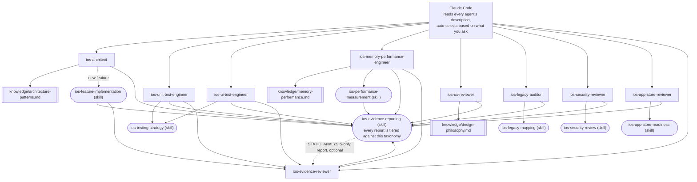

# claude-ai-agents-ios

🌐 [English](README.md) | [简体中文](README.zh-CN.md) | [Español](README.es.md) | [हिन्दी](README.hi.md) | [العربية](README.ar.md) | [Português (Brasil)](README.pt-BR.md) | [Русский](README.ru.md) | [日本語](README.ja.md) | [Français](README.fr.md) | [Deutsch](README.de.md) | [한국어](README.ko.md) | [Italiano](README.it.md) | [Türkçe](README.tr.md) | [Tiếng Việt](README.vi.md) | [Bahasa Indonesia](README.id.md)

مجموعة جاهزة للاستخدام من الوكلاء الفرعيين (subagents) والمهارات (Skills) الخاصة بـ [Claude Code](https://claude.com/claude-code)، تُحوّل Claude Code إلى فريق متخصص لتطوير iOS: الهندسة المعمارية، اختبارات الوحدة، اختبارات واجهة المستخدم، الذاكرة/الأداء، مراجعة واجهة المستخدم وتجربة المستخدم، الأمان، جاهزية App Store، تدقيق الأكواد القديمة، ومراجعة الأدلة المستقلة — يتم استدعاء كل منها تلقائيًا بناءً على طلبك، دون الحاجة للتبديل اليدوي.

## ما الذي يتضمنه هذا المستودع

### الوكلاء الفرعيون (`.claude/agents/`)

| الوكيل | يُستدعى عندما... | الأدوات |
|---|---|---|
| `ios-architect` | تبدأ ميزة/وحدة جديدة، تسأل "كيف يجب أن أبني هذا؟"، تخطط لإعادة هيكلة، تختار بين MVVM/Clean/VIPER، تقرر بشأن حقن التبعيات (DI) أو SwiftData مقابل Core Data | Read, Grep, Glob, Write, Edit, Skill, `ios-agent`* |
| `ios-unit-test-engineer` | تطلب اختبارات، تغطية اختبارية، TDD، أو جعل الكود قابلاً للاختبار | Read, Grep, Glob, Write, Edit, Bash, Skill, `ios-agent`* |
| `ios-ui-test-engineer` | تطلب اختبارات واجهة المستخدم، تصحيح اختبار واجهة مستخدم غير مستقر، أو إعداد اختبار اللقطات (snapshot) | Read, Grep, Glob, Write, Edit, Bash, Skill, `ios-agent`*, `ios-simulator`* |
| `ios-memory-performance-engineer` | تُبلّغ عن تسرب ذاكرة، نمو في استهلاك الذاكرة، بطء في التمرير، أو بطء في الإطلاق | Read, Grep, Glob, Bash, Edit, Skill, `ios-agent`*, `ios-simulator`* |
| `ios-ux-reviewer` | تطلب مراجعة لواجهة المستخدم/تجربة المستخدم أو فحص اتساق التصميم | Read, Grep, Glob, Skill, `ios-agent`* (للقراءة فقط) |
| `ios-legacy-auditor` | تبدأ العمل على مشروع غير مألوف، غير موثّق، أو قاعدة كود قديمة كبيرة | Read, Grep, Glob, Bash, Skill, `ios-agent`* (للقراءة فقط) |
| `ios-security-reviewer` | تطلب مراجعة أمنية، "هل هذا آمن؟"، فحص الثغرات، أو تدقيق المصادقة/الجلسات | Read, Grep, Glob, Bash, Skill, `ios-agent`* (للقراءة فقط) |
| `ios-app-store-reviewer` | تسأل "هل هذا جاهز للإرسال؟"، "هل سيُرفض؟"، أو للتحقق من امتثال App Store | Read, Grep, Glob, Bash, Skill, `ios-agent`* (للقراءة فقط) |
| `ios-evidence-reviewer` | بعد أن ينتج وكيل آخر تقريرًا، أو عند الطلب "تحقق مرة أخرى من هذا التقرير"/"تحقق من هذه الادعاءات" | Read, Grep, Glob, Skill (للقراءة فقط) |

\* `ios-agent` و `ios-simulator` هما خادما MCP اختياريان من جهة خارجية — راجع
قسم "الأدوات الاختيارية" أدناه.
كل وكيل يعمل بشكل مستقل دونهما. يعزز `ios-agent` قراءة من مستوى
`STATIC_ANALYSIS` بأدوات منظمة — لكنه لا يرفع أبدًا ادعاءً إلى مستوى
`BUILD_VERIFIED`/`TEST_VERIFIED`/`RUNTIME_VERIFIED`، لأنه لا يقوم أبدًا ببناء
أو تشغيل التطبيق نفسه. أما `ios-simulator` فهو فعليًا يقوم بالبناء/التثبيت/تشغيل
التطبيق، لذا يمكن لمخرجاته أن تكسب فعليًا مستوى
`BUILD_VERIFIED` أو `TEST_VERIFIED` أو `RUNTIME_VERIFIED` — راجع
التصنيف السباعي المستويات ضمن قسم "الأدلة قبل التأكيد" أدناه.

### المهارات (`.claude/skills/`)

| المهارة | تدعم | الغرض |
|---|---|---|
| `ios-testing-strategy` | `ios-unit-test-engineer`, `ios-ui-test-engineer` | إجراء ملموس: تحديد نقاط الفصل ← كتابة كائن اختبار وهمي ← دورة أحمر/أخضر |
| `ios-legacy-mapping` | `ios-legacy-auditor` | جرد ملموس ← اكتشاف الهندسة المعمارية ← مخاطر الربط ← إشارات الأمان ← إجراء توثيق ملخّص |
| `ios-security-review` | `ios-security-reviewer` | تدقيق من 8 مجالات: تخزين البيانات/الخصوصية ← أمان النقل ← المصادقة/الجلسات ← التحقق من المدخلات ← الروابط العميقة ← حزم SDK الخارجية ← نظافة الكود ← الأذونات |
| `ios-app-store-readiness` | `ios-app-store-reviewer` | تدقيق ما قبل الإرسال: بيان الخصوصية ← الامتثال للتصدير ← أوصاف الأذونات ← شفافية تتبع التطبيقات (ATT) ← تكافؤ Sign in with Apple ← الأذونات غير المستخدمة ← أسباب الرفض الشائعة |
| `ios-feature-implementation` | عام — يُفعَّل عند أي طلب ميزة، ويعمل جنبًا إلى جنب مع `ios-architect` | فحص الكود الحالي، منطق العمل، سلوك API/الاتصال، والوضع الأمني ← الشرح قبل لمس الملفات ← التنفيذ ← التحقق (البناء، الاختبارات، دورات الاحتفاظ بالذاكرة، الأداء، الأمان) ← التقرير |
| `ios-performance-measurement` | `ios-memory-performance-engineer` | إعادة الإنتاج ← اختيار ما سيُقاس ← القياس قبل إجراء أي تغيير ← التغيير ← إعادة القياس بنفس الظروف ← التحقق من إزالة أدوات القياس |
| `ios-evidence-reporting` | جميع الوكلاء التسعة — يُفعَّل كلما أنهى أحدهم مهمة | تصنيف سباعي المستويات للأدلة (`ASSUMPTION` ← `HUMAN_VERIFICATION`)، مصفوفة الادعاء ← الحد الأدنى من الأدلة، وقائمة الادعاءات المحظورة، بحيث لا يدّعي أي وكيل أن شيئًا يعمل، أو تم إصلاحه، أو أصبح أسرع/آمنًا/آمنًا للخيوط (thread-safe) دون أدلة على المستوى المطابق |

### مكتبة المعرفة (`knowledge/`)

تعيش المواد المرجعية العميقة هنا بدلاً من داخل نصوص الوكلاء، بحيث
يبقى كل وكيل مركّزًا على *متى يتصرف* و*ما الإجراء الذي
يتبعه*، بينما يكون ملف المعرفة هو *مصدر الحقيقة لما يجب
فحصه*. يقرأ الوكلاء هذه الملفات باستخدام أداة `Read` عند الحاجة — دون
أي إعداد إضافي.

| الملف | يُستخدم من قِبل | المحتوى |
|---|---|---|
| `memory-performance.md` | `ios-memory-performance-engineer` | أساسيات ARC/Instruments/الصور/التزامن بالإضافة إلى أنماط خاصة بالأطر (RxSwift, WKWebView, PDFKit, Core Data, Firebase, CocoaPods, Keychain, مكتبات العرض الخارجية, UICollectionView/UITableView, جسور SwiftUI/UIKit, AVFoundation, CoreLocation, URLSession) |
| `architecture-patterns.md` | `ios-architect` | معايير الأنماط/القرارات: MVVM/Clean/VIPER، تزامن Swift، التقسيم إلى وحدات، التخزين الدائم، التنقل، حقن التبعيات، البنية الواعية بالأمان |
| `design-philosophy.md` | `ios-ux-reviewer` | إرشادات واجهة إنسان آبل (HIG)، مبادئ ديتر رامز العشرة المطبقة على iOS، معايير مجموعة نيلسن نورمان، وقائمة المراجع المذكورة |

### القالب

- `CLAUDE.md.template` — انسخه إلى جذر مشروعك باسم `CLAUDE.md`
  واملأ الحقول (أو دع `ios-legacy-auditor` يُنشئ
  قسم الهندسة المعمارية لك في حال وجود كود غير مألوف).

## التثبيت

انسخ ما تحتاجه إلى جذر مستودع مشروع iOS الخاص بك:

```bash
# من هذا المستودع، انسخ إلى مشروعك:
mkdir -p /path/to/your-ios-project/.claude
cp -r .claude/agents /path/to/your-ios-project/.claude/
cp -r .claude/skills /path/to/your-ios-project/.claude/
cp -r knowledge /path/to/your-ios-project/knowledge
cp CLAUDE.md.template /path/to/your-ios-project/CLAUDE.md   # ثم عدّله
```

```bash
# أو أنشئ رابطًا رمزيًا بدلاً من النسخ، للبقاء متزامنًا عبر عدة مشاريع:
ln -s /path/to/claude-ai-agents-ios/.claude/agents /path/to/your-ios-project/.claude/agents
ln -s /path/to/claude-ai-agents-ios/.claude/skills /path/to/your-ios-project/.claude/skills
ln -s /path/to/claude-ai-agents-ios/knowledge /path/to/your-ios-project/knowledge
```

يجب أن يكون مجلد `knowledge/` موجودًا في جذر مستودع مشروعك (بجانب
`.claude/`) — يشير إليه الوكلاء عبر هذا المسار النسبي.

للاستخدام الشخصي (عبر مشاريع متعددة) بدلاً من كل مشروع على حدة، انسخ إلى
`~/.claude/agents/` و `~/.claude/skills/` — يدمج Claude Code
الوكلاء/المهارات على مستوى المستخدم والمشروع تلقائيًا. لاحظ أن
`knowledge/` يُشار إليها كمسار نسبي للمستودع، لذا للاستخدام الشخصي
ستحتاج لوجود `knowledge/` في جذر كل مشروع (الربط الرمزي
لكل مشروع هو الأبسط).

لا حاجة لأي شيء آخر — يقرأ Claude Code حقل `description` في كل وكيل
ويستدعي الوكيل المناسب تلقائيًا بناءً على
طلبك. راجع قسم "الأدوات الاختيارية" أدناه للاطلاع على خادمي MCP
من جهة خارجية يعززان مستوى الأدلة لعدة وكلاء، والتي بدونها كل ما سبق
يعمل بمفرده تمامًا.

## الأدوات الاختيارية: التحليل الساكن وتحكم المحاكي

يوفر خادمان من [`ios-agent-skill`](https://github.com/Nagarjuna2997/ios-agent-skill)
(مرخّص بموجب MIT، وغير تابع لهذا المستودع) لعدة وكلاء أعلاه طريقة
*لتشغيل* فحص بدلاً من مجرد قراءة الكود من أجله. لا يُعد أي منهما
مطلوبًا — يعمل كل وكيل بالفعل دونهما، بالرجوع إلى
قراءات من مستوى `STATIC_ANALYSIS` وإجراءات موصوفة يدويًا.

### `ios-agent-mcp` — التحليل الساكن (منشور، موصى به)

عشر أدوات للقراءة فقط تفحص مشروع Swift وتُرجع نتائج
منظمة (الملف، السطر، العاقبة، الإصلاح) للتزامن، الهندسة المعمارية،
أنماط SwiftUI، ضمانات التوافر، جاهزية App Store، الذاكرة،
الأمان، الاختبار، والأداء — راجع [قائمة الأدوات](https://github.com/Nagarjuna2997/ios-agent-skill/tree/main/mcp-server)
للتفاصيل. إنه للقراءة فقط من نظام الملفات ودون وصول للشبكة.

يُعلن ملف `.mcp.json` في هذا المستودع عنه بالفعل، لذا نسخ `.mcp.json`
إلى مشروعك بجانب `.claude/` هو الخطوة الوحيدة:

```bash
cp .mcp.json /path/to/your-ios-project/.mcp.json
```

سيعرض Claude Code تفعيل الخادم المحدد للمشروع في أول
مرة يكون فيها ذا صلة؛ يقوم `npx` بجلب الحزمة عند أول استخدام، دون
الحاجة لتثبيت عام.

### `ios-simulator-mcp` — تحكم المحاكي (مبكر، من المصدر فقط)

أدوات للبناء، الاختبار، التثبيت، الإطلاق، الروابط العميقة، ولقطات الشاشة
لمحاكي iOS قيد التشغيل — النظير في وقت التشغيل للمحلل الساكن
أعلاه. حتى وقت كتابة هذا، هو **الإصدار v0.1.0، لم يُنشر بعد على npm، وما زال
مبكرًا** (توثيقه الخاص يصفه بـ"الشريحة الآمنة الأولى")، لذا تعامل معه
كشيء تجربه، وليس كشيء تعتمد عليه:

```bash
git clone https://github.com/Nagarjuna2997/ios-agent-skill.git
cd ios-agent-skill/ios-simulator-mcp
npm install && npm run build
```

ثم أضفه إلى ملف `.mcp.json` الخاص بمشروعك (أو إعدادات MCP الشخصية)
تحت اسم الخادم `ios-simulator`، مع الإشارة إلى المسار المبني:

```jsonc
{
  "mcpServers": {
    "ios-simulator": {
      "command": "node",
      "args": ["/absolute/path/to/ios-agent-skill/ios-simulator-mcp/dist/index.js"]
    }
  }
}
```

يتطلب macOS وأدوات سطر أوامر Xcode. إذا سمّيت الخادم
باسم مختلف عن `ios-simulator`، حدّث صلاحية الأداة
`mcp__ios-simulator__*` في `ios-ui-test-engineer.md` و
`ios-memory-performance-engineer.md` لمطابقة ذلك.

## كيف يترابط كل ذلك معًا



لا يوجد موجّه (router) أو منسّق (orchestrator) لضبطه — مطابقة الأوصاف
الخاصة بـ Claude Code نفسها *هي* طبقة التوزيع. كل وكيل هو ورقة نهائية
إما تقرأ ملف `knowledge/*.md` لمواد مرجعية عميقة،
أو تتبع `Skill` لإجراء مشترك، أو كليهما، وكل مسار
يتقارب في نهاية المطاف مع معيار الإبلاغ عن الأدلة نفسه.
`ios-evidence-reviewer` هو الاستثناء الوحيد لكونه "ورقة نهائية": فهو يقرأ
تقرير وكيل *آخر* المُنجز ويُخفّض مستوى أي ادعاء لا تدعمه
الأدلة المعروضة فعليًا، ثم يُغلق التقرير المُصحَّح
بنفس تنسيق كتلة الحالة مرة أخرى. يمر كل من `ios-feature-implementation`،
`ios-memory-performance-engineer`، `ios-unit-test-engineer`، و
`ios-ui-test-engineer` من خلاله تلقائيًا كلما وصل
تقريره الخاص إلى `BUILD_VERIFIED` أو أعلى — فالوكيل الذي قام
بالبناء/الاختبار/القياس ليس الوحيد الذي يتحقق مما إذا كان
تقريره صادقًا بشأن ذلك.

## كيف يُسلّم بعضها العمل لبعض

تدفق نموذجي، رغم أنك لست بحاجة أبدًا لاستدعاء أيٍّ من هذا بالاسم:

1. **قاعدة كود غير مألوفة/غير موثّقة؟** ابدأ بـ `ios-legacy-auditor`
   — فهو يرسم خريطة الهندسة المعمارية الفعلية وينتج ملخصًا يمكنك وضعه
   في `CLAUDE.md`، قبل أن يمس أي شيء آخر الكود.
2. **ميزة/وحدة جديدة؟** يقترح `ios-architect` هيكلًا ويُشير إلى
   ما إذا كان التصميم قابلاً للاختبار الوحدوي؛ ثم يتولى `ios-feature-implementation`
   البناء الفعلي — بفحص منطق العمل الحالي
   أولاً، شرح الخطة قبل لمس الملفات، تنفيذ العمل
   وفق الهيكل المتفق عليه، والتحقق (البناء، الاختبارات، الذاكرة،
   الأداء) قبل الإبلاغ بالانتهاء.
3. **بحاجة لاختبارات؟** `ios-unit-test-engineer` للمنطق، `ios-ui-test-engineer`
   لتدفقات المستخدم — كلاهما يتبع نفس انضباط نقاط الفصل ← أحمر/أخضر
   من `ios-testing-strategy`.
4. **شاشة جديدة أو مُعدَّلة؟** يتحقق `ios-ux-reviewer` منها وفق إرشادات
   واجهة إنسان آبل وفلسفة التصميم الأساسية
   قبل إطلاقها.
5. **شيء ما يبدو بطيئًا أو يُسرّب الذاكرة؟** يقرأ `ios-memory-performance-engineer`
   الكود بحثًا عن الأسباب الساكنة أولاً، ويمنحك إجراء
   Instruments الدقيق عندما لا يمكن إيجاده بالقراءة وحدها.
6. **تريد فحصًا أمنيًا؟** يجري `ios-security-reviewer` تدقيقًا مخصصًا
   من 8 مجالات (التخزين، النقل، المصادقة، التحقق من المدخلات، الروابط
   العميقة، التبعيات، نظافة الكود، الأذونات)؛ كما يشير كل من `ios-architect`،
   `ios-legacy-auditor`، و `ios-feature-implementation` إلى
   مخاوف أمنية أخف وأكثر تحديدًا كجزء من عملهم الخاص
   ويوجّهون إلى هنا لأي شيء يستحق تدقيقًا كاملاً.
7. **على وشك الإرسال إلى App Store؟** يتحقق `ios-app-store-reviewer` من
   العوائق المرئية في الكود قبل الإرسال (بيان الخصوصية، أوصاف
   الأذونات، الامتثال للتصدير، تكافؤ Sign in with Apple) — وهو
   قلق منفصل عن `ios-security-reviewer` حتى وإن تشاركا في بعض
   الأرضية (الأذونات، أمان النقل)، لذا شغّل كليهما قبل
   الإصدار إذا كان أيٌّ منهما ذا صلة.
8. **تقرير يصل إلى `BUILD_VERIFIED` أو أعلى؟** يتحقق منه `ios-evidence-reviewer`
   قبل اعتباره منتهيًا. يمر كل من `ios-feature-implementation`،
   `ios-memory-performance-engineer`، `ios-unit-test-engineer`، و
   `ios-ui-test-engineer` — الوكلاء القادرون على إنتاج
   ادعاء بناء/اختبار/تشغيل/قياس بشكل مستقل، وليس مجرد نتيجة ساكنة — كلٌّ منهم
   يمر تلقائيًا خلاله كخطوته الأخيرة؛ ويمكن أيضًا تسليم
   تقرير أي وكيل آخر إليه مباشرة.

## الأدلة قبل التأكيد

ثقة الذكاء الاصطناعي ليست دليلاً. استدلال الذكاء الاصطناعي ليس دليلاً وقت التشغيل. تعديل
الكود ليس إصلاحًا مُتحقَّقًا منه تلقائيًا. يُنهي كل وكيل في هذا
المستودع تقريره بكتلة حالة من مهارة `ios-evidence-reporting`
بدلاً من مجرد "تم! إنه يعمل"، وكل سطر في تلك الكتلة
مصنَّف وفق أحد سبعة مستويات من الأدلة، من الأضعف إلى الأقوى:

`ASSUMPTION` ← `STATIC_ANALYSIS` ← `BUILD_VERIFIED` ← `TEST_VERIFIED`
← `RUNTIME_VERIFIED` ← `RUNTIME_MEASURED` ← `HUMAN_VERIFICATION`

لا يُبلَّغ عن أي ادعاء أبدًا بمستوى أعلى مما وصلت إليه الأدلة فعليًا.
قراءة المصدر (بما في ذلك مخرجات محلل MCP الساكن المنظمة) هي
`STATIC_ANALYSIS`، بلا استثناء، سواء قام إنسان أو أداة
بالقراءة — فهي لا تصبح دليلاً أقوى لمجرد أن أداة
أنتجتها، ولا يمكنها أبدًا دعم "لا يوجد تسرب" أو "تحسّنت
الذاكرة". يتطلب هذان الادعاءان تحديدًا `RUNTIME_MEASURED`: رقمًا
فعليًا من تشغيل التطبيق فعليًا (Instruments، MetricKit،
`os_signpost`)، عبر حلقة إعادة الإنتاج ← خط الأساس
← القياس ← التغيير ← البناء ← الاختبار ← إعادة القياس ← المقارنة ← التقرير
الخاصة بـ `ios-performance-measurement`. ادعاء لن يقوله وكلاء هذا
المستودع أبدًا دون أدلة مطابقة:
"تم إصلاحه"، "مُحسَّن"، "أسرع"، "خالٍ من التسريبات"، "آمن للخيوط (thread-safe)"،
"آمن"، أو "جاهز للإنتاج" (وهو ادعاء شامل لا تغطيه أدلة أي
وكيل واحد بمفرده) — راجع مصفوفة الادعاء ← الحد الأدنى من الأدلة
في `ios-evidence-reporting` للاطلاع على القائمة الكاملة والبدائل
اللغوية الدقيقة.

نظرًا لأن الوكيل الذي ينفّذ شيئًا ما لا ينبغي أن يكون السلطة
الوحيدة فيما إذا كان تقريره صادقًا، يعيد `ios-evidence-reviewer`
التحقق بشكل مستقل من ادعاءات تقرير مُنجز مقابل تلك
المصفوفة نفسها ويُخفّض مستوى أي شيء غير مدعوم قبل تقديمه
كنسخة نهائية — راجع قسم "كيف يترابط كل ذلك معًا" أعلاه.

## فلسفة التصميم

يستند `ios-ux-reviewer` بشكل خاص إلى مصادر مسمّاة بدلاً من
ذوق مُفترض: إرشادات واجهة إنسان آبل، مبادئ ديتر رامز
العشرة للتصميم الجيد، كتاب دون نورمان *The Design of Everyday Things*،
معايير قابلية الاستخدام لمجموعة نيلسن نورمان، وكتاب *Refactoring UI* للأحكام
البصرية الملموسة. راجع `knowledge/design-philosophy.md`
للاطلاع على كيفية تطبيق كل منها على iOS تحديدًا.

## صيانة هذا المستودع

يُشغّل `scripts/audit-agents.sh` الفحوصات الآلية التي يُقاس بها
كل ملف وكيل/مهارة أثناء التطوير: تطابق `name:` في البيانات الوصفية
مع اسم الملف أو المجلد، احتواء `description:` على عبارة استدعاء
حقيقية بين علامتي اقتباس، عدم وجود ادعاء بالقراءة فقط في
النص بجانب صلاحية `Write`/`Edit`، إغلاق أسيجة الكود، تطابق
كل إشارة بعلامة `ios-*` في المستودع مع وكيل أو مهارة حقيقية،
وعدم احتواء أي ملف على تصنيف `(static)`/`(executed)` القديم بدلاً
من التصنيف السباعي المستويات الحالي. إنه غير معطِّل للعمل — النتائج
مخصصة لكي يتصرف بشأنها الإنسان، وليست بوابة إلزامية.

```bash
./scripts/audit-agents.sh
```
