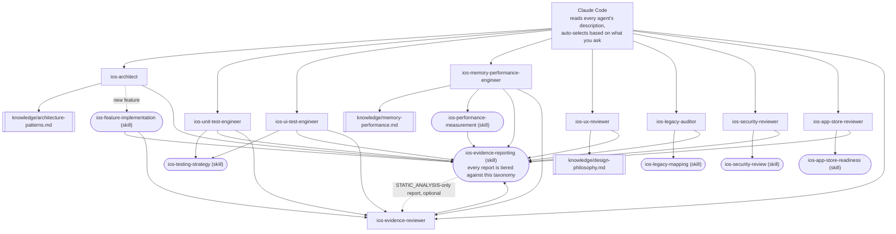

# claude-ai-agents-ios

🌐 [English](README.md) | [简体中文](README.zh-CN.md) | [Español](README.es.md) | [हिन्दी](README.hi.md) | [العربية](README.ar.md) | [Português (Brasil)](README.pt-BR.md) | [Русский](README.ru.md) | [日本語](README.ja.md) | [Français](README.fr.md) | [Deutsch](README.de.md) | [한국어](README.ko.md) | [Italiano](README.it.md) | [Türkçe](README.tr.md) | [Tiếng Việt](README.vi.md) | [Bahasa Indonesia](README.id.md)

Eine einsatzbereite Sammlung von [Claude Code](https://claude.com/claude-code)
Subagents und Skills, die Claude Code in ein spezialisiertes iOS-Entwicklungsteam
verwandelt: Architektur, Unit-Tests, UI-Tests, Speicher/Performance,
UI/UX-Review, Sicherheit, App-Store-Bereitschaft, Legacy-Codebase-Audit
und unabhängige Evidenzprüfung — jeder automatisch aufgerufen je nachdem,
was Sie fragen, ohne manuelles Umschalten.

## Was enthalten ist

### Subagents (`.claude/agents/`)

| Agent | Aufgerufen, wenn Sie... | Tools |
|---|---|---|
| `ios-architect` | ein neues Feature/Modul beginnen, fragen "wie sollte ich das strukturieren", ein Refactoring planen, zwischen MVVM/Clean/VIPER wählen, sich für Dependency Injection oder zwischen SwiftData und Core Data entscheiden | Read, Grep, Glob, Write, Edit, Skill, `ios-agent`* |
| `ios-unit-test-engineer` | nach Tests, Testabdeckung, TDD fragen, oder Code testbar machen wollen | Read, Grep, Glob, Write, Edit, Bash, Skill, `ios-agent`* |
| `ios-ui-test-engineer` | UI-Tests anfordern, einen instabilen UI-Test debuggen, oder Snapshot-Tests einrichten | Read, Grep, Glob, Write, Edit, Bash, Skill, `ios-agent`*, `ios-simulator`* |
| `ios-memory-performance-engineer` | ein Speicherleck, wachsenden Speicherverbrauch, langsames Scrollen oder langsamen Start melden | Read, Grep, Glob, Bash, Edit, Skill, `ios-agent`*, `ios-simulator`* |
| `ios-ux-reviewer` | nach einem UI/UX-Review oder einer Konsistenzprüfung des Designs fragen | Read, Grep, Glob, Skill, `ios-agent`* (nur lesend) |
| `ios-legacy-auditor` | sich in ein unbekanntes, undokumentiertes oder großes Legacy-Projekt einarbeiten | Read, Grep, Glob, Bash, Skill, `ios-agent`* (nur lesend) |
| `ios-security-reviewer` | ein Sicherheits-Review anfordern, fragen "ist das sicher", eine Schwachstellenprüfung oder ein Auth-/Session-Audit | Read, Grep, Glob, Bash, Skill, `ios-agent`* (nur lesend) |
| `ios-app-store-reviewer` | fragen "ist das einreichfertig", "wird das abgelehnt", oder die App-Store-Konformität prüfen | Read, Grep, Glob, Bash, Skill, `ios-agent`* (nur lesend) |
| `ios-evidence-reviewer` | nachdem ein anderer Agent einen Bericht erstellt hat, oder wenn Sie darum bitten, "diesen Bericht zu überprüfen"/"diese Behauptungen zu verifizieren" | Read, Grep, Glob, Skill (nur lesend) |

\* `ios-agent` und `ios-simulator` sind optionale MCP-Server von Drittanbietern — siehe
den Abschnitt „Optionale Werkzeuge" weiter unten.
Jeder Agent funktioniert eigenständig ohne sie. `ios-agent` verstärkt eine
Lektüre auf `STATIC_ANALYSIS`-Ebene mit strukturiertem Tooling — er hebt eine
Behauptung nie auf `BUILD_VERIFIED`/`TEST_VERIFIED`/`RUNTIME_VERIFIED` an, da er
die App selbst nie baut oder ausführt. `ios-simulator` baut, installiert und
startet die App tatsächlich, sodass seine Ausgabe wirklich `BUILD_VERIFIED`,
`TEST_VERIFIED` oder `RUNTIME_VERIFIED` erreichen kann — siehe die siebenstufige
Taxonomie im Abschnitt „Evidenz statt Behauptung".

### Skills (`.claude/skills/`)

| Skill | Unterstützt | Zweck |
|---|---|---|
| `ios-testing-strategy` | `ios-unit-test-engineer`, `ios-ui-test-engineer` | Konkretes Verfahren: Nahtstellen → Test-Double → Rot/Grün |
| `ios-legacy-mapping` | `ios-legacy-auditor` | Konkretes Verfahren: Inventar → Architekturerkennung → Brückenrisiko → Sicherheitssignal → Zusammenfassungsdokument |
| `ios-security-review` | `ios-security-reviewer` | 8-Bereichs-Audit: Speicherung/Datenschutz → Transport → Auth/Session → Eingabevalidierung → Deep Links → Drittanbieter-SDKs → Code-Hygiene → Berechtigungen |
| `ios-app-store-readiness` | `ios-app-store-reviewer` | Einreichungs-Audit: Datenschutz-Manifest → Exportkonformität → Berechtigungsbeschreibungen → App Tracking Transparency → Sign in with Apple-Parität → ungenutzte Berechtigungen → Ablehnungsauslöser |
| `ios-feature-implementation` | Allgemein — greift bei jeder Feature-Anfrage, arbeitet zusammen mit `ios-architect` | Bestehenden Code, Geschäftslogik, API-/Netzwerkverhalten und Sicherheitslage prüfen → erklären, bevor Dateien angefasst werden → implementieren → verifizieren (Build, Tests, Retain-Zyklen, Speicher, Performance, Sicherheit) → berichten |
| `ios-performance-measurement` | `ios-memory-performance-engineer` | Reproduzieren → auswählen, was gemessen wird → messen, bevor etwas geändert wird → ändern → unter denselben Bedingungen erneut messen → Entfernung der Instrumentierung verifizieren |
| `ios-evidence-reporting` | Alle 9 Agenten — greift, wann immer einer von ihnen eine Aufgabe abschließt | Siebenstufige Evidenz-Taxonomie (`ASSUMPTION` → `HUMAN_VERIFICATION`), die Matrix Behauptung → Mindestevidenz, und die Liste verbotener Behauptungen, damit kein Agent behauptet, etwas funktioniere, sei behoben, oder sei schneller/sicherer/thread-sicher, ohne Evidenz auf der passenden Stufe |

### Wissensbibliothek (`knowledge/`)

Tiefergehendes Referenzmaterial liegt hier statt in den Agenten-Dateien selbst,
damit jeder Agent fokussiert bleibt auf *wann handeln* und *welchem Verfahren
folgen*, während die Wissensdatei die *maßgebliche Quelle dafür ist, was zu
prüfen ist*. Agenten lesen diese mit dem `Read`-Tool, wenn relevant — keine
zusätzliche Konfiguration nötig.

| Datei | Referenziert von | Inhalt |
|---|---|---|
| `memory-performance.md` | `ios-memory-performance-engineer` | ARC-/Instruments-/Bild-/Nebenläufigkeits-Grundlagen plus Framework-spezifische Muster (RxSwift, WKWebView, PDFKit, Core Data, Firebase, CocoaPods, Keychain, Drittanbieter-Präsentationsbibliotheken, UICollectionView/UITableView, SwiftUI/UIKit-Brücken, AVFoundation, CoreLocation, URLSession) |
| `architecture-patterns.md` | `ios-architect` | Muster-/Entscheidungskriterien: MVVM/Clean/VIPER, Swift Concurrency, Modularisierung, Persistenz, Navigation, Dependency Injection, sicherheitsbewusste Struktur |
| `design-philosophy.md` | `ios-ux-reviewer` | Apple Human Interface Guidelines, Dieter Rams' zehn Prinzipien angewendet auf iOS, Nielsen-Norman-Group-Heuristiken, und die Liste der genannten Referenzen |

### Vorlage

- `CLAUDE.md.template` — in das Wurzelverzeichnis Ihres Projekts als `CLAUDE.md`
  kopieren und die Platzhalter ausfüllen (oder `ios-legacy-auditor` den
  Architekturabschnitt für einen unbekannten Codebase generieren lassen).

## Installation

Kopieren Sie, was Sie brauchen, in das Wurzelverzeichnis Ihres iOS-Projekts:

```bash
# Aus diesem Repo in Ihr Projekt kopieren:
mkdir -p /path/to/your-ios-project/.claude
cp -r .claude/agents /path/to/your-ios-project/.claude/
cp -r .claude/skills /path/to/your-ios-project/.claude/
cp -r knowledge /path/to/your-ios-project/knowledge
cp CLAUDE.md.template /path/to/your-ios-project/CLAUDE.md   # dann bearbeiten
```

```bash
# Oder verlinken statt kopieren, um über mehrere Projekte hinweg synchron zu bleiben:
ln -s /path/to/claude-ai-agents-ios/.claude/agents /path/to/your-ios-project/.claude/agents
ln -s /path/to/claude-ai-agents-ios/.claude/skills /path/to/your-ios-project/.claude/skills
ln -s /path/to/claude-ai-agents-ios/knowledge /path/to/your-ios-project/knowledge
```

Der Ordner `knowledge/` muss im Wurzelverzeichnis Ihres Projekts liegen
(neben `.claude/`) — Agenten referenzieren ihn über diesen relativen Pfad.

Für den persönlichen (projektübergreifenden) Gebrauch statt pro Projekt,
kopieren Sie stattdessen nach `~/.claude/agents/` und `~/.claude/skills/` —
Claude Code führt persönliche und projektweite Agenten/Skills automatisch
zusammen. Beachten Sie, dass `knowledge/` über einen repo-relativen Pfad
referenziert wird, sodass Sie für den persönlichen Gebrauch trotzdem
`knowledge/` im Wurzelverzeichnis jedes Projekts benötigen (am einfachsten
per Symlink pro Projekt).

Nichts weiter ist erforderlich — Claude Code liest das `description`-Frontmatter
jedes Agenten und ruft automatisch den richtigen basierend auf Ihrer Anfrage
auf. Siehe „Optionale Werkzeuge" unten für zwei MCP-Server von Drittanbietern,
die die Evidenzstufe mehrerer Agenten verstärken, ohne die alles oben
Genannte trotzdem eigenständig funktioniert.

## Optionale Werkzeuge: Statische Analyse & Simulatorsteuerung

Zwei Server aus [`ios-agent-skill`](https://github.com/Nagarjuna2997/ios-agent-skill)
(MIT-lizenziert, nicht mit diesem Repo verbunden) geben mehreren Agenten oben
die Möglichkeit, eine Prüfung tatsächlich *auszuführen*, statt nur Code zu
lesen. Keiner der beiden ist erforderlich — jeder Agent funktioniert bereits
ohne sie und fällt auf Lektüre der Stufe `STATIC_ANALYSIS` und manuell
beschriebene Verfahren zurück.

### `ios-agent-mcp` — statische Analyse (veröffentlicht, empfohlen)

Zehn nur lesende Tools, die ein Swift-Projekt scannen und strukturierte
Befunde (Datei, Zeile, Konsequenz, Fix) zurückgeben für Nebenläufigkeit,
Architektur, SwiftUI-Muster, Verfügbarkeits-Guards, App-Store-Bereitschaft,
Speicher, Sicherheit, Tests und Performance — siehe die
[Werkzeugliste](https://github.com/Nagarjuna2997/ios-agent-skill/tree/main/mcp-server)
für Details. Es ist rein lesend auf dem Dateisystem, ohne Netzwerkzugriff.

Die `.mcp.json` dieses Repos deklariert ihn bereits, sodass das Kopieren von
`.mcp.json` in Ihr Projekt neben `.claude/` der einzige Schritt ist:

```bash
cp .mcp.json /path/to/your-ios-project/.mcp.json
```

Claude Code wird anbieten, den projektbezogenen Server bei der ersten
Relevanz zu aktivieren; `npx` lädt das Paket bei der ersten Nutzung herunter,
keine globale Installation nötig.

### `ios-simulator-mcp` — Simulatorsteuerung (früh, nur Quellcode)

Werkzeuge zum Bauen, Testen, Installieren, Starten, für Deep Links und
Screenshots auf einem gestarteten iOS-Simulator — das Laufzeit-Gegenstück zum
statischen Analysewerkzeug oben. Zum Zeitpunkt der Erstellung ist es
**v0.1.0, noch nicht auf npm veröffentlicht und früh** (die eigene
Dokumentation nennt es "die erste sichere Scheibe"), also als etwas zum
Ausprobieren behandeln, nicht als etwas, worauf man sich verlässt:

```bash
git clone https://github.com/Nagarjuna2997/ios-agent-skill.git
cd ios-agent-skill/ios-simulator-mcp
npm install && npm run build
```

Fügen Sie ihn dann zur `.mcp.json` Ihres Projekts (oder Ihrer persönlichen
MCP-Konfiguration) unter dem Servernamen `ios-simulator` hinzu, mit Verweis
auf den gebauten Pfad:

```jsonc
{
  "mcpServers": {
    "ios-simulator": {
      "command": "node",
      "args": ["/absolute/path/to/ios-agent-skill/ios-simulator-mcp/dist/index.js"]
    }
  }
}
```

Erfordert macOS und die Xcode-Kommandozeilenwerkzeuge. Wenn Sie den Server
anders als `ios-simulator` benennen, aktualisieren Sie die
`mcp__ios-simulator__*`-Tool-Zuweisung in `ios-ui-test-engineer.md` und
`ios-memory-performance-engineer.md` entsprechend.

## Wie alles zusammenpasst



Es gibt keinen Router oder Orchestrator zu konfigurieren — Claude Codes eigener
Beschreibungsabgleich *ist* die Verteilungsschicht. Jeder Agent ist ein
Endpunkt, der entweder eine `knowledge/*.md`-Datei für tiefgehendes
Referenzmaterial liest, einem `Skill` für ein gemeinsames Verfahren folgt,
oder beides, und jeder Pfad konvergiert am Ende zum selben
Evidenzberichts-Standard. `ios-evidence-reviewer` ist die einzige Ausnahme
vom „Endpunkt": Er liest den fertigen Bericht eines *anderen* Agenten und
stuft jede Behauptung herab, die die gezeigte Evidenz nicht tatsächlich
stützt, dann schließt der korrigierte Bericht mit demselben Statusblock-Format
wieder ab. `ios-feature-implementation`, `ios-memory-performance-engineer`,
`ios-unit-test-engineer`, und `ios-ui-test-engineer` leiten automatisch durch
ihn, wann immer ihr eigener Bericht `BUILD_VERIFIED` oder höher erreicht — der
Agent, der den Build/Test/die Messung ausgeführt hat, ist nicht der Einzige,
der prüft, ob sein Bericht ehrlich darüber ist.

## Wie sie einander übergeben

Ein typischer Ablauf, obwohl Sie nichts davon je namentlich aufrufen müssen:

1. **Unbekannter/undokumentierter Codebase?** Beginnen Sie mit
   `ios-legacy-auditor` — er kartiert die tatsächliche Architektur und
   erstellt eine Zusammenfassung, die Sie in `CLAUDE.md` ablegen können,
   bevor irgendetwas anderes den Code berührt.
2. **Neues Feature/Modul?** `ios-architect` schlägt eine Struktur vor und
   kennzeichnet, ob das Design unit-testbar ist; `ios-feature-implementation`
   treibt dann den tatsächlichen Build voran — indem zuerst die bestehende
   Geschäftslogik geprüft wird, der Plan erklärt wird, bevor Dateien
   angefasst werden, gemäß der vereinbarten Struktur implementiert wird, und
   verifiziert wird (Build, Tests, Speicher, Performance), bevor als
   abgeschlossen berichtet wird.
3. **Tests benötigt?** `ios-unit-test-engineer` für Logik,
   `ios-ui-test-engineer` für Nutzerabläufe — beide folgen derselben
   Nahtstellen-→-Rot/Grün-Disziplin aus `ios-testing-strategy`.
4. **Neuer oder geänderter Bildschirm?** `ios-ux-reviewer` prüft ihn gegen
   Apples Human Interface Guidelines und die zugrundeliegende
   Design-Philosophie, bevor Sie ihn ausliefern.
5. **Etwas fühlt sich langsam an oder verliert Speicher?**
   `ios-memory-performance-engineer` liest zuerst den Code nach statischen
   Ursachen und gibt Ihnen das exakte Instruments-Verfahren, wenn es nicht
   allein durch Lesen gefunden werden kann.
6. **Sie möchten eine Sicherheitsprüfung?** `ios-security-reviewer` führt ein
   dediziertes 8-Bereichs-Audit durch (Speicherung, Transport,
   Authentifizierung, Eingabevalidierung, Deep Links, Abhängigkeiten,
   Code-Hygiene, Berechtigungen); `ios-architect`, `ios-legacy-auditor`, und
   `ios-feature-implementation` kennzeichnen ebenfalls leichtere, gezielte
   Sicherheitsbedenken als Teil ihrer eigenen Arbeit und verweisen hierher
   für alles, was ein vollständiges Audit rechtfertigt.
7. **Kurz vor der Einreichung im App Store?** `ios-app-store-reviewer` prüft
   die im Code sichtbaren Einreichungsblocker (Datenschutz-Manifest,
   Berechtigungsbeschreibungen, Exportkonformität, Sign in with
   Apple-Parität) — das ist ein eigenständiges Anliegen gegenüber
   `ios-security-reviewer`, auch wenn sie sich gewisse Bereiche teilen
   (Berechtigungen, Transportsicherheit), also führen Sie beide vor einer
   Veröffentlichung aus, wenn eines von beiden relevant ist.
8. **Bericht erreicht `BUILD_VERIFIED` oder höher?** `ios-evidence-reviewer`
   prüft ihn, bevor er als abgeschlossen gilt. `ios-feature-implementation`,
   `ios-memory-performance-engineer`, `ios-unit-test-engineer`, und
   `ios-ui-test-engineer` — die Agenten, die eigenständig eine
   Build-/Test-/Laufzeit-/Mess-Behauptung erzeugen können, nicht nur einen
   statischen Befund — leiten jeweils automatisch als letzten Schritt durch
   ihn; der Bericht jedes anderen Agenten kann ihm auch direkt übergeben
   werden.

## Evidenz statt Behauptung

KI-Zuversicht ist keine Evidenz. KI-Argumentation ist keine Laufzeit-Evidenz.
Eine Codeänderung ist nicht automatisch ein verifizierter Fix. Jeder Agent in
diesem Repo beendet seinen Bericht mit dem Statusblock des `ios-evidence-reporting`-Skills
statt mit einem bloßen „Fertig! Es funktioniert", und jede Zeile in diesem
Block wird gegen eine von sieben Evidenzstufen eingeordnet, von der
schwächsten zur stärksten:

`ASSUMPTION` → `STATIC_ANALYSIS` → `BUILD_VERIFIED` → `TEST_VERIFIED`
→ `RUNTIME_VERIFIED` → `RUNTIME_MEASURED` → `HUMAN_VERIFICATION`

Eine Behauptung wird nie auf einer höheren Stufe berichtet, als die Evidenz
tatsächlich erreicht hat. Quellcode zu lesen (einschließlich der
strukturierten Ausgabe eines statischen MCP-Analysewerkzeugs) ist
`STATIC_ANALYSIS`, Punkt — egal ob ein Mensch oder ein Werkzeug die Lektüre
vorgenommen hat — es wird nicht zu stärkerer Evidenz, nur weil ein Werkzeug
sie erzeugt hat, und es kann niemals „kein Leck existiert" oder „Speicher hat
sich verbessert" stützen. Diese benötigen speziell `RUNTIME_MEASURED`: eine
tatsächliche Zahl aus einer tatsächlichen Ausführung der App (Instruments,
MetricKit, `os_signpost`), über die Schleife Reproduzieren → Baseline →
Messen → Ändern → Bauen → Testen → Erneut messen → Vergleichen → Berichten
von `ios-performance-measurement`. Eine Behauptung, die die Agenten dieses
Repos nie ohne passende Evidenz machen werden: "behoben", "optimiert",
"schneller", "leckfrei", "thread-sicher", "sicher", oder
"produktionsreif" (eine bereichsübergreifende Behauptung, die keine
einzelne Agenten-Evidenz allein abdeckt) — siehe die Matrix Behauptung →
Mindestevidenz von `ios-evidence-reporting` für die vollständige Liste und
die präzisen sprachlichen Alternativen.

Da der Agent, der etwas implementiert, nicht die alleinige Autorität darüber
sein sollte, ob sein eigener Bericht ehrlich ist, überprüft
`ios-evidence-reviewer` die Behauptungen eines fertigen Berichts unabhängig
gegen dieselbe Matrix und stuft alles Unbelegte herab, bevor es als
endgültig präsentiert wird — siehe „Wie alles zusammenpasst" oben.

## Design-Philosophie

`ios-ux-reviewer` stützt sich insbesondere auf benannte Quellen statt auf
behauptetem Geschmack: Apples Human Interface Guidelines, Dieter Rams' zehn
Prinzipien guten Designs, Don Normans *The Design of Everyday Things*,
die Usability-Heuristiken der Nielsen Norman Group, und *Refactoring UI*
für konkrete visuelle Urteile. Siehe `knowledge/design-philosophy.md` dafür,
wie jede davon spezifisch auf iOS angewendet wird.

## Pflege dieses Repos

`scripts/audit-agents.sh` führt die mechanischen Prüfungen aus, denen jede
Agenten-/Skill-Datei während der Entwicklung unterzogen wird: Das
`name:`-Frontmatter stimmt mit dem Datei- oder Verzeichnisnamen überein,
`description:` trägt eine echte, in Anführungszeichen gesetzte
Auslösephrase, eine Nur-Lese-Behauptung im Text steht nicht neben einer
`Write`-/`Edit`-Zuweisung, Code-Blöcke schließen korrekt, jede Backtick-`ios-*`-Referenz
im gesamten Repo löst zu einem echten Agenten oder Skill auf, und keine
Datei trägt noch die alte `(static)`/`(executed)`-Bewertung statt der
aktuellen siebenstufigen Taxonomie. Es ist nicht-blockierend — Befunde sind
für einen Menschen zum Handeln gedacht, keine Sperre.

```bash
./scripts/audit-agents.sh
```
