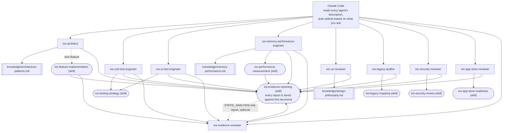

# claude-ai-agents-ios

🌐 [English](README.md) | [简体中文](README.zh-CN.md) | [Español](README.es.md) | [हिन्दी](README.hi.md) | [العربية](README.ar.md) | [Português (Brasil)](README.pt-BR.md) | [Русский](README.ru.md) | [日本語](README.ja.md) | [Français](README.fr.md) | [Deutsch](README.de.md) | [한국어](README.ko.md) | [Italiano](README.it.md) | [Türkçe](README.tr.md) | [Tiếng Việt](README.vi.md) | [Bahasa Indonesia](README.id.md)

Un conjunto listo para usar de subagentes y Skills de [Claude Code](https://claude.com/claude-code)
que convierte a Claude Code en un equipo especializado de desarrollo iOS:
arquitectura, pruebas unitarias, pruebas de UI, memoria/rendimiento,
revisión de UI/UX, seguridad, preparación para App Store, auditoría de
código heredado y revisión independiente de evidencia — cada uno se
invoca automáticamente según lo que pidas, sin cambiar manualmente entre
ellos.

## Qué incluye

### Subagentes (`.claude/agents/`)

| Agente | Se invoca cuando... | Herramientas |
|---|---|---|
| `ios-architect` | inicias una nueva función/módulo, preguntas "cómo debería estructurar esto", planeas una refactorización, eliges entre MVVM/Clean/VIPER, decides sobre DI o SwiftData vs. Core Data | Read, Grep, Glob, Write, Edit, Skill, `ios-agent`* |
| `ios-unit-test-engineer` | pides pruebas, cobertura de pruebas, TDD, o hacer el código comprobable | Read, Grep, Glob, Write, Edit, Bash, Skill, `ios-agent`* |
| `ios-ui-test-engineer` | pides pruebas de UI, depurar una prueba de UI inestable, o configurar pruebas de snapshot | Read, Grep, Glob, Write, Edit, Bash, Skill, `ios-agent`*, `ios-simulator`* |
| `ios-memory-performance-engineer` | reportas una fuga, memoria creciente, desplazamiento lento, o arranque lento | Read, Grep, Glob, Bash, Edit, Skill, `ios-agent`*, `ios-simulator`* |
| `ios-ux-reviewer` | pides una revisión de UI/UX o una comprobación de consistencia de diseño | Read, Grep, Glob, Skill, `ios-agent`* (solo lectura) |
| `ios-legacy-auditor` | te incorporas a un proyecto desconocido, sin documentar, o a una base de código heredada grande | Read, Grep, Glob, Bash, Skill, `ios-agent`* (solo lectura) |
| `ios-security-reviewer` | pides una revisión de seguridad, "¿esto es seguro?", una comprobación de vulnerabilidades, o una auditoría de autenticación/sesión | Read, Grep, Glob, Bash, Skill, `ios-agent`* (solo lectura) |
| `ios-app-store-reviewer` | preguntas "¿está listo para enviarse?", "¿esto será rechazado?", o quieres comprobar el cumplimiento de App Store | Read, Grep, Glob, Bash, Skill, `ios-agent`* (solo lectura) |
| `ios-evidence-reviewer` | otro agente produce un informe, o pides "revisa este informe de nuevo"/"verifica estas afirmaciones" | Read, Grep, Glob, Skill (solo lectura) |

\* `ios-agent` y `ios-simulator` son servidores MCP de terceros opcionales — ver
[Herramientas opcionales](#herramientas-opcionales-análisis-estático-y-control-del-simulador) más abajo.
Cada agente funciona de forma independiente sin ellos. `ios-agent` refuerza
una lectura de nivel `STATIC_ANALYSIS` con herramientas estructuradas — nunca
eleva una afirmación a `BUILD_VERIFIED`/`TEST_VERIFIED`/`RUNTIME_VERIFIED`,
ya que nunca compila ni ejecuta la app por sí mismo. `ios-simulator` sí
compila, instala y lanza la app, por lo que su salida puede ganar
legítimamente `BUILD_VERIFIED`, `TEST_VERIFIED`, o `RUNTIME_VERIFIED` — ver
la taxonomía de siete niveles en [La evidencia por encima de la afirmación](#la-evidencia-por-encima-de-la-afirmación).

### Skills (`.claude/skills/`)

| Skill | Respalda a | Propósito |
|---|---|---|
| `ios-testing-strategy` | `ios-unit-test-engineer`, `ios-ui-test-engineer` | Procedimiento concreto: costuras → doble de prueba → rojo/verde |
| `ios-legacy-mapping` | `ios-legacy-auditor` | Procedimiento concreto: inventario → detectar arquitectura → riesgo de puentes → señal de seguridad → documento resumen |
| `ios-security-review` | `ios-security-reviewer` | Auditoría de 8 áreas: almacenamiento/privacidad → transporte → autenticación/sesión → validación de entrada → deep links → SDKs de terceros → higiene de código → entitlements |
| `ios-app-store-readiness` | `ios-app-store-reviewer` | Auditoría previa al envío: manifiesto de privacidad → cumplimiento de exportación → descripciones de permisos → App Tracking Transparency → paridad de Sign in with Apple → entitlements sin usar → factores de rechazo |
| `ios-feature-implementation` | General — se activa con cualquier solicitud de función, funciona junto a `ios-architect` | Inspeccionar el código existente, la lógica de negocio, el comportamiento de API/conectividad, y la postura de seguridad → explicar antes de tocar archivos → implementar → verificar (compilación, pruebas, ciclos de retención, memoria, rendimiento, seguridad) → informar |
| `ios-performance-measurement` | `ios-memory-performance-engineer` | Reproducir → elegir qué medir → medir antes de cambiar nada → cambiar → volver a medir con las mismas condiciones → verificar que la instrumentación se eliminó |
| `ios-evidence-reporting` | Los 9 agentes — se activa cada vez que cualquiera de ellos concluye una tarea | Taxonomía de evidencia de siete niveles (`ASSUMPTION` → `HUMAN_VERIFICATION`), la matriz de afirmación → evidencia mínima, y la lista de afirmaciones prohibidas, para que ningún agente afirme que algo funciona, está arreglado, o es más rápido/seguro/thread-safe sin evidencia del nivel correspondiente |

### Biblioteca de conocimiento (`knowledge/`)

El material de referencia profundo vive aquí en lugar de dentro del cuerpo
de los agentes, para que cada agente se mantenga centrado en *cuándo actuar*
y *qué procedimiento seguir*, mientras el archivo de conocimiento es la
*fuente de verdad sobre qué comprobar*. Los agentes leen estos archivos con
la herramienta `Read` cuando es relevante — no requiere configuración
adicional.

| Archivo | Referenciado por | Contenido |
|---|---|---|
| `memory-performance.md` | `ios-memory-performance-engineer` | Fundamentos de ARC/Instruments/imágenes/concurrencia además de patrones específicos de frameworks (RxSwift, WKWebView, PDFKit, Core Data, Firebase, CocoaPods, Keychain, bibliotecas de presentación de terceros, UICollectionView/UITableView, puentes SwiftUI/UIKit, AVFoundation, CoreLocation, URLSession) |
| `architecture-patterns.md` | `ios-architect` | Criterios de patrón/decisión: MVVM/Clean/VIPER, Swift Concurrency, modularización, persistencia, navegación, DI, estructura consciente de la seguridad |
| `design-philosophy.md` | `ios-ux-reviewer` | Apple HIG, los diez principios de Dieter Rams aplicados a iOS, heurísticas de Nielsen Norman Group, y la lista de referencias con nombre |

### Plantilla

- `CLAUDE.md.template` — cópiala a la raíz de tu proyecto como `CLAUDE.md`
  y completa los marcadores de posición (o deja que `ios-legacy-auditor`
  genere la sección de arquitectura por ti en una base de código
  desconocida).

## Instalación

Copia lo que necesites a la raíz del repositorio de tu proyecto iOS:

```bash
# Desde este repositorio, copia a tu proyecto:
mkdir -p /path/to/your-ios-project/.claude
cp -r .claude/agents /path/to/your-ios-project/.claude/
cp -r .claude/skills /path/to/your-ios-project/.claude/
cp -r knowledge /path/to/your-ios-project/knowledge
cp CLAUDE.md.template /path/to/your-ios-project/CLAUDE.md   # luego edítalo
```

```bash
# O crea un enlace simbólico en lugar de copiar, para mantenerte sincronizado entre varios proyectos:
ln -s /path/to/claude-ai-agents-ios/.claude/agents /path/to/your-ios-project/.claude/agents
ln -s /path/to/claude-ai-agents-ios/.claude/skills /path/to/your-ios-project/.claude/skills
ln -s /path/to/claude-ai-agents-ios/knowledge /path/to/your-ios-project/knowledge
```

La carpeta `knowledge/` debe estar en la raíz del repositorio de tu
proyecto (junto a `.claude/`) — los agentes la referencian mediante esa
ruta relativa.

Para uso personal (entre varios proyectos) en lugar de por proyecto,
copia en `~/.claude/agents/` y `~/.claude/skills/` — Claude Code combina
automáticamente los agentes/skills personales y los de nivel de proyecto.
Ten en cuenta que `knowledge/` se referencia como una ruta relativa al
repositorio, así que para uso personal seguirías necesitando `knowledge/`
presente en la raíz de cada proyecto (lo más simple es enlazarlo de forma
simbólica por proyecto).

No se requiere nada más — Claude Code lee el frontmatter `description`
de cada agente e invoca el correcto automáticamente según tu solicitud.
Ver [Herramientas opcionales](#herramientas-opcionales-análisis-estático-y-control-del-simulador)
más abajo para dos servidores MCP de terceros que refuerzan el nivel de
evidencia de varios agentes, sin los cuales todo lo anterior sigue
funcionando por sí solo.

## Herramientas opcionales: análisis estático y control del simulador

Dos servidores de [`ios-agent-skill`](https://github.com/Nagarjuna2997/ios-agent-skill)
(con licencia MIT, no afiliado a este repositorio) dan a varios agentes
de arriba una forma de *ejecutar* una comprobación en lugar de solo leer
el código para ello. Ninguno es obligatorio — cada agente ya funciona sin
ellos, recurriendo a lecturas de nivel `STATIC_ANALYSIS` y procedimientos
descritos manualmente.

### `ios-agent-mcp` — análisis estático (publicado, recomendado)

Diez herramientas de solo lectura que analizan un proyecto Swift y
devuelven hallazgos estructurados (archivo, línea, consecuencia, arreglo)
para concurrencia, arquitectura, patrones de SwiftUI, guardas de
disponibilidad, preparación para App Store, memoria, seguridad, pruebas y
rendimiento — ver la [lista de herramientas](https://github.com/Nagarjuna2997/ios-agent-skill/tree/main/mcp-server)
para más detalles. Es de solo lectura en el sistema de archivos, sin
acceso a red.

El `.mcp.json` de este repositorio ya lo declara, así que copiar
`.mcp.json` a tu proyecto junto a `.claude/` es el único paso:

```bash
cp .mcp.json /path/to/your-ios-project/.mcp.json
```

Claude Code ofrecerá activar el servidor de ámbito de proyecto la primera
vez que sea relevante; `npx` descarga el paquete en el primer uso, sin
instalación global necesaria.

### `ios-simulator-mcp` — control del simulador (temprano, solo desde el código fuente)

Herramientas de compilación, prueba, instalación, lanzamiento, deep link
y captura de pantalla para un Simulador de iOS iniciado — la contraparte
en tiempo de ejecución del analizador estático anterior. A la fecha de
escritura es **v0.1.0, aún no publicado en npm, y temprano** (su propia
documentación lo llama "la primera porción segura"), así que trátalo
como algo que probar, no algo de lo que depender:

```bash
git clone https://github.com/Nagarjuna2997/ios-agent-skill.git
cd ios-agent-skill/ios-simulator-mcp
npm install && npm run build
```

Luego agrégalo al `.mcp.json` de tu proyecto (o a la configuración MCP
personal) bajo el nombre de servidor `ios-simulator`, apuntando a la ruta
compilada:

```jsonc
{
  "mcpServers": {
    "ios-simulator": {
      "command": "node",
      "args": ["/absolute/path/to/ios-agent-skill/ios-simulator-mcp/dist/index.js"]
    }
  }
}
```

Requiere macOS y las herramientas de línea de comandos de Xcode. Si
nombras al servidor de forma distinta a `ios-simulator`, actualiza el
otorgamiento de herramienta `mcp__ios-simulator__*` en
`ios-ui-test-engineer.md` y `ios-memory-performance-engineer.md` para
que coincida.

## Cómo encaja todo



No hay un enrutador u orquestador que configurar — la propia
coincidencia de descripciones de Claude Code *es* la capa de despacho.
Cada agente es una hoja que lee un archivo `knowledge/*.md` para
material de referencia profundo, sigue una `Skill` para un procedimiento
compartido, o ambas cosas, y cada ruta converge en el mismo estándar de
reporte de evidencia al final. `ios-evidence-reviewer` es la única
excepción a "hoja": lee el informe terminado de *otro* agente y rebaja
cualquier afirmación que la evidencia mostrada no respalde realmente,
luego el informe corregido se cierra con el mismo formato de bloque de
estado de nuevo. `ios-feature-implementation`, `ios-memory-performance-engineer`,
`ios-unit-test-engineer`, y `ios-ui-test-engineer` pasan por él
automáticamente cada vez que su propio informe alcanza `BUILD_VERIFIED`
o superior — el agente que ejecutó la compilación/prueba/medición no es
el único que verifica si su informe es honesto al respecto.

## Cómo se entregan el trabajo entre sí

Un flujo típico, aunque nunca necesitas invocar nada de esto por nombre:

1. **¿Base de código desconocida/sin documentar?** Empieza con
   `ios-legacy-auditor` — mapea la arquitectura real y produce un
   resumen que puedes colocar en `CLAUDE.md`, antes de que nada más
   toque el código.
2. **¿Función/módulo nuevo?** `ios-architect` propone la estructura y
   señala si el diseño es comprobable con pruebas unitarias;
   `ios-feature-implementation` entonces impulsa la construcción real
   — inspeccionando primero la lógica de negocio existente, explicando
   el plan antes de tocar archivos, implementando según la estructura
   acordada, y verificando (compilación, pruebas, memoria, rendimiento)
   antes de informar que está terminado.
3. **¿Necesitas pruebas?** `ios-unit-test-engineer` para lógica,
   `ios-ui-test-engineer` para flujos de usuario — ambos siguen la
   misma disciplina de costuras → rojo/verde de `ios-testing-strategy`.
4. **¿Pantalla nueva o modificada?** `ios-ux-reviewer` la comprueba
   contra las Human Interface Guidelines de Apple y la filosofía de
   diseño subyacente antes de que la envíes.
5. **¿Algo se siente lento o tiene fugas de memoria?** `ios-memory-performance-engineer`
   lee el código en busca de causas estáticas primero, y te da el
   procedimiento exacto de Instruments cuando no se puede encontrar
   solo leyendo.
6. **¿Quieres una comprobación de seguridad?** `ios-security-reviewer`
   ejecuta una auditoría dedicada de 8 áreas (almacenamiento, transporte,
   autenticación, validación de entrada, deep links, dependencias,
   higiene de código, entitlements); `ios-architect`, `ios-legacy-auditor`,
   y `ios-feature-implementation` también señalan preocupaciones de
   seguridad más ligeras y acotadas como parte de su propio trabajo, y
   apuntan aquí para cualquier cosa que amerite una auditoría completa.
7. **¿A punto de enviar a la App Store?** `ios-app-store-reviewer`
   comprueba los bloqueadores de envío visibles en el código (manifiesto
   de privacidad, descripciones de permisos, cumplimiento de
   exportación, paridad de Sign in with Apple) — es una preocupación
   separada de `ios-security-reviewer` aunque comparten algo de terreno
   (entitlements, seguridad de transporte), así que ejecuta ambos antes
   de un lanzamiento si alguno es relevante.
8. **¿Informe que alcanza `BUILD_VERIFIED` o más alto?**
   `ios-evidence-reviewer` lo comprueba antes de darlo por terminado.
   `ios-feature-implementation`, `ios-memory-performance-engineer`,
   `ios-unit-test-engineer`, y `ios-ui-test-engineer` — los agentes que
   pueden producir de forma independiente una afirmación de
   compilación/prueba/tiempo de ejecución/medición, no solo un hallazgo
   estático — pasan por él automáticamente como su último paso;
   el informe de cualquier otro agente también se le puede entregar
   directamente.

## La evidencia por encima de la afirmación

La confianza de la IA no es evidencia. El razonamiento de la IA no es
evidencia en tiempo de ejecución. Un cambio de código no es
automáticamente un arreglo verificado. Cada agente en este repositorio
termina su informe con el bloque de estado de la skill
`ios-evidence-reporting` en lugar de un simple "¡Listo! Funciona," y
cada línea de ese bloque está clasificada según uno de siete niveles de
evidencia, del más débil al más fuerte:

`ASSUMPTION` → `STATIC_ANALYSIS` → `BUILD_VERIFIED` → `TEST_VERIFIED`
→ `RUNTIME_VERIFIED` → `RUNTIME_MEASURED` → `HUMAN_VERIFICATION`

Una afirmación nunca se reporta en un nivel más alto que el que la
evidencia realmente alcanzó. Leer el código fuente (incluyendo la
salida estructurada de un analizador estático MCP) es `STATIC_ANALYSIS`,
punto final, ya sea que lo haya leído un humano o una herramienta — no
se convierte en evidencia más fuerte solo porque una herramienta la
produjo, y nunca puede respaldar "no existe fuga" o "la memoria
mejoró." Esas afirmaciones específicamente requieren `RUNTIME_MEASURED`:
un número real proveniente de ejecutar realmente la app (Instruments,
MetricKit, `os_signpost`), mediante el ciclo de `ios-performance-measurement`
de reproducir → línea base → medir → cambiar → compilar → probar → medir
de nuevo → comparar → informar. Una afirmación que los agentes de este
repositorio nunca harán sin la evidencia correspondiente: "arreglado,"
"optimizado," "más rápido," "sin fugas," "thread-safe," "seguro," o
"listo para producción" (una afirmación transversal que la evidencia de
ningún agente individual cubre por sí sola) — ver la matriz de afirmación
→ evidencia mínima de `ios-evidence-reporting` para la lista completa y
las alternativas de lenguaje preciso.

Debido a que el agente que implementa algo no debería ser la única
autoridad sobre si su propio informe es honesto, `ios-evidence-reviewer`
vuelve a comprobar de forma independiente las afirmaciones de un informe
terminado contra esa misma matriz y rebaja cualquier cosa no respaldada
antes de que se presente como final — ver "Cómo encaja todo" más arriba.

## Filosofía de diseño

`ios-ux-reviewer` en particular está fundamentado en fuentes con nombre
en lugar de en gustos afirmados: las Human Interface Guidelines de
Apple, los diez principios de buen diseño de Dieter Rams, *El diseño de
los objetos cotidianos* de Don Norman, las heurísticas de usabilidad de
Nielsen Norman Group, y *Refactoring UI* para decisiones concretas de
juicio visual. Ver `knowledge/design-philosophy.md` para cómo se aplica
cada uno específicamente a iOS.

## Mantenimiento de este repositorio

`scripts/audit-agents.sh` ejecuta las comprobaciones mecánicas a las que
se somete cada archivo de agente/skill durante el desarrollo: el
`name:` del frontmatter coincide con el nombre de archivo o directorio,
`description:` lleva una frase disparadora entre comillas real, una
afirmación de solo lectura en el cuerpo no está junto a un otorgamiento
`Write`/`Edit`, los bloques de código cierran correctamente, cada
referencia entre comillas invertidas `ios-*` en todo el repositorio se
resuelve a un agente o skill real, y ningún archivo sigue usando la
antigua clasificación `(static)`/`(executed)` en lugar de la taxonomía
actual de siete niveles. No bloquea nada — los hallazgos son para que
una persona actúe sobre ellos, no una puerta de bloqueo.

```bash
./scripts/audit-agents.sh
```
