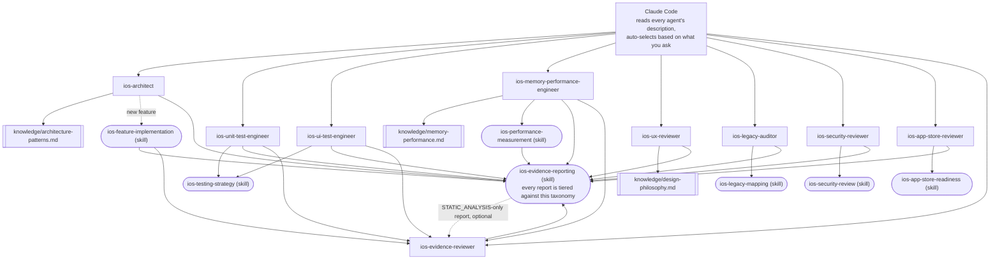

# claude-ai-agents-ios

🌐 [English](README.md) | [简体中文](README.zh-CN.md) | [Español](README.es.md) | [हिन्दी](README.hi.md) | [العربية](README.ar.md) | [Português (Brasil)](README.pt-BR.md) | [Русский](README.ru.md) | [日本語](README.ja.md) | [Français](README.fr.md) | [Deutsch](README.de.md) | [한국어](README.ko.md) | [Italiano](README.it.md) | [Türkçe](README.tr.md) | [Tiếng Việt](README.vi.md) | [Bahasa Indonesia](README.id.md)

Un ensemble prêt à l'emploi de subagents et de Skills [Claude Code](https://claude.com/claude-code)
qui transforme Claude Code en une équipe spécialisée de développement iOS :
architecture, tests unitaires, tests d'interface, mémoire/performance,
revue UI/UX, sécurité, conformité App Store, audit de code hérité,
et revue indépendante des preuves — chacun invoqué automatiquement selon
votre demande, sans changement manuel.

## Contenu

### Subagents (`.claude/agents/`)

| Agent | Invoqué quand vous... | Outils |
|---|---|---|
| `ios-architect` | démarrez une nouvelle fonctionnalité/module, demandez "comment structurer ceci", planifiez une refonte, choisissez entre MVVM/Clean/VIPER, décidez de l'injection de dépendances ou entre SwiftData et Core Data | Read, Grep, Glob, Write, Edit, Skill, `ios-agent`* |
| `ios-unit-test-engineer` | demandez des tests, une couverture de tests, du TDD, ou à rendre le code testable | Read, Grep, Glob, Write, Edit, Bash, Skill, `ios-agent`* |
| `ios-ui-test-engineer` | demandez des tests d'interface, déboguez un test UI instable, ou configurez des tests de snapshot | Read, Grep, Glob, Write, Edit, Bash, Skill, `ios-agent`*, `ios-simulator`* |
| `ios-memory-performance-engineer` | signalez une fuite mémoire, une croissance mémoire, un défilement lent, ou un lancement lent | Read, Grep, Glob, Bash, Edit, Skill, `ios-agent`*, `ios-simulator`* |
| `ios-ux-reviewer` | demandez une revue UI/UX ou une vérification de cohérence de design | Read, Grep, Glob, Skill, `ios-agent`* (lecture seule) |
| `ios-legacy-auditor` | découvrez un projet non familier, non documenté, ou un ancien code volumineux | Read, Grep, Glob, Bash, Skill, `ios-agent`* (lecture seule) |
| `ios-security-reviewer` | demandez une revue de sécurité, "est-ce sécurisé", une vérification de vulnérabilité, ou un audit d'authentification/session | Read, Grep, Glob, Bash, Skill, `ios-agent`* (lecture seule) |
| `ios-app-store-reviewer` | demandez "est-ce prêt à soumettre", "vais-je être rejeté", ou à vérifier la conformité App Store | Read, Grep, Glob, Bash, Skill, `ios-agent`* (lecture seule) |
| `ios-evidence-reviewer` | après qu'un autre agent produit un rapport, ou demandez à "revérifier ce rapport"/"vérifier ces affirmations" | Read, Grep, Glob, Skill (lecture seule) |

\* `ios-agent` et `ios-simulator` sont des serveurs MCP tiers optionnels — voir
la section « Outillage optionnel » plus loin dans ce document.
Chaque agent fonctionne de manière autonome sans eux. `ios-agent` renforce une
lecture de niveau `STATIC_ANALYSIS` avec un outillage structuré — il n'élève jamais
une affirmation au niveau `BUILD_VERIFIED`/`TEST_VERIFIED`/`RUNTIME_VERIFIED`, puisqu'il
ne compile ni n'exécute jamais l'application lui-même. `ios-simulator` effectue
réellement la compilation/installation/lancement de l'application, donc sa sortie peut
véritablement atteindre `BUILD_VERIFIED`, `TEST_VERIFIED`, ou `RUNTIME_VERIFIED` — voir
la taxonomie à sept niveaux dans la section « Les preuves plutôt que l'affirmation ».

### Skills (`.claude/skills/`)

| Skill | Soutient | Objectif |
|---|---|---|
| `ios-testing-strategy` | `ios-unit-test-engineer`, `ios-ui-test-engineer` | Procédure concrète : points d'injection → double de test → rouge/vert |
| `ios-legacy-mapping` | `ios-legacy-auditor` | Procédure concrète : inventaire → détection d'architecture → risque de pont → signal de sécurité → document de synthèse |
| `ios-security-review` | `ios-security-reviewer` | Audit en 8 domaines : stockage/confidentialité → transport → authN/session → validation des entrées → liens profonds → SDK tiers → hygiène du code → droits d'accès |
| `ios-app-store-readiness` | `ios-app-store-reviewer` | Audit de pré-soumission : manifeste de confidentialité → conformité à l'export → descriptions de permissions → App Tracking Transparency → parité Sign in with Apple → droits d'accès inutilisés → déclencheurs de rejet |
| `ios-feature-implementation` | Général — se déclenche sur toute demande de fonctionnalité, agit aux côtés de `ios-architect` | Inspecter le code existant, la logique métier, le comportement API/réseau, et la posture de sécurité → expliquer avant de toucher aux fichiers → implémenter → vérifier (compilation, tests, cycles de rétention, mémoire, performance, sécurité) → rapporter |
| `ios-performance-measurement` | `ios-memory-performance-engineer` | Reproduire → choisir quoi mesurer → mesurer avant tout changement → changer → re-mesurer dans les mêmes conditions → vérifier la suppression de l'instrumentation |
| `ios-evidence-reporting` | Les 9 agents — se déclenche chaque fois que l'un d'eux conclut une tâche | Taxonomie de preuves à sept niveaux (`ASSUMPTION` → `HUMAN_VERIFICATION`), la matrice affirmation → preuve minimale, et la liste des affirmations interdites, afin qu'aucun agent n'affirme que quelque chose fonctionne, est corrigé, ou est plus rapide/sécurisé/thread-safe sans preuve au niveau correspondant |

### Bibliothèque de connaissances (`knowledge/`)

Les connaissances techniques approfondies résident ici plutôt que dans le corps
des agents, afin que chaque agent reste concentré sur *quand agir* et *quelle
procédure suivre*, tandis que le fichier de connaissances est la *source de
vérité pour ce qu'il faut vérifier*. Les agents lisent ces fichiers avec l'outil
`Read` lorsque c'est pertinent — aucune configuration supplémentaire nécessaire.

| Fichier | Référencé par | Contenu |
|---|---|---|
| `memory-performance.md` | `ios-memory-performance-engineer` | Fondamentaux ARC/Instruments/image/concurrence, plus des schémas spécifiques aux frameworks (RxSwift, WKWebView, PDFKit, Core Data, Firebase, CocoaPods, Keychain, bibliothèques de présentation tierces, UICollectionView/UITableView, ponts SwiftUI/UIKit, AVFoundation, CoreLocation, URLSession) |
| `architecture-patterns.md` | `ios-architect` | Critères de schéma/décision : MVVM/Clean/VIPER, concurrence Swift, modularisation, persistance, navigation, injection de dépendances, structure sensible à la sécurité |
| `design-philosophy.md` | `ios-ux-reviewer` | Human Interface Guidelines d'Apple, les dix principes de Dieter Rams appliqués à iOS, heuristiques du Nielsen Norman Group, et la liste des références citées |

### Modèle

- `CLAUDE.md.template` — copiez à la racine de votre projet sous le nom `CLAUDE.md` et
  remplissez les emplacements réservés (ou laissez `ios-legacy-auditor` générer
  la section architecture pour vous sur un code non familier).

## Installation

Copiez ce dont vous avez besoin à la racine de votre projet iOS :

```bash
# Depuis ce dépôt, copiez dans votre projet :
mkdir -p /path/to/your-ios-project/.claude
cp -r .claude/agents /path/to/your-ios-project/.claude/
cp -r .claude/skills /path/to/your-ios-project/.claude/
cp -r knowledge /path/to/your-ios-project/knowledge
cp CLAUDE.md.template /path/to/your-ios-project/CLAUDE.md   # puis modifiez-le
```

```bash
# Ou créez des liens symboliques au lieu de copier, pour rester synchronisé entre plusieurs projets :
ln -s /path/to/claude-ai-agents-ios/.claude/agents /path/to/your-ios-project/.claude/agents
ln -s /path/to/claude-ai-agents-ios/.claude/skills /path/to/your-ios-project/.claude/skills
ln -s /path/to/claude-ai-agents-ios/knowledge /path/to/your-ios-project/knowledge
```

Le dossier `knowledge/` doit se trouver à la racine du dépôt de votre projet
(à côté de `.claude/`) — les agents y font référence via ce chemin relatif.

Pour un usage personnel (multi-projets) plutôt que par projet, copiez plutôt dans
`~/.claude/agents/` et `~/.claude/skills/` — Claude Code fusionne
automatiquement les agents/skills personnels et ceux du projet. Notez que
`knowledge/` est référencé via un chemin relatif au dépôt, donc pour un usage
personnel vous auriez quand même besoin de `knowledge/` présent à la racine de
chaque projet (le plus simple étant d'y créer un lien symbolique par projet).

Rien d'autre n'est requis — Claude Code lit le frontmatter `description` de
chaque agent et invoque automatiquement le bon en fonction de votre demande.
Voir la section « Outillage optionnel » ci-dessous pour deux serveurs MCP tiers
qui renforcent le niveau de preuve de plusieurs agents, sans lesquels tout ce
qui précède fonctionne quand même de manière autonome.

## Outillage optionnel : analyse statique et contrôle du simulateur

Deux serveurs du dépôt [`ios-agent-skill`](https://github.com/Nagarjuna2997/ios-agent-skill)
(sous licence MIT, non affilié à ce dépôt) donnent à plusieurs agents ci-dessus
un moyen d'*exécuter* une vérification plutôt que de simplement lire le code.
Aucun des deux n'est requis — chaque agent fonctionne déjà sans eux, en se
rabattant sur des lectures de niveau `STATIC_ANALYSIS` et des procédures
décrites manuellement.

### `ios-agent-mcp` — analyse statique (publié, recommandé)

Dix outils en lecture seule qui analysent un projet Swift et renvoient des
résultats structurés (fichier, ligne, conséquence, correction) pour la
concurrence, l'architecture, les schémas SwiftUI, les garde-fous de
disponibilité, la conformité App Store, la mémoire, la sécurité, les tests, et
la performance — voir la [liste des outils](https://github.com/Nagarjuna2997/ios-agent-skill/tree/main/mcp-server)
pour les détails. Il fonctionne uniquement en lecture sur le système de
fichiers, sans accès réseau.

Le fichier `.mcp.json` de ce dépôt le déclare déjà, il suffit donc de copier
`.mcp.json` dans votre projet à côté de `.claude/` :

```bash
cp .mcp.json /path/to/your-ios-project/.mcp.json
```

Claude Code proposera d'activer le serveur configuré au niveau du projet dès
que c'est pertinent ; `npx` récupère le paquet à la première utilisation,
aucune installation globale n'est nécessaire.

### `ios-simulator-mcp` — contrôle du simulateur (précoce, source uniquement)

Outils de compilation, test, installation, lancement, lien profond, et capture
d'écran pour un Simulateur iOS démarré — le pendant en exécution de l'analyseur
statique ci-dessus. Au moment de la rédaction, il est en **v0.1.0, pas encore
publié sur npm, et précoce** (sa propre documentation le qualifie de « première
tranche sûre »), donc à considérer comme quelque chose à essayer, pas comme une
dépendance fiable :

```bash
git clone https://github.com/Nagarjuna2997/ios-agent-skill.git
cd ios-agent-skill/ios-simulator-mcp
npm install && npm run build
```

Ajoutez-le ensuite au fichier `.mcp.json` de votre projet (ou à votre
configuration MCP personnelle) sous le nom de serveur `ios-simulator`, en
pointant vers le chemin compilé :

```jsonc
{
  "mcpServers": {
    "ios-simulator": {
      "command": "node",
      "args": ["/absolute/path/to/ios-agent-skill/ios-simulator-mcp/dist/index.js"]
    }
  }
}
```

Nécessite macOS et les outils en ligne de commande Xcode. Si vous nommez le
serveur autrement que `ios-simulator`, mettez à jour l'attribution de l'outil
`mcp__ios-simulator__*` dans `ios-ui-test-engineer.md` et
`ios-memory-performance-engineer.md` en conséquence.

## Comment tout s'articule



Il n'y a pas de routeur ou d'orchestrateur à configurer — la mise en
correspondance des descriptions par Claude Code *est* la couche de
distribution. Chaque agent est une feuille qui soit lit un fichier
`knowledge/*.md` pour de la documentation de référence approfondie, soit suit
un `Skill` pour une procédure partagée, soit les deux, et chaque chemin
converge vers la même norme de rapport de preuves à la fin.
`ios-evidence-reviewer` est la seule exception à « feuille » : il lit le
rapport terminé d'un *autre* agent et rétrograde toute affirmation que la
preuve montrée ne soutient pas réellement, puis le rapport corrigé se termine
avec le même format de bloc de statut. `ios-feature-implementation`,
`ios-memory-performance-engineer`, `ios-unit-test-engineer`, et
`ios-ui-test-engineer` passent automatiquement par lui chaque fois que leur
propre rapport atteint `BUILD_VERIFIED` ou plus — l'agent qui a exécuté la
compilation/le test/la mesure n'est pas le seul à vérifier que son rapport est
honnête à ce sujet.

## Comment ils se transmettent le relais

Un flux typique, bien que vous n'ayez jamais besoin d'invoquer quoi que ce soit
de tout cela par son nom :

1. **Code non familier/non documenté ?** Commencez par `ios-legacy-auditor`
   — il cartographie l'architecture réelle et produit une synthèse que vous
   pouvez déposer dans `CLAUDE.md`, avant que quoi que ce soit d'autre ne
   touche au code.
2. **Nouvelle fonctionnalité/module ?** `ios-architect` propose une structure
   et signale si le schéma est testable unitairement ; `ios-feature-implementation`
   pilote ensuite la construction réelle — en inspectant d'abord la logique
   métier existante, en expliquant le plan avant de toucher aux fichiers, en
   implémentant selon la structure convenue, et en vérifiant (compilation,
   tests, mémoire, performance) avant de rapporter que c'est terminé.
3. **Besoin de tests ?** `ios-unit-test-engineer` pour la logique,
   `ios-ui-test-engineer` pour les parcours utilisateur — les deux suivent la
   même discipline points d'injection → rouge/vert issue de `ios-testing-strategy`.
4. **Écran nouveau ou modifié ?** `ios-ux-reviewer` le vérifie par rapport aux
   Human Interface Guidelines d'Apple et à la philosophie de design sous-jacente
   avant que vous ne le livriez.
5. **Quelque chose semble lent ou fuit la mémoire ?** `ios-memory-performance-engineer`
   lit d'abord le code à la recherche de causes statiques, et vous donne la
   procédure Instruments exacte lorsque cela ne peut pas être trouvé par la
   seule lecture.
6. **Vous voulez une vérification de sécurité ?** `ios-security-reviewer`
   effectue un audit dédié en 8 domaines (stockage, transport, authentification,
   validation des entrées, liens profonds, dépendances, hygiène du code, droits
   d'accès) ; `ios-architect`, `ios-legacy-auditor`, et `ios-feature-implementation`
   signalent aussi des préoccupations de sécurité plus légères et ciblées dans le
   cadre de leur propre travail, et renvoient ici pour tout ce qui justifie un
   audit complet.
7. **Sur le point de soumettre à l'App Store ?** `ios-app-store-reviewer`
   vérifie les blocages de soumission visibles dans le code (manifeste de
   confidentialité, descriptions de permissions, conformité à l'export, parité
   Sign in with Apple) — c'est une préoccupation distincte de `ios-security-reviewer`
   même s'ils partagent un certain terrain commun (droits d'accès, sécurité du
   transport), donc exécutez les deux avant une sortie si l'un ou l'autre est
   pertinent.
8. **Rapport atteignant `BUILD_VERIFIED` ou plus ?** `ios-evidence-reviewer`
   le vérifie avant qu'il ne soit déclaré terminé. `ios-feature-implementation`,
   `ios-memory-performance-engineer`, `ios-unit-test-engineer`, et
   `ios-ui-test-engineer` — les agents capables de produire de manière
   autonome une affirmation de compilation/test/exécution/mesure, pas
   seulement un constat statique — passent chacun automatiquement par lui
   comme dernière étape ; le rapport de tout autre agent peut aussi lui être
   transmis directement.

## Les preuves plutôt que l'affirmation

La confiance de l'IA n'est pas une preuve. Le raisonnement de l'IA n'est pas
une preuve d'exécution. Un changement de code n'est pas automatiquement une
correction vérifiée. Chaque agent de ce dépôt termine son rapport par le bloc
de statut du skill `ios-evidence-reporting` au lieu d'un simple « Terminé ! Ça
marche », et chaque ligne de ce bloc est classée selon l'un des sept niveaux de
preuve, du plus faible au plus fort :

`ASSUMPTION` → `STATIC_ANALYSIS` → `BUILD_VERIFIED` → `TEST_VERIFIED`
→ `RUNTIME_VERIFIED` → `RUNTIME_MEASURED` → `HUMAN_VERIFICATION`

Une affirmation n'est jamais rapportée à un niveau supérieur à celui
réellement atteint par la preuve. Lire le code source (y compris la sortie
structurée d'un analyseur statique MCP) est `STATIC_ANALYSIS`, point final,
qu'un humain ou un outil ait fait la lecture — cela ne devient pas une preuve
plus solide simplement parce qu'un outil l'a produite, et cela ne peut jamais
soutenir « aucune fuite n'existe » ou « la mémoire s'est améliorée ». Ces
affirmations nécessitent spécifiquement `RUNTIME_MEASURED` : un nombre réel
provenant d'une exécution réelle de l'application (Instruments, MetricKit,
`os_signpost`), via la boucle reproduire → référence → mesurer → changer →
compiler → tester → re-mesurer → comparer → rapporter de
`ios-performance-measurement`. Une affirmation que les agents de ce dépôt ne
feront jamais sans preuve correspondante : « corrigé », « optimisé », « plus
rapide », « sans fuite », « thread-safe », « sécurisé », ou « prêt pour la
production » (une affirmation transversale qu'aucune preuve d'un seul agent ne
couvre à elle seule) — voir la matrice affirmation → preuve minimale de
`ios-evidence-reporting` pour la liste complète et les formulations précises
alternatives.

Parce que l'agent qui implémente quelque chose ne devrait pas être la seule
autorité pour juger si son propre rapport est honnête, `ios-evidence-reviewer`
revérifie de manière indépendante les affirmations d'un rapport terminé par
rapport à cette même matrice et rétrograde tout ce qui n'est pas soutenu avant
que ce ne soit présenté comme définitif — voir « Comment tout s'articule »
ci-dessus.

## Philosophie de design

`ios-ux-reviewer` en particulier s'appuie sur des sources nommées plutôt que
sur du goût affirmé : les Human Interface Guidelines d'Apple, les dix
principes de bon design de Dieter Rams, *The Design of Everyday Things* de
Don Norman, les heuristiques d'utilisabilité du Nielsen Norman Group, et
*Refactoring UI* pour des jugements visuels concrets. Voir
`knowledge/design-philosophy.md` pour la façon dont chacun s'applique
spécifiquement à iOS.

## Maintenir ce dépôt

`scripts/audit-agents.sh` exécute les vérifications mécaniques auxquelles
chaque fichier agent/skill est soumis pendant le développement : le `name:`
du frontmatter correspond au nom de fichier ou de répertoire, `description:`
porte une véritable phrase de déclenchement entre guillemets, une affirmation
de lecture seule dans le corps ne côtoie pas une attribution `Write`/`Edit`,
les blocs de code se referment correctement, chaque référence `ios-*` entre
guillemets inverses dans le dépôt correspond à un agent ou skill réel, et
aucun fichier ne porte encore l'ancienne notation `(static)`/`(executed)` au
lieu de l'actuelle taxonomie à sept niveaux. Il est non-bloquant — les
constats sont destinés à un humain qui agit dessus, pas une barrière.

```bash
./scripts/audit-agents.sh
```
