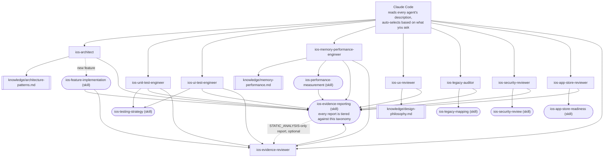

# claude-ai-agents-ios

🌐 [English](README.md) | [简体中文](README.zh-CN.md) | [Español](README.es.md) | [हिन्दी](README.hi.md) | [العربية](README.ar.md) | [Português (Brasil)](README.pt-BR.md) | [Русский](README.ru.md) | [日本語](README.ja.md) | [Français](README.fr.md) | [Deutsch](README.de.md) | [한국어](README.ko.md) | [Italiano](README.it.md) | [Türkçe](README.tr.md) | [Tiếng Việt](README.vi.md) | [Bahasa Indonesia](README.id.md)

[Claude Code](https://claude.com/claude-code) के लिए तैयार सबएजेंट्स
(subagents) और स्किल्स (Skills) का एक ड्रॉप-इन सेट, जो Claude Code को
एक विशेषज्ञ iOS डेवलपमेंट टीम में बदल देता है: आर्किटेक्चर, यूनिट
टेस्टिंग, यूआई टेस्टिंग, मेमोरी/परफॉर्मेंस, यूआई/यूएक्स रिव्यू, सिक्योरिटी,
ऐप स्टोर रेडीनेस, लेगेसी-कोडबेस ऑडिटिंग, और स्वतंत्र एविडेंस रिव्यू — आप
जो भी पूछें उसके आधार पर हर एक अपने-आप इनवोक हो जाता है, मैन्युअल
स्विचिंग की ज़रूरत नहीं।

## इसमें क्या शामिल है

### सबएजेंट्स (`.claude/agents/`)

| एजेंट | कब इनवोक होता है... | टूल्स |
|---|---|---|
| `ios-architect` | जब आप नया फीचर/मॉड्यूल शुरू करते हैं, पूछते हैं "इसे कैसे स्ट्रक्चर करूं", रीफैक्टर की योजना बनाते हैं, MVVM/Clean/VIPER में से चुनते हैं, DI या SwiftData बनाम Core Data तय करते हैं | Read, Grep, Glob, Write, Edit, Skill, `ios-agent`* |
| `ios-unit-test-engineer` | जब आप टेस्ट्स, टेस्ट कवरेज, TDD मांगते हैं, या कोड को टेस्टेबल बनाना चाहते हैं | Read, Grep, Glob, Write, Edit, Bash, Skill, `ios-agent`* |
| `ios-ui-test-engineer` | जब आप यूआई टेस्ट्स मांगते हैं, फ्लेकी यूआई टेस्ट डीबग करते हैं, या स्नैपशॉट टेस्टिंग सेट अप करते हैं | Read, Grep, Glob, Write, Edit, Bash, Skill, `ios-agent`*, `ios-simulator`* |
| `ios-memory-performance-engineer` | जब आप लीक, बढ़ती मेमोरी, धीमी स्क्रॉलिंग, या धीमे लॉन्च की रिपोर्ट करते हैं | Read, Grep, Glob, Bash, Edit, Skill, `ios-agent`*, `ios-simulator`* |
| `ios-ux-reviewer` | जब आप यूआई/यूएक्स रिव्यू या डिज़ाइन-कंसिस्टेंसी चेक मांगते हैं | Read, Grep, Glob, Skill, `ios-agent`* (केवल पढ़ने के लिए) |
| `ios-legacy-auditor` | जब आप किसी अपरिचित, अनडॉक्यूमेंटेड, या बड़े लेगेसी कोडबेस पर काम शुरू करते हैं | Read, Grep, Glob, Bash, Skill, `ios-agent`* (केवल पढ़ने के लिए) |
| `ios-security-reviewer` | जब आप सिक्योरिटी रिव्यू मांगते हैं, "क्या यह सुरक्षित है", वल्नरेबिलिटी चेक, या ऑथ/सेशन ऑडिट | Read, Grep, Glob, Bash, Skill, `ios-agent`* (केवल पढ़ने के लिए) |
| `ios-app-store-reviewer` | जब आप पूछते हैं "क्या यह सबमिट करने के लिए तैयार है", "क्या यह रिजेक्ट हो जाएगा", या ऐप स्टोर कम्प्लायंस चेक करना चाहते हैं | Read, Grep, Glob, Bash, Skill, `ios-agent`* (केवल पढ़ने के लिए) |
| `ios-evidence-reviewer` | जब कोई अन्य एजेंट रिपोर्ट तैयार करता है, या जब आप पूछते हैं "इस रिपोर्ट को दोबारा जांचो"/"इन दावों को वेरिफाई करो" | Read, Grep, Glob, Skill (केवल पढ़ने के लिए) |

\* `ios-agent` और `ios-simulator` वैकल्पिक थर्ड-पार्टी MCP सर्वर हैं — नीचे
"वैकल्पिक टूलिंग" सेक्शन देखें।
हर एजेंट इनके बिना भी स्वतंत्र रूप से काम करता है। `ios-agent`
`STATIC_ANALYSIS`-टियर रीड को स्ट्रक्चर्ड टूलिंग से मज़बूत बनाता है — यह
कभी भी किसी दावे को `BUILD_VERIFIED`/`TEST_VERIFIED`/`RUNTIME_VERIFIED`
तक नहीं बढ़ाता, क्योंकि यह कभी भी ऐप को बिल्ड या रन नहीं करता। दूसरी ओर
`ios-simulator` वास्तव में ऐप को बिल्ड/इंस्टॉल/लॉन्च करता है, इसलिए इसका
आउटपुट वास्तव में `BUILD_VERIFIED`, `TEST_VERIFIED`, या `RUNTIME_VERIFIED`
अर्जित कर सकता है — नीचे "एविडेंस बनाम दावा" सेक्शन में सात-स्तरीय
वर्गीकरण देखें।

### स्किल्स (`.claude/skills/`)

| स्किल | किसका समर्थन करती है | उद्देश्य |
|---|---|---|
| `ios-testing-strategy` | `ios-unit-test-engineer`, `ios-ui-test-engineer` | ठोस प्रक्रिया: सीम्स पहचानें → टेस्ट-डबल लिखें → रेड/ग्रीन प्रक्रिया |
| `ios-legacy-mapping` | `ios-legacy-auditor` | ठोस इन्वेंटरी → आर्किटेक्चर पहचान → ब्रिजिंग-रिस्क → सिक्योरिटी-सिग्नल → सारांश-दस्तावेज़ प्रक्रिया |
| `ios-security-review` | `ios-security-reviewer` | 8-क्षेत्रीय ऑडिट: डेटा स्टोरेज/प्राइवेसी → ट्रांसपोर्ट → ऑथएन/सेशन → इनपुट वैलिडेशन → डीप लिंक्स → थर्ड-पार्टी SDK → कोड हाइजीन → एंटाइटलमेंट्स |
| `ios-app-store-readiness` | `ios-app-store-reviewer` | प्री-सबमिशन ऑडिट: प्राइवेसी मैनिफेस्ट → एक्सपोर्ट कम्प्लायंस → परमिशन डिस्क्रिप्शन्स → ऐप ट्रैकिंग ट्रांसपेरेंसी → Sign in with Apple समता → अनयूज्ड एंटाइटलमेंट्स → रिजेक्शन ट्रिगर्स |
| `ios-feature-implementation` | सामान्य — किसी भी फीचर रिक्वेस्ट पर फायर होती है, `ios-architect` के साथ मिलकर काम करती है | मौजूदा कोड, बिज़नेस लॉजिक, API/कनेक्टिविटी व्यवहार, और सिक्योरिटी स्थिति की जांच करें → फाइलों को छूने से पहले समझाएं → लागू करें → वेरिफाई करें (बिल्ड, टेस्ट्स, रिटेन साइकल्स, मेमोरी, परफॉर्मेंस, सिक्योरिटी) → रिपोर्ट करें |
| `ios-performance-measurement` | `ios-memory-performance-engineer` | रीप्रोड्यूस करें → क्या मापना है चुनें → कुछ भी बदलने से पहले मापें → बदलें → वही परिस्थितियों में फिर से मापें → इंस्ट्रुमेंटेशन हटाया गया है यह वेरिफाई करें |
| `ios-evidence-reporting` | सभी 9 एजेंट्स — जब भी कोई एजेंट कोई टास्क पूरा करता है, फायर होती है | सात-स्तरीय एविडेंस वर्गीकरण (`ASSUMPTION` → `HUMAN_VERIFICATION`), दावा → न्यूनतम-एविडेंस मैट्रिक्स, और वर्जित-दावों की सूची, ताकि कोई भी एजेंट बिना मिलते-जुलते स्तर के एविडेंस के यह दावा न करे कि कुछ काम करता है, ठीक हो गया है, या तेज़/सुरक्षित/थ्रेड-सेफ है |

### नॉलेज लाइब्रेरी (`knowledge/`)

गहन संदर्भ सामग्री एजेंट बॉडी के अंदर के बजाय यहां रहती है, ताकि
हर एजेंट *कब कार्रवाई करनी है* और *किस प्रक्रिया का पालन करना है* पर
केंद्रित रहे, जबकि नॉलेज फाइल *क्या जांचना है इसके लिए सत्य का स्रोत*
बनी रहे। एजेंट्स ज़रूरत पड़ने पर `Read` टूल के साथ इन्हें पढ़ते हैं — किसी
अतिरिक्त कॉन्फ़िगरेशन की ज़रूरत नहीं।

| फाइल | किसके द्वारा संदर्भित | सामग्री |
|---|---|---|
| `memory-performance.md` | `ios-memory-performance-engineer` | ARC/Instruments/इमेज/कॉन्करेंसी की बुनियादी बातें, साथ ही फ्रेमवर्क-विशिष्ट पैटर्न (RxSwift, WKWebView, PDFKit, Core Data, Firebase, CocoaPods, Keychain, थर्ड-पार्टी प्रेजेंटेशन लाइब्रेरीज़, UICollectionView/UITableView, SwiftUI/UIKit ब्रिज, AVFoundation, CoreLocation, URLSession) |
| `architecture-patterns.md` | `ios-architect` | पैटर्न/निर्णय मानदंड: MVVM/Clean/VIPER, Swift कॉन्करेंसी, मॉड्युलराइज़ेशन, पर्सिस्टेंस, नेविगेशन, DI, सिक्योरिटी-अवेयर स्ट्रक्चर |
| `design-philosophy.md` | `ios-ux-reviewer` | Apple HIG, iOS पर लागू डिटर रैम्स के दस सिद्धांत, नीलसन नॉर्मन ग्रुप के मानदंड, और नामित संदर्भों की सूची |

### टेम्पलेट

- `CLAUDE.md.template` — इसे अपने प्रोजेक्ट रूट में `CLAUDE.md` के
  नाम से कॉपी करें और प्लेसहोल्डर्स भरें (या किसी अपरिचित कोडबेस पर
  `ios-legacy-auditor` से आर्किटेक्चर सेक्शन जनरेट करवाएं)।

## इंस्टॉलेशन

अपने iOS प्रोजेक्ट के रिपॉजिटरी रूट में जो चाहिए वह कॉपी करें:

```bash
# इस रिपॉजिटरी से, अपने प्रोजेक्ट में कॉपी करें:
mkdir -p /path/to/your-ios-project/.claude
cp -r .claude/agents /path/to/your-ios-project/.claude/
cp -r .claude/skills /path/to/your-ios-project/.claude/
cp -r knowledge /path/to/your-ios-project/knowledge
cp CLAUDE.md.template /path/to/your-ios-project/CLAUDE.md   # फिर इसे एडिट करें
```

```bash
# या कॉपी करने के बजाय सिमलिंक करें, ताकि कई प्रोजेक्ट्स में सिंक बना रहे:
ln -s /path/to/claude-ai-agents-ios/.claude/agents /path/to/your-ios-project/.claude/agents
ln -s /path/to/claude-ai-agents-ios/.claude/skills /path/to/your-ios-project/.claude/skills
ln -s /path/to/claude-ai-agents-ios/knowledge /path/to/your-ios-project/knowledge
```

`knowledge/` फोल्डर आपके प्रोजेक्ट के रिपॉजिटरी रूट में (`.claude/` के
साथ) होना चाहिए — एजेंट्स इसे इसी रिलेटिव पाथ से संदर्भित करते हैं।

प्रति-प्रोजेक्ट के बजाय पर्सनल (क्रॉस-प्रोजेक्ट) उपयोग के लिए, इसके बजाय
`~/.claude/agents/` और `~/.claude/skills/` में कॉपी करें — Claude Code
पर्सनल और प्रोजेक्ट-स्तरीय एजेंट्स/स्किल्स को अपने-आप मर्ज कर देता है।
ध्यान दें कि `knowledge/` को रिपॉजिटरी-रिलेटिव पाथ के रूप में संदर्भित
किया जाता है, इसलिए पर्सनल उपयोग के लिए भी आपको हर प्रोजेक्ट के रूट
में `knowledge/` की ज़रूरत होगी (प्रति-प्रोजेक्ट सिमलिंक करना सबसे आसान है)।

बस इतना ही चाहिए — Claude Code हर एजेंट के `description` फ्रंटमैटर को
पढ़ता है और आपके अनुरोध के आधार पर सही एजेंट को अपने-आप इनवोक करता है।
कई एजेंट्स के एविडेंस टियर को मज़बूत बनाने वाले दो थर्ड-पार्टी MCP
सर्वरों के लिए नीचे "वैकल्पिक टूलिंग" सेक्शन देखें, जिनके बिना भी ऊपर
बताया गया सब कुछ अपने-आप काम करता है।

## वैकल्पिक टूलिंग: स्टैटिक एनालिसिस और सिम्युलेटर कंट्रोल

[`ios-agent-skill`](https://github.com/Nagarjuna2997/ios-agent-skill)
(MIT-लाइसेंस्ड, इस रिपॉजिटरी से असंबद्ध) के दो सर्वर ऊपर बताए गए कई
एजेंट्स को केवल कोड पढ़ने के बजाय कोई चेक *रन* करने का तरीका देते हैं।
कोई भी अनिवार्य नहीं है — हर एजेंट पहले से ही इनके बिना काम करता है,
`STATIC_ANALYSIS`-टियर रीड्स और मैन्युअल रूप से वर्णित प्रक्रियाओं पर
वापस चला जाता है।

### `ios-agent-mcp` — स्टैटिक एनालिसिस (प्रकाशित, अनुशंसित)

दस केवल-पढ़ने वाले टूल्स जो Swift प्रोजेक्ट को स्कैन करते हैं और
कॉन्करेंसी, आर्किटेक्चर, SwiftUI पैटर्न, अवेलेबिलिटी गार्ड्स, ऐप स्टोर
रेडीनेस, मेमोरी, सिक्योरिटी, टेस्टिंग, और परफॉर्मेंस के लिए स्ट्रक्चर्ड
निष्कर्ष (फाइल, लाइन, परिणाम, फिक्स) लौटाते हैं — विवरण के लिए
[टूल लिस्ट](https://github.com/Nagarjuna2997/ios-agent-skill/tree/main/mcp-server)
देखें। यह फाइलसिस्टम-रीड-ओनली है, नेटवर्क एक्सेस के बिना।

इस रिपॉजिटरी का `.mcp.json` इसे पहले से घोषित करता है, इसलिए
`.mcp.json` को `.claude/` के साथ अपने प्रोजेक्ट में कॉपी करना ही एकमात्र
कदम है:

```bash
cp .mcp.json /path/to/your-ios-project/.mcp.json
```

जब भी प्रासंगिक होगा Claude Code प्रोजेक्ट-स्कोप्ड सर्वर को सक्षम करने
का विकल्प देगा; `npx` पहली बार उपयोग में पैकेज को खुद-ब-खुद ला देता है,
किसी ग्लोबल इंस्टॉल की ज़रूरत नहीं।

### `ios-simulator-mcp` — सिम्युलेटर कंट्रोल (शुरुआती, केवल-सोर्स)

बूटेड iOS सिम्युलेटर के लिए बिल्ड, टेस्ट, इंस्टॉल, लॉन्च, डीप-लिंक, और
स्क्रीनशॉट टूल्स — ऊपर बताए गए स्टैटिक एनालाइज़र का रनटाइम समकक्ष।
लिखे जाने के समय यह **v0.1.0 है, अभी npm पर प्रकाशित नहीं हुआ है, और
शुरुआती चरण में है** (इसका अपना डॉक्यूमेंटेशन इसे "पहला सुरक्षित हिस्सा"
कहता है), इसलिए इसे आज़माने वाली चीज़ समझें, भरोसा करने वाली नहीं:

```bash
git clone https://github.com/Nagarjuna2997/ios-agent-skill.git
cd ios-agent-skill/ios-simulator-mcp
npm install && npm run build
```

फिर इसे अपने प्रोजेक्ट के `.mcp.json` (या पर्सनल MCP कॉन्फ़िग) में
सर्वर नाम `ios-simulator` के तहत जोड़ें, बिल्ट पाथ की ओर इशारा करते हुए:

```jsonc
{
  "mcpServers": {
    "ios-simulator": {
      "command": "node",
      "args": ["/absolute/path/to/ios-agent-skill/ios-simulator-mcp/dist/index.js"]
    }
  }
}
```

macOS और Xcode कमांड-लाइन टूल्स की ज़रूरत है। अगर आप सर्वर का नाम
`ios-simulator` के अलावा कुछ और रखते हैं, तो `ios-ui-test-engineer.md`
और `ios-memory-performance-engineer.md` में `mcp__ios-simulator__*`
टूल ग्रांट को मैच करने के लिए अपडेट करें।

## यह सब कैसे साथ काम करता है



कॉन्फ़िगर करने के लिए कोई राउटर या ऑर्केस्ट्रेटर नहीं है — Claude Code
की अपनी डिस्क्रिप्शन-मैचिंग *ही* डिस्पैच लेयर है। हर एजेंट एक "लीफ" है
जो या तो गहन संदर्भ सामग्री के लिए `knowledge/*.md` फाइल पढ़ता है, या
साझा प्रक्रिया के लिए `Skill` फॉलो करता है, या दोनों, और हर रास्ता अंत
में उसी एविडेंस-रिपोर्टिंग स्टैंडर्ड पर मिलता है। `ios-evidence-reviewer`
"लीफ" होने का एकमात्र अपवाद है: यह किसी *अन्य* एजेंट की पूरी हो चुकी
रिपोर्ट पढ़ता है और किसी भी ऐसे दावे का स्तर घटा देता है जिसे दिखाए गए
एविडेंस का वास्तव में समर्थन नहीं है, फिर सुधारी गई रिपोर्ट उसी स्टेटस
ब्लॉक फॉर्मेट के साथ फिर से बंद होती है। `ios-feature-implementation`,
`ios-memory-performance-engineer`, `ios-unit-test-engineer`, और
`ios-ui-test-engineer` जब भी उनकी खुद की रिपोर्ट `BUILD_VERIFIED` या
उससे ऊपर पहुंचती है तो अपने-आप इससे होकर गुज़रते हैं — जो एजेंट
बिल्ड/टेस्ट/माप चलाता है वही एकमात्र नहीं है जो यह जांचता है कि उसकी
रिपोर्ट इस बारे में ईमानदार है या नहीं।

## एक-दूसरे को कैसे सौंपते हैं

एक सामान्य फ्लो, हालांकि आपको इनमें से किसी को भी नाम से इनवोक करने की
ज़रूरत कभी नहीं होगी:

1. **अपरिचित/अनडॉक्यूमेंटेड कोडबेस?** `ios-legacy-auditor` से शुरू करें
   — यह वास्तविक आर्किटेक्चर का नक्शा बनाता है और एक सारांश तैयार करता
   है जिसे आप `CLAUDE.md` में डाल सकते हैं, इससे पहले कि कुछ और कोड को
   छुए।
2. **नया फीचर/मॉड्यूल?** `ios-architect` एक स्ट्रक्चर प्रस्तावित करता है
   और बताता है कि क्या डिज़ाइन यूनिट-टेस्टेबल है; फिर
   `ios-feature-implementation` वास्तविक बिल्ड को आगे बढ़ाता है — पहले
   मौजूदा बिज़नेस लॉजिक की जांच करके, फाइलों को छूने से पहले योजना
   समझाकर, सहमत स्ट्रक्चर के अनुसार लागू करके, और पूर्ण होने की रिपोर्ट
   देने से पहले वेरिफाई करके (बिल्ड, टेस्ट्स, मेमोरी, परफॉर्मेंस)।
3. **टेस्ट्स चाहिए?** लॉजिक के लिए `ios-unit-test-engineer`, यूज़र फ्लोज़
   के लिए `ios-ui-test-engineer` — दोनों `ios-testing-strategy` से
   सीम्स → रेड/ग्रीन का वही अनुशासन फॉलो करते हैं।
4. **नई या बदली हुई स्क्रीन?** `ios-ux-reviewer` इसे शिप करने से पहले
   Apple की Human Interface Guidelines और अंतर्निहित डिज़ाइन फिलॉसफी के
   आधार पर जांचता है।
5. **कुछ धीमा महसूस हो रहा है या मेमोरी लीक हो रही है?**
   `ios-memory-performance-engineer` पहले स्टैटिक कारणों के लिए कोड
   पढ़ता है, और जब अकेले पढ़ने से नहीं मिल पाता तो सटीक Instruments
   प्रक्रिया देता है।
6. **सिक्योरिटी चेक चाहिए?** `ios-security-reviewer` एक समर्पित 8-क्षेत्रीय
   ऑडिट करता है (स्टोरेज, ट्रांसपोर्ट, ऑथ, इनपुट वैलिडेशन, डीप लिंक्स,
   डिपेंडेंसीज़, कोड हाइजीन, एंटाइटलमेंट्स); `ios-architect`,
   `ios-legacy-auditor`, और `ios-feature-implementation` भी अपने काम के
   हिस्से के रूप में हल्की, सीमित सिक्योरिटी चिंताओं को चिह्नित करते हैं
   और पूर्ण ऑडिट के लायक किसी भी चीज़ के लिए यहां इशारा करते हैं।
7. **ऐप स्टोर पर सबमिट करने वाले हैं?** `ios-app-store-reviewer` कोड-में-
   दिखने वाले सबमिशन ब्लॉकर्स की जांच करता है (प्राइवेसी मैनिफेस्ट,
   परमिशन डिस्क्रिप्शन्स, एक्सपोर्ट कम्प्लायंस, Sign in with Apple समता)
   — यह `ios-security-reviewer` से अलग सरोकार है, भले ही वे कुछ समान
   जमीन साझा करते हों (एंटाइटलमेंट्स, ट्रांसपोर्ट सिक्योरिटी), इसलिए अगर
   दोनों में से कोई भी प्रासंगिक हो तो रिलीज़ से पहले दोनों चलाएं।
8. **`BUILD_VERIFIED` या उससे ऊपर पहुंचने वाली रिपोर्ट?**
   `ios-evidence-reviewer` इसे पूर्ण घोषित करने से पहले जांचता है।
   `ios-feature-implementation`, `ios-memory-performance-engineer`,
   `ios-unit-test-engineer`, और `ios-ui-test-engineer` — जो एजेंट्स
   स्वतंत्र रूप से बिल्ड/टेस्ट/रनटाइम/मापा गया दावा कर सकते हैं, सिर्फ
   एक स्टैटिक निष्कर्ष नहीं — हर एक अपने अंतिम चरण के रूप में अपने-आप
   इससे होकर गुज़रता है; किसी भी अन्य एजेंट की रिपोर्ट भी सीधे इसे सौंपी
   जा सकती है।

## दावे से पहले एविडेंस

AI का भरोसा एविडेंस नहीं है। AI का तर्क रनटाइम एविडेंस नहीं है। कोड में
बदलाव अपने-आप वेरिफाइड फिक्स नहीं है। इस रिपॉजिटरी का हर एजेंट अपनी
रिपोर्ट को सिर्फ "हो गया! यह काम करता है" कहने के बजाय
`ios-evidence-reporting` स्किल के स्टेटस ब्लॉक के साथ समाप्त करता है,
और उस ब्लॉक में हर लाइन सात एविडेंस स्तरों में से एक के अनुसार वर्गीकृत
होती है, सबसे कमज़ोर से सबसे मज़बूत तक:

`ASSUMPTION` → `STATIC_ANALYSIS` → `BUILD_VERIFIED` → `TEST_VERIFIED`
→ `RUNTIME_VERIFIED` → `RUNTIME_MEASURED` → `HUMAN_VERIFICATION`

किसी भी दावे को उस स्तर से ऊंचे स्तर पर कभी रिपोर्ट नहीं किया जाता जितना
एविडेंस वास्तव में पहुंचा हो। सोर्स पढ़ना (MCP स्टैटिक एनालाइज़र के
स्ट्रक्चर्ड आउटपुट सहित) पूरी तरह `STATIC_ANALYSIS` है, चाहे पढ़ने का
काम इंसान ने किया हो या टूल ने — यह सिर्फ इसलिए मज़बूत एविडेंस नहीं बन
जाता क्योंकि किसी टूल ने इसे तैयार किया, और यह कभी भी "कोई लीक नहीं है"
या "मेमोरी बेहतर हो गई" का समर्थन नहीं कर सकता। इन दोनों के लिए खास तौर
पर `RUNTIME_MEASURED` चाहिए: ऐप को वास्तव में चलाने से मिला एक वास्तविक
आंकड़ा (Instruments, MetricKit, `os_signpost`), जो
`ios-performance-measurement` की रीप्रोड्यूस → बेसलाइन → माप → बदलाव →
बिल्ड → टेस्ट → फिर से माप → तुलना → रिपोर्ट लूप से आता है। एक दावा जो
इस रिपॉजिटरी के एजेंट्स मिलते-जुलते एविडेंस के बिना कभी नहीं करेंगे:
"ठीक कर दिया", "ऑप्टिमाइज़्ड", "तेज़", "लीक-फ्री", "थ्रेड-सेफ", "सुरक्षित",
या "प्रोडक्शन-रेडी" (एक क्रॉस-कटिंग दावा जिसे कोई एक एजेंट का एविडेंस
अकेले कवर नहीं करता) — पूरी सूची और सटीक भाषा के विकल्पों के लिए
`ios-evidence-reporting` का दावा → न्यूनतम-एविडेंस मैट्रिक्स देखें।

चूंकि जो एजेंट कुछ लागू करता है उसे यह तय करने वाला अकेला अधिकारी नहीं
होना चाहिए कि उसकी अपनी रिपोर्ट ईमानदार है या नहीं, `ios-evidence-reviewer`
पूरी हो चुकी रिपोर्ट के दावों को उसी मैट्रिक्स के मुकाबले स्वतंत्र रूप से
दोबारा जांचता है और इसे अंतिम रूप में प्रस्तुत करने से पहले किसी भी
असमर्थित चीज़ का स्तर घटा देता है — ऊपर "यह सब कैसे साथ काम करता है"
सेक्शन देखें।

## डिज़ाइन फिलॉसफी

`ios-ux-reviewer` विशेष रूप से मानी गई पसंद के बजाय नामित स्रोतों पर
आधारित है: Apple की Human Interface Guidelines, अच्छे डिज़ाइन के लिए
डिटर रैम्स के दस सिद्धांत, डॉन नॉर्मन की *The Design of Everyday Things*,
नीलसन नॉर्मन ग्रुप के उपयोगिता मानदंड, और ठोस विज़ुअल निर्णयों के लिए
*Refactoring UI*। हर एक को iOS पर विशेष रूप से कैसे लागू किया जाता है,
इसके लिए `knowledge/design-philosophy.md` देखें।

## इस रिपॉजिटरी को मेंटेन करना

`scripts/audit-agents.sh` वे यांत्रिक जांचें चलाता है जिन पर हर एजेंट/
स्किल फाइल को डेवलपमेंट के दौरान परखा जाता है: फ्रंटमैटर का `name:`
फाइलनेम या डायरेक्टरी से मेल खाता हो, `description:` में एक वास्तविक
कोटेड ट्रिगर फ्रेज़ हो, बॉडी में केवल-पढ़ने का दावा `Write`/`Edit` ग्रांट
के साथ न हो, कोड फेंस बंद हों, रिपॉजिटरी में हर बैकटिक `ios-*` संदर्भ
किसी वास्तविक एजेंट या स्किल से मेल खाता हो, और कोई फाइल वर्तमान
सात-स्तरीय वर्गीकरण के बजाय पुराना `(static)`/`(executed)` ग्रेडिंग न
रखती हो। यह ब्लॉकिंग नहीं है — निष्कर्ष इंसान के कार्रवाई करने के लिए
हैं, किसी गेट के लिए नहीं।

```bash
./scripts/audit-agents.sh
```
