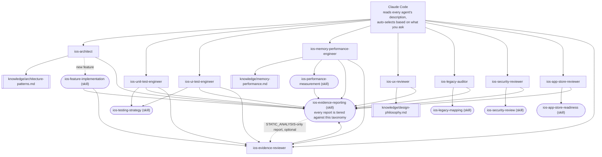

# claude-ai-agents-ios

🌐 [English](README.md) | [简体中文](README.zh-CN.md) | [Español](README.es.md) | [हिन्दी](README.hi.md) | [العربية](README.ar.md) | [Português (Brasil)](README.pt-BR.md) | [Русский](README.ru.md) | [日本語](README.ja.md) | [Français](README.fr.md) | [Deutsch](README.de.md) | [한국어](README.ko.md) | [Italiano](README.it.md) | [Türkçe](README.tr.md) | [Tiếng Việt](README.vi.md) | [Bahasa Indonesia](README.id.md)

Sekumpulan subagent dan Skill siap pakai untuk [Claude Code](https://claude.com/claude-code)
yang mengubah Claude Code menjadi tim pengembangan iOS khusus: arsitektur,
unit testing, UI testing, memori/performa, tinjauan UI/UX, keamanan,
kesiapan App Store, audit kode lawas, dan tinjauan bukti independen —
setiap agent dipanggil otomatis berdasarkan apa yang Anda minta, tanpa
perlu berpindah manual.

## Yang disertakan

### Subagent (`.claude/agents/`)

| Agent | Dipanggil ketika Anda... | Tools |
|---|---|---|
| `ios-architect` | memulai fitur/modul baru, bertanya "bagaimana sebaiknya struktur ini", merencanakan refactor, memilih antara MVVM/Clean/VIPER, memutuskan DI atau SwiftData vs. Core Data | Read, Grep, Glob, Write, Edit, Skill, `ios-agent`* |
| `ios-unit-test-engineer` | meminta test, cakupan test, TDD, atau membuat kode dapat ditest | Read, Grep, Glob, Write, Edit, Bash, Skill, `ios-agent`* |
| `ios-ui-test-engineer` | meminta UI test, men-debug UI test yang tidak stabil, atau menyiapkan snapshot testing | Read, Grep, Glob, Write, Edit, Bash, Skill, `ios-agent`*, `ios-simulator`* |
| `ios-memory-performance-engineer` | melaporkan kebocoran memori, memori yang terus bertambah, scrolling lambat, atau startup lambat | Read, Grep, Glob, Bash, Edit, Skill, `ios-agent`*, `ios-simulator`* |
| `ios-ux-reviewer` | meminta tinjauan UI/UX atau pengecekan konsistensi desain | Read, Grep, Glob, Skill, `ios-agent`* (hanya baca) |
| `ios-legacy-auditor` | mempelajari proyek yang asing, tanpa dokumentasi, atau kode lawas berskala besar | Read, Grep, Glob, Bash, Skill, `ios-agent`* (hanya baca) |
| `ios-security-reviewer` | meminta tinjauan keamanan, "apakah ini aman", pengecekan kerentanan, atau audit autentikasi/sesi | Read, Grep, Glob, Bash, Skill, `ios-agent`* (hanya baca) |
| `ios-app-store-reviewer` | bertanya "apakah ini siap diajukan", "apakah ini akan ditolak", atau mengecek kepatuhan App Store | Read, Grep, Glob, Bash, Skill, `ios-agent`* (hanya baca) |
| `ios-evidence-reviewer` | setelah agent lain menghasilkan laporan, atau meminta "periksa ulang laporan ini"/"verifikasi klaim ini" | Read, Grep, Glob, Skill (hanya baca) |

\* `ios-agent` dan `ios-simulator` adalah MCP server pihak ketiga yang
opsional — lihat bagian "Optional tooling" di bawah. Setiap agent tetap
berfungsi mandiri tanpa keduanya. `ios-agent` memperkuat pembacaan level
`STATIC_ANALYSIS` dengan tooling terstruktur — ia tidak pernah menaikkan
klaim ke `BUILD_VERIFIED`/`TEST_VERIFIED`/`RUNTIME_VERIFIED`, karena
tidak pernah melakukan build atau menjalankan aplikasi. `ios-simulator`
benar-benar melakukan build/install/menjalankan aplikasi, sehingga
hasilnya dapat memperoleh level `BUILD_VERIFIED`, `TEST_VERIFIED`, atau
`RUNTIME_VERIFIED` secara sah — lihat taksonomi tujuh level di bagian
"Evidence over assertion" di bawah.

### Skill (`.claude/skills/`)

| Skill | Mendukung | Tujuan |
|---|---|---|
| `ios-testing-strategy` | `ios-unit-test-engineer`, `ios-ui-test-engineer` | Prosedur konkret: seam → test double → red/green |
| `ios-legacy-mapping` | `ios-legacy-auditor` | Inventarisasi → deteksi arsitektur → risiko bridging → sinyal keamanan → dokumen ringkasan |
| `ios-security-review` | `ios-security-reviewer` | Audit 8 area: penyimpanan/privasi → transport → autentikasi/sesi → validasi input → deep link → SDK pihak ketiga → kebersihan kode → hak akses |
| `ios-app-store-readiness` | `ios-app-store-reviewer` | Audit pra-pengajuan: manifest privasi → kepatuhan ekspor → deskripsi izin → App Tracking Transparency → paritas Sign in with Apple → hak akses tak terpakai → pemicu penolakan |
| `ios-feature-implementation` | Umum — aktif untuk permintaan fitur apa pun, bekerja bersama `ios-architect` | Periksa kode yang ada, logika bisnis, perilaku API/konektivitas, dan postur keamanan → jelaskan sebelum mengubah file → implementasikan → verifikasi (build, test, retain cycle, memori, performa, keamanan) → laporkan |
| `ios-performance-measurement` | `ios-memory-performance-engineer` | Reproduksi → pilih apa yang diukur → ukur sebelum mengubah apa pun → ubah → ukur ulang dengan kondisi yang sama → verifikasi instrumentasi sudah dihapus |
| `ios-evidence-reporting` | Kesembilan agent — aktif setiap kali salah satu menyelesaikan tugas | Taksonomi bukti tujuh level (`ASSUMPTION` → `HUMAN_VERIFICATION`), matriks klaim → bukti minimum, dan daftar klaim terlarang, sehingga tidak ada agent yang mengklaim sesuatu berfungsi, sudah diperbaiki, atau lebih cepat/aman/thread-safe tanpa bukti pada level yang sesuai |

### Pustaka pengetahuan (`knowledge/`)

Materi referensi mendalam disimpan di sini alih-alih di dalam badan
agent, sehingga setiap agent tetap fokus pada *kapan harus bertindak*
dan *prosedur apa yang harus diikuti*, sementara file pengetahuan
menjadi *sumber kebenaran tentang apa yang harus diperiksa*. Agent
membaca file ini dengan tool `Read` saat diperlukan — tidak perlu
konfigurasi tambahan.

| File | Digunakan oleh | Isi |
|---|---|---|
| `memory-performance.md` | `ios-memory-performance-engineer` | Dasar-dasar ARC/Instruments/gambar/concurrency plus pola spesifik framework (RxSwift, WKWebView, PDFKit, Core Data, Firebase, CocoaPods, Keychain, library presentasi pihak ketiga, UICollectionView/UITableView, jembatan SwiftUI/UIKit, AVFoundation, CoreLocation, URLSession) |
| `architecture-patterns.md` | `ios-architect` | Kriteria pola/keputusan: MVVM/Clean/VIPER, Swift Concurrency, modularisasi, persistensi, navigasi, DI, struktur yang memperhatikan keamanan |
| `design-philosophy.md` | `ios-ux-reviewer` | Apple HIG, sepuluh prinsip Dieter Rams yang diterapkan pada iOS, heuristik Nielsen Norman Group, dan daftar referensi bernama |

### Template

- `CLAUDE.md.template` — salin ke root proyek Anda sebagai `CLAUDE.md`
  dan isi placeholder-nya (atau biarkan `ios-legacy-auditor` membuatkan
  bagian arsitektur untuk Anda pada codebase yang asing).

## Instalasi

Salin apa yang Anda butuhkan ke root repo proyek iOS Anda:

```bash
# Dari repo ini, salin ke proyek Anda:
mkdir -p /path/to/your-ios-project/.claude
cp -r .claude/agents /path/to/your-ios-project/.claude/
cp -r .claude/skills /path/to/your-ios-project/.claude/
cp -r knowledge /path/to/your-ios-project/knowledge
cp CLAUDE.md.template /path/to/your-ios-project/CLAUDE.md   # lalu edit
```

```bash
# Atau buat symlink alih-alih menyalin, agar tetap sinkron di beberapa proyek:
ln -s /path/to/claude-ai-agents-ios/.claude/agents /path/to/your-ios-project/.claude/agents
ln -s /path/to/claude-ai-agents-ios/.claude/skills /path/to/your-ios-project/.claude/skills
ln -s /path/to/claude-ai-agents-ios/knowledge /path/to/your-ios-project/knowledge
```

Folder `knowledge/` harus berada di root repo proyek Anda (sejajar
dengan `.claude/`) — agent mereferensikannya melalui jalur relatif ini.

Untuk penggunaan pribadi (lintas proyek) alih-alih per proyek, salin ke
`~/.claude/agents/` dan `~/.claude/skills/` — Claude Code secara
otomatis menggabungkan agent/skill pribadi dan tingkat proyek. Perlu
diperhatikan bahwa `knowledge/` direferensikan sebagai jalur relatif
repo, jadi untuk penggunaan pribadi Anda tetap memerlukan `knowledge/`
di root setiap proyek (symlink per proyek adalah cara paling sederhana).

Tidak ada lagi yang diperlukan — Claude Code membaca field `description`
di metadata setiap agent dan otomatis memanggil yang tepat berdasarkan
permintaan Anda. Lihat "Optional tooling" di bawah untuk dua MCP server
pihak ketiga yang memperkuat level bukti beberapa agent, meskipun tanpa
keduanya semua di atas tetap berfungsi sendiri.

## Optional tooling: analisis statis & kontrol simulator

Dua server dari [`ios-agent-skill`](https://github.com/Nagarjuna2997/ios-agent-skill)
(berlisensi MIT, tidak berafiliasi dengan repo ini) memberi beberapa
agent di atas cara untuk *menjalankan* pengecekan alih-alih hanya
membaca kode untuk itu. Tidak ada yang wajib — setiap agent sudah
berfungsi tanpanya, kembali ke pembacaan level `STATIC_ANALYSIS` dan
prosedur yang dijelaskan secara manual.

### `ios-agent-mcp` — analisis statis (sudah dipublikasikan, direkomendasikan)

Sepuluh tool hanya-baca yang memindai proyek Swift dan mengembalikan
temuan terstruktur (file, baris, konsekuensi, perbaikan) untuk
concurrency, arsitektur, pola SwiftUI, availability guard, kesiapan App
Store, memori, keamanan, testing, dan performa — lihat [daftar tool](https://github.com/Nagarjuna2997/ios-agent-skill/tree/main/mcp-server)
untuk detailnya. Hanya-baca pada sistem file, tanpa akses jaringan.

`.mcp.json` repo ini sudah mendeklarasikannya, jadi cukup salin
`.mcp.json` ke proyek Anda bersama `.claude/`:

```bash
cp .mcp.json /path/to/your-ios-project/.mcp.json
```

Claude Code akan menawarkan untuk mengaktifkan server tingkat proyek
saat pertama kali relevan; `npx` akan mengambil paket saat pertama kali
digunakan, tidak perlu instalasi global.

### `ios-simulator-mcp` — kontrol simulator (tahap awal, hanya kode sumber)

Tool build, test, install, jalankan, deep link, dan screenshot untuk
Simulator iOS yang sedang berjalan — pasangan runtime dari analisis
statis di atas. Pada saat penulisan ini, versinya **v0.1.0, belum
dipublikasikan ke npm, dan masih tahap awal** (dokumentasinya sendiri
menyebutnya "irisan aman pertama"), jadi perlakukan ini sebagai sesuatu
untuk dicoba, bukan sesuatu untuk diandalkan:

```bash
git clone https://github.com/Nagarjuna2997/ios-agent-skill.git
cd ios-agent-skill/ios-simulator-mcp
npm install && npm run build
```

Kemudian tambahkan ke `.mcp.json` proyek Anda (atau konfigurasi MCP
pribadi) dengan nama server `ios-simulator`, mengarah ke jalur hasil
build:

```jsonc
{
  "mcpServers": {
    "ios-simulator": {
      "command": "node",
      "args": ["/absolute/path/to/ios-agent-skill/ios-simulator-mcp/dist/index.js"]
    }
  }
}
```

Membutuhkan macOS dan Xcode command-line tools. Jika Anda menamai
server dengan nama selain `ios-simulator`, perbarui izin tool
`mcp__ios-simulator__*` di `ios-ui-test-engineer.md` dan
`ios-memory-performance-engineer.md` agar sesuai.

## Bagaimana semuanya saling terhubung



Tidak ada router atau orchestrator yang perlu dikonfigurasi —
pencocokan berbasis deskripsi milik Claude Code sendiri *adalah* lapisan
dispatch-nya. Setiap agent adalah "daun" yang membaca file `knowledge/*.md`
untuk materi referensi mendalam, mengikuti sebuah `Skill` untuk prosedur
bersama, atau keduanya, dan setiap jalur berujung pada standar pelaporan
bukti yang sama di akhir. `ios-evidence-reviewer` adalah satu-satunya
pengecualian dari "daun": ia membaca laporan selesai dari agent *lain*
dan menurunkan level klaim apa pun yang tidak didukung oleh bukti yang
ditampilkan, kemudian laporan yang sudah dikoreksi ditutup lagi dengan
format status block yang sama. `ios-feature-implementation`,
`ios-memory-performance-engineer`, `ios-unit-test-engineer`, dan
`ios-ui-test-engineer` otomatis melewati proses ini setiap kali laporan
mereka sendiri mencapai level `BUILD_VERIFIED` atau lebih tinggi — agent
yang menjalankan build/test/pengukuran bukan satu-satunya pihak yang
memeriksa kejujuran laporannya sendiri.

## Bagaimana mereka saling menyerahkan pekerjaan

Alur yang umum terjadi, meskipun Anda tidak pernah perlu memanggil
salah satu dari ini dengan namanya:

1. **Codebase asing/tanpa dokumentasi?** Mulai dengan `ios-legacy-auditor`
   — ia memetakan arsitektur sebenarnya dan menghasilkan ringkasan yang
   bisa Anda masukkan ke `CLAUDE.md`, sebelum apa pun menyentuh kodenya.
2. **Fitur/modul baru?** `ios-architect` mengusulkan struktur dan
   menandai apakah desainnya dapat di-unit-test; kemudian
   `ios-feature-implementation` melakukan pembangunan sebenarnya —
   pertama memeriksa logika bisnis yang ada, menjelaskan rencana
   sebelum mengubah file, mengimplementasikan sesuai struktur yang
   disepakati, dan memverifikasi (build, test, memori, performa)
   sebelum melaporkan selesai.
3. **Butuh test?** `ios-unit-test-engineer` untuk logika,
   `ios-ui-test-engineer` untuk alur pengguna — keduanya mengikuti
   disiplin seam → red/green yang sama dari `ios-testing-strategy`.
4. **Layar baru atau yang diubah?** `ios-ux-reviewer` memeriksanya
   terhadap Apple Human Interface Guidelines dan filosofi desain yang
   mendasarinya sebelum Anda merilisnya.
5. **Ada yang lambat atau bocor memori?** `ios-memory-performance-engineer`
   pertama-tama membaca kode untuk mencari penyebab statis, dan
   memberikan prosedur Instruments yang tepat ketika penyebabnya tidak
   dapat ditemukan hanya dengan membaca.
6. **Butuh pengecekan keamanan?** `ios-security-reviewer` menjalankan
   audit khusus 8 area (penyimpanan, transport, autentikasi, validasi
   input, deep link, dependensi, kebersihan kode, hak akses);
   `ios-architect`, `ios-legacy-auditor`, dan `ios-feature-implementation`
   juga menandai masalah keamanan yang lebih ringan dan spesifik sebagai
   bagian dari pekerjaan mereka sendiri dan mengarahkan ke sini untuk
   hal yang memerlukan audit penuh.
7. **Akan mengajukan ke App Store?** `ios-app-store-reviewer` memeriksa
   penghalang pengajuan yang terlihat di kode (manifest privasi,
   deskripsi izin, kepatuhan ekspor, paritas Sign in with Apple) — ini
   adalah hal yang berbeda dari `ios-security-reviewer` meskipun
   keduanya memiliki area yang sama (hak akses, keamanan transport),
   jadi jalankan keduanya sebelum rilis jika relevan.
8. **Laporan mencapai level `BUILD_VERIFIED` atau lebih tinggi?**
   `ios-evidence-reviewer` memeriksanya sebelum dianggap selesai.
   `ios-feature-implementation`, `ios-memory-performance-engineer`,
   `ios-unit-test-engineer`, dan `ios-ui-test-engineer` — agent yang
   dapat secara mandiri menghasilkan klaim build/test/runtime/
   pengukuran, bukan hanya temuan statis — masing-masing melewati
   proses ini secara otomatis sebagai langkah terakhir; laporan agent
   lain mana pun juga bisa langsung diserahkan ke sini.

## Bukti lebih penting daripada keyakinan

Keyakinan AI bukanlah bukti. Penalaran AI bukanlah bukti perilaku
runtime. Perubahan kode bukan otomatis merupakan perbaikan yang sudah
diverifikasi. Setiap agent dalam repo ini mengakhiri laporannya dengan
status block dari skill `ios-evidence-reporting` alih-alih pernyataan
polos "Selesai! Ini berfungsi," dan setiap baris dalam block tersebut
dinilai terhadap salah satu dari tujuh level bukti, dari yang paling
lemah ke paling kuat:

`ASSUMPTION` → `STATIC_ANALYSIS` → `BUILD_VERIFIED` → `TEST_VERIFIED`
→ `RUNTIME_VERIFIED` → `RUNTIME_MEASURED` → `HUMAN_VERIFICATION`

Sebuah klaim tidak pernah dilaporkan pada level yang lebih tinggi
daripada bukti yang sebenarnya dicapai. Membaca kode sumber (termasuk
keluaran terstruktur dari analisis statis MCP) adalah `STATIC_ANALYSIS`,
titik — baik manusia maupun tool yang melakukan pembacaan — ini tidak
menjadi bukti yang lebih kuat hanya karena dihasilkan oleh tool, dan
tidak pernah bisa mendukung klaim "tidak ada kebocoran" atau "memori
membaik". Klaim tersebut secara khusus memerlukan `RUNTIME_MEASURED`:
angka nyata dari benar-benar menjalankan aplikasi (Instruments,
MetricKit, `os_signpost`), melalui siklus skill `ios-performance-measurement`:
reproduksi → baseline → ukur → ubah → build → test → ukur ulang →
bandingkan → laporkan. Klaim yang tidak akan pernah dibuat oleh
agent-agent di repo ini tanpa bukti yang sesuai: "sudah diperbaiki",
"sudah dioptimalkan", "lebih cepat", "bebas kebocoran", "thread-safe",
"aman", atau "siap produksi" (klaim lintas-bidang yang tidak dapat
dicakup oleh bukti satu agent saja) — lihat matriks "klaim → bukti
minimum" milik `ios-evidence-reporting` untuk daftar lengkap dan
alternatif kata-kata yang lebih presisi.

Karena agent yang mengimplementasikan sesuatu seharusnya bukan satu-
satunya pihak yang menentukan apakah laporannya sendiri jujur,
`ios-evidence-reviewer` secara independen memeriksa ulang klaim dari
laporan yang sudah selesai terhadap matriks yang sama dan menurunkan
level apa pun yang tidak didukung sebelum disajikan sebagai hasil akhir
— lihat "Bagaimana semuanya saling terhubung" di atas.

## Filosofi desain

`ios-ux-reviewer` secara khusus didasarkan pada sumber-sumber bernama
alih-alih selera yang diklaim begitu saja: Apple Human Interface
Guidelines, sepuluh prinsip desain baik dari Dieter Rams, *The Design
of Everyday Things* karya Don Norman, heuristik usability dari Nielsen
Norman Group, dan *Refactoring UI* untuk keputusan visual yang konkret.
Lihat `knowledge/design-philosophy.md` untuk melihat bagaimana masing-
masing diterapkan secara spesifik pada iOS.

## Memelihara repo ini

`scripts/audit-agents.sh` menjalankan pengecekan mekanis yang harus
dipenuhi setiap file agent/skill selama pengembangan: `name:` di
metadata cocok dengan nama file atau direktori, `description:`
mengandung frasa pemicu yang benar-benar dikutip, klaim hanya-baca
dalam isi file tidak berdampingan dengan izin `Write`/`Edit`, blok kode
tertutup dengan benar, setiap referensi `ios-*` dalam backtick di
seluruh repo mengarah ke agent atau skill yang benar-benar ada, dan
tidak ada file yang masih membawa penilaian lama `(static)`/`(executed)`
alih-alih taksonomi tujuh level saat ini. Script ini tidak menghalangi
pekerjaan — temuannya untuk ditindaklanjuti manusia, bukan sebagai
gerbang penghalang.

```bash
./scripts/audit-agents.sh
```
