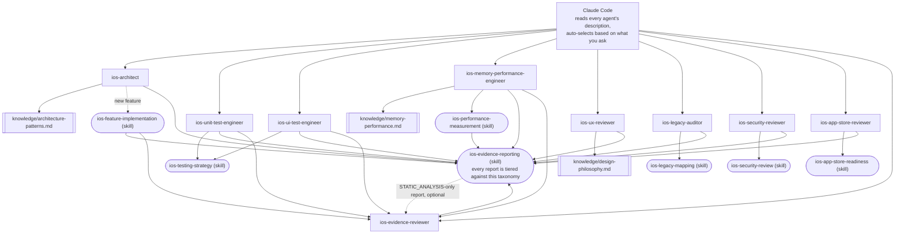

# claude-ai-agents-ios

🌐 [English](README.md) | [简体中文](README.zh-CN.md) | [Español](README.es.md) | [हिन्दी](README.hi.md) | [العربية](README.ar.md) | [Português (Brasil)](README.pt-BR.md) | [Русский](README.ru.md) | [日本語](README.ja.md) | [Français](README.fr.md) | [Deutsch](README.de.md) | [한국어](README.ko.md) | [Italiano](README.it.md) | [Türkçe](README.tr.md) | [Tiếng Việt](README.vi.md) | [Bahasa Indonesia](README.id.md)

Un insieme pronto all'uso di subagent e Skills di [Claude Code](https://claude.com/claude-code)
che trasforma Claude Code in un team specializzato di sviluppo iOS:
architettura, unit test, test di UI, memoria/prestazioni, revisione
UI/UX, sicurezza, prontezza per l'App Store, audit del codice legacy, e
revisione indipendente delle evidenze — ciascuno invocato
automaticamente in base a ciò che chiedi, senza bisogno di cambiare
manualmente.

## Cosa include

### Subagent (`.claude/agents/`)

| Agente | Invocato quando... | Strumenti |
|---|---|---|
| `ios-architect` | avvii una nuova funzionalità/modulo, chiedi "come dovrei strutturare questo", pianifichi un refactoring, scegli tra MVVM/Clean/VIPER, decidi su DI o SwiftData vs. Core Data | Read, Grep, Glob, Write, Edit, Skill, `ios-agent`* |
| `ios-unit-test-engineer` | chiedi test, copertura dei test, TDD, o di rendere il codice testabile | Read, Grep, Glob, Write, Edit, Bash, Skill, `ios-agent`* |
| `ios-ui-test-engineer` | chiedi test UI, di eseguire il debug di un test UI instabile, o di configurare test di snapshot | Read, Grep, Glob, Write, Edit, Bash, Skill, `ios-agent`*, `ios-simulator`* |
| `ios-memory-performance-engineer` | segnali una perdita di memoria, memoria crescente, scorrimento lento, o avvio lento | Read, Grep, Glob, Bash, Edit, Skill, `ios-agent`*, `ios-simulator`* |
| `ios-ux-reviewer` | chiedi una revisione UI/UX o un controllo di coerenza del design | Read, Grep, Glob, Skill, `ios-agent`* (sola lettura) |
| `ios-legacy-auditor` | ti unisci a un progetto sconosciuto, privo di documentazione, o a una grande base di codice legacy | Read, Grep, Glob, Bash, Skill, `ios-agent`* (sola lettura) |
| `ios-security-reviewer` | chiedi una revisione di sicurezza, "è sicuro questo?", un controllo delle vulnerabilità, o un audit di autenticazione/sessione | Read, Grep, Glob, Bash, Skill, `ios-agent`* (sola lettura) |
| `ios-app-store-reviewer` | chiedi "è pronto per l'invio?", "verrà rifiutato?", o vuoi controllare la conformità all'App Store | Read, Grep, Glob, Bash, Skill, `ios-agent`* (sola lettura) |
| `ios-evidence-reviewer` | un altro agente produce un report, o chiedi di "ricontrollare questo report"/"verificare queste affermazioni" | Read, Grep, Glob, Skill (sola lettura) |

\* `ios-agent` e `ios-simulator` sono server MCP di terze parti opzionali — vedi
[Strumenti opzionali](#strumenti-opzionali-analisi-statica-e-controllo-del-simulatore) più sotto.
Ogni agente funziona autonomamente senza di essi. `ios-agent` rafforza
una lettura di livello `STATIC_ANALYSIS` con strumenti strutturati — non
eleva mai un'affermazione a `BUILD_VERIFIED`/`TEST_VERIFIED`/
`RUNTIME_VERIFIED`, poiché non compila né esegue mai l'app da solo.
`ios-simulator` invece compila, installa e avvia davvero l'app, quindi
il suo output può genuinamente guadagnare `BUILD_VERIFIED`,
`TEST_VERIFIED`, o `RUNTIME_VERIFIED` — vedi la tassonomia a sette
livelli in [L'evidenza prima dell'affermazione](#levidenza-prima-dellaffermazione).

### Skill (`.claude/skills/`)

| Skill | Supporta | Scopo |
|---|---|---|
| `ios-testing-strategy` | `ios-unit-test-engineer`, `ios-ui-test-engineer` | Procedura concreta: giunture → doppio di test → rosso/verde |
| `ios-legacy-mapping` | `ios-legacy-auditor` | Procedura concreta: inventario → rilevare l'architettura → rischio dei ponti → segnale di sicurezza → documento riassuntivo |
| `ios-security-review` | `ios-security-reviewer` | Audit in 8 aree: archiviazione/privacy → trasporto → autenticazione/sessione → convalida dell'input → deep link → SDK di terze parti → igiene del codice → entitlement |
| `ios-app-store-readiness` | `ios-app-store-reviewer` | Audit pre-invio: manifesto della privacy → conformità all'esportazione → descrizioni dei permessi → App Tracking Transparency → parità di Sign in with Apple → entitlement inutilizzati → fattori scatenanti di rifiuto |
| `ios-feature-implementation` | Generale — si attiva su qualsiasi richiesta di funzionalità, funziona insieme a `ios-architect` | Ispezionare il codice esistente, la logica di business, il comportamento API/connettività, e la postura di sicurezza → spiegare prima di toccare i file → implementare → verificare (build, test, cicli di retention, memoria, prestazioni, sicurezza) → riportare |
| `ios-performance-measurement` | `ios-memory-performance-engineer` | Riprodurre → scegliere cosa misurare → misurare prima di cambiare qualsiasi cosa → cambiare → rimisurare con le stesse condizioni → verificare che la strumentazione sia stata rimossa |
| `ios-evidence-reporting` | Tutti e 9 gli agenti — si attiva ogni volta che uno di essi conclude un compito | Tassonomia dell'evidenza a sette livelli (`ASSUMPTION` → `HUMAN_VERIFICATION`), la matrice affermazione → evidenza minima, e l'elenco delle affermazioni vietate, così nessun agente afferma che qualcosa funziona, è stato corretto, o è più veloce/sicuro/thread-safe senza evidenza al livello corrispondente |

### Libreria di conoscenza (`knowledge/`)

Il materiale di riferimento approfondito vive qui invece che nel corpo
degli agenti, così ogni agente rimane concentrato su *quando agire* e
*quale procedura seguire*, mentre il file di conoscenza è la *fonte di
verità su cosa controllare*. Gli agenti leggono questi file con lo
strumento `Read` quando rilevante — nessuna configurazione aggiuntiva
necessaria.

| File | Referenziato da | Contenuto |
|---|---|---|
| `memory-performance.md` | `ios-memory-performance-engineer` | Fondamenti di ARC/Instruments/immagini/concorrenza più pattern specifici per framework (RxSwift, WKWebView, PDFKit, Core Data, Firebase, CocoaPods, Keychain, librerie di presentazione di terze parti, UICollectionView/UITableView, ponti SwiftUI/UIKit, AVFoundation, CoreLocation, URLSession) |
| `architecture-patterns.md` | `ios-architect` | Criteri di pattern/decisione: MVVM/Clean/VIPER, Swift Concurrency, modularizzazione, persistenza, navigazione, DI, struttura consapevole della sicurezza |
| `design-philosophy.md` | `ios-ux-reviewer` | Apple HIG, i dieci principi di Dieter Rams applicati a iOS, le euristiche del Nielsen Norman Group, e l'elenco dei riferimenti nominati |

### Modello

- `CLAUDE.md.template` — copialo nella radice del tuo progetto come
  `CLAUDE.md` e compila i segnaposto (o lascia che `ios-legacy-auditor`
  generi per te la sezione di architettura su una base di codice
  sconosciuta).

## Installazione

Copia ciò di cui hai bisogno nella radice del repository del tuo
progetto iOS:

```bash
# Da questo repository, copia nel tuo progetto:
mkdir -p /path/to/your-ios-project/.claude
cp -r .claude/agents /path/to/your-ios-project/.claude/
cp -r .claude/skills /path/to/your-ios-project/.claude/
cp -r knowledge /path/to/your-ios-project/knowledge
cp CLAUDE.md.template /path/to/your-ios-project/CLAUDE.md   # poi modificalo
```

```bash
# Oppure crea un collegamento simbolico invece di copiare, per rimanere sincronizzato tra più progetti:
ln -s /path/to/claude-ai-agents-ios/.claude/agents /path/to/your-ios-project/.claude/agents
ln -s /path/to/claude-ai-agents-ios/.claude/skills /path/to/your-ios-project/.claude/skills
ln -s /path/to/claude-ai-agents-ios/knowledge /path/to/your-ios-project/knowledge
```

La cartella `knowledge/` deve trovarsi nella radice del repository del
tuo progetto (accanto a `.claude/`) — gli agenti la referenziano
tramite quel percorso relativo.

Per un uso personale (tra più progetti) invece che per singolo
progetto, copia in `~/.claude/agents/` e `~/.claude/skills/` — Claude
Code unisce automaticamente agenti/skill personali e a livello di
progetto. Nota che `knowledge/` è referenziato come percorso relativo
al repository, quindi per un uso personale avresti comunque bisogno di
`knowledge/` presente nella radice di ogni progetto (creare un
collegamento simbolico per progetto è la soluzione più semplice).

Non serve altro — Claude Code legge il frontmatter `description` di
ogni agente e invoca automaticamente quello giusto in base alla tua
richiesta. Vedi [Strumenti opzionali](#strumenti-opzionali-analisi-statica-e-controllo-del-simulatore)
più sotto per due server MCP di terze parti che rafforzano il livello
di evidenza di diversi agenti, senza i quali tutto quanto sopra
funziona comunque da solo.

## Strumenti opzionali: analisi statica e controllo del simulatore

Due server da [`ios-agent-skill`](https://github.com/Nagarjuna2997/ios-agent-skill)
(con licenza MIT, non affiliato a questo repository) danno a diversi
agenti sopra un modo per *eseguire* un controllo invece di limitarsi a
leggere il codice per farlo. Nessuno dei due è obbligatorio — ogni
agente funziona già senza di essi, ricadendo su letture di livello
`STATIC_ANALYSIS` e procedure descritte manualmente.

### `ios-agent-mcp` — analisi statica (pubblicato, consigliato)

Dieci strumenti di sola lettura che analizzano un progetto Swift e
restituiscono risultati strutturati (file, riga, conseguenza,
correzione) per concorrenza, architettura, pattern SwiftUI, controlli
di disponibilità, prontezza per l'App Store, memoria, sicurezza, test,
e prestazioni — vedi l'[elenco degli strumenti](https://github.com/Nagarjuna2997/ios-agent-skill/tree/main/mcp-server)
per i dettagli. È di sola lettura sul file system, senza accesso alla
rete.

Il `.mcp.json` di questo repository lo dichiara già, quindi copiare
`.mcp.json` nel tuo progetto accanto a `.claude/` è l'unico passaggio:

```bash
cp .mcp.json /path/to/your-ios-project/.mcp.json
```

Claude Code offrirà di attivare il server con ambito di progetto la
prima volta che sarà rilevante; `npx` scarica il pacchetto al primo
utilizzo, nessuna installazione globale necessaria.

### `ios-simulator-mcp` — controllo del simulatore (iniziale, solo da sorgente)

Strumenti di build, test, installazione, avvio, deep link, e
screenshot per un Simulatore iOS avviato — la controparte a runtime
dell'analizzatore statico sopra. Al momento della stesura è **v0.1.0,
non ancora pubblicato su npm, e iniziale** (la sua stessa
documentazione lo definisce "la prima fetta sicura"), quindi trattalo
come qualcosa da provare, non da cui dipendere:

```bash
git clone https://github.com/Nagarjuna2997/ios-agent-skill.git
cd ios-agent-skill/ios-simulator-mcp
npm install && npm run build
```

Poi aggiungilo al `.mcp.json` del tuo progetto (o alla configurazione
MCP personale) sotto il nome server `ios-simulator`, puntando al
percorso compilato:

```jsonc
{
  "mcpServers": {
    "ios-simulator": {
      "command": "node",
      "args": ["/absolute/path/to/ios-agent-skill/ios-simulator-mcp/dist/index.js"]
    }
  }
}
```

Richiede macOS e gli strumenti da riga di comando di Xcode. Se
assegni al server un nome diverso da `ios-simulator`, aggiorna la
concessione dello strumento `mcp__ios-simulator__*` in
`ios-ui-test-engineer.md` e `ios-memory-performance-engineer.md` per
farla corrispondere.

## Come si incastra tutto



Non c'è un router o un orchestratore da configurare — la
corrispondenza delle descrizioni di Claude Code stessa *è* il livello
di dispatch. Ogni agente è una foglia che legge un file
`knowledge/*.md` per materiale di riferimento approfondito, segue una
`Skill` per una procedura condivisa, o entrambi, e ogni percorso
converge sullo stesso standard di reporting delle evidenze alla fine.
`ios-evidence-reviewer` è l'unica eccezione a "foglia": legge il
report finito di *un altro* agente e declassa qualsiasi affermazione
che l'evidenza mostrata non supporti realmente, poi il report corretto
si chiude di nuovo con lo stesso formato a blocco di stato.
`ios-feature-implementation`, `ios-memory-performance-engineer`,
`ios-unit-test-engineer`, e `ios-ui-test-engineer` passano
automaticamente attraverso di esso ogni volta che il proprio report
raggiunge `BUILD_VERIFIED` o superiore — l'agente che ha eseguito la
build/test/misurazione non è l'unico a controllare se il proprio
report è onesto al riguardo.

## Come si passano il lavoro a vicenda

Un flusso tipico, anche se non hai mai bisogno di invocare nulla di
tutto ciò per nome:

1. **Base di codice sconosciuta/priva di documentazione?** Inizia con
   `ios-legacy-auditor` — mappa l'architettura reale e produce un
   riassunto che puoi inserire in `CLAUDE.md`, prima che qualsiasi
   altra cosa tocchi il codice.
2. **Nuova funzionalità/modulo?** `ios-architect` propone la struttura
   e segnala se il design è testabile con unit test;
   `ios-feature-implementation` guida poi la build vera e propria —
   ispezionando prima la logica di business esistente, spiegando il
   piano prima di toccare i file, implementando secondo la struttura
   concordata, e verificando (build, test, memoria, prestazioni) prima
   di riportare come completato.
3. **Servono test?** `ios-unit-test-engineer` per la logica,
   `ios-ui-test-engineer` per i flussi utente — entrambi seguono la
   stessa disciplina giunture → rosso/verde di `ios-testing-strategy`.
4. **Schermata nuova o modificata?** `ios-ux-reviewer` la controlla
   rispetto alle Human Interface Guidelines di Apple e alla filosofia
   di design sottostante prima che tu la rilasci.
5. **Qualcosa sembra lento o perde memoria?** `ios-memory-performance-engineer`
   legge prima il codice per le cause statiche, e fornisce la
   procedura esatta di Instruments quando non può essere trovata
   semplicemente leggendo.
6. **Vuoi un controllo di sicurezza?** `ios-security-reviewer` esegue
   un audit dedicato in 8 aree (archiviazione, trasporto,
   autenticazione, convalida dell'input, deep link, dipendenze,
   igiene del codice, entitlement); `ios-architect`,
   `ios-legacy-auditor`, e `ios-feature-implementation` segnalano
   anche preoccupazioni di sicurezza più leggere e limitate come parte
   del proprio lavoro, e rimandano qui per qualsiasi cosa che
   giustifichi un audit completo.
7. **Stai per inviare all'App Store?** `ios-app-store-reviewer`
   controlla i blocchi di invio visibili nel codice (manifesto della
   privacy, descrizioni dei permessi, conformità all'esportazione,
   parità di Sign in with Apple) — è una preoccupazione separata da
   `ios-security-reviewer` anche se condividono un po' di terreno
   (entitlement, sicurezza del trasporto), quindi esegui entrambi
   prima di un rilascio se uno dei due è rilevante.
8. **Report che raggiunge `BUILD_VERIFIED` o superiore?**
   `ios-evidence-reviewer` lo controlla prima che venga considerato
   completato. `ios-feature-implementation`,
   `ios-memory-performance-engineer`, `ios-unit-test-engineer`, e
   `ios-ui-test-engineer` — gli agenti che possono produrre in modo
   indipendente un'affermazione di build/test/runtime/misurazione, non
   solo un risultato statico — passano automaticamente attraverso di
   esso come ultimo passaggio; anche il report di qualsiasi altro
   agente può essergli consegnato direttamente.

## L'evidenza prima dell'affermazione

La sicurezza dell'IA non è evidenza. Il ragionamento dell'IA non è
evidenza a runtime. Una modifica del codice non è automaticamente una
correzione verificata. Ogni agente in questo repository conclude il
proprio report con il blocco di stato della skill
`ios-evidence-reporting` invece di un semplice "Fatto! Funziona," e
ogni riga in quel blocco è classificata secondo uno dei sette livelli
di evidenza, dal più debole al più forte:

`ASSUMPTION` → `STATIC_ANALYSIS` → `BUILD_VERIFIED` → `TEST_VERIFIED`
→ `RUNTIME_VERIFIED` → `RUNTIME_MEASURED` → `HUMAN_VERIFICATION`

Un'affermazione non viene mai riportata a un livello più alto di
quello che l'evidenza ha effettivamente raggiunto. Leggere il codice
sorgente (incluso l'output strutturato di un analizzatore statico MCP)
è `STATIC_ANALYSIS`, punto e basta, sia che a leggerlo sia stato un
umano o uno strumento — non diventa un'evidenza più forte solo perché
uno strumento l'ha prodotta, e non può mai sostenere "non esiste
alcuna perdita" o "la memoria è migliorata." Queste affermazioni
richiedono specificamente `RUNTIME_MEASURED`: un numero reale
proveniente dall'effettiva esecuzione dell'app (Instruments,
MetricKit, `os_signpost`), tramite il ciclo di
`ios-performance-measurement` di riprodurre → baseline → misurare →
cambiare → build → test → rimisurare → confrontare → riportare.
Un'affermazione che gli agenti di questo repository non faranno mai
senza l'evidenza corrispondente: "corretto," "ottimizzato," "più
veloce," "senza perdite," "thread-safe," "sicuro," o "pronto per la
produzione" (un'affermazione trasversale che l'evidenza di nessun
singolo agente copre da sola) — vedi la matrice affermazione →
evidenza minima di `ios-evidence-reporting` per l'elenco completo e le
alternative di linguaggio preciso.

Poiché l'agente che implementa qualcosa non dovrebbe essere l'unica
autorità sul fatto che il proprio report sia onesto,
`ios-evidence-reviewer` ricontrolla in modo indipendente le
affermazioni di un report finito rispetto a quella stessa matrice e
declassa qualsiasi cosa non supportata prima che venga presentata come
definitiva — vedi "Come si incastra tutto" sopra.

## Filosofia del design

`ios-ux-reviewer` in particolare è fondato su fonti nominate piuttosto
che su un gusto affermato: le Human Interface Guidelines di Apple, i
dieci principi del buon design di Dieter Rams, *La caffettiera del
masochista* di Don Norman, le euristiche di usabilità del Nielsen
Norman Group, e *Refactoring UI* per decisioni concrete di giudizio
visivo. Vedi `knowledge/design-philosophy.md` per come ciascuno viene
applicato specificamente a iOS.

## Manutenzione di questo repository

`scripts/audit-agents.sh` esegue i controlli meccanici a cui ogni file
di agente/skill è sottoposto durante lo sviluppo: il `name:` del
frontmatter corrisponde al nome del file o della directory,
`description:` porta una vera frase innesco tra virgolette,
un'affermazione di sola lettura nel corpo non si trova accanto a una
concessione `Write`/`Edit`, i blocchi di codice si chiudono
correttamente, ogni riferimento tra backtick `ios-*` in tutto il
repository si risolve in un agente o skill reale, e nessun file porta
ancora la vecchia classificazione `(static)`/`(executed)` invece
dell'attuale tassonomia a sette livelli. Non è bloccante — i risultati
sono affinché una persona agisca, non un cancello di blocco.

```bash
./scripts/audit-agents.sh
```
