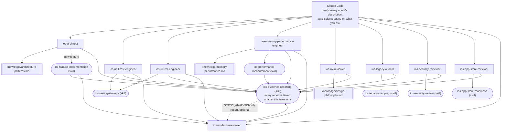

# claude-ai-agents-ios

🌐 [English](README.md) | [简体中文](README.zh-CN.md) | [Español](README.es.md) | [हिन्दी](README.hi.md) | [العربية](README.ar.md) | [Português (Brasil)](README.pt-BR.md) | [Русский](README.ru.md) | [日本語](README.ja.md) | [Français](README.fr.md) | [Deutsch](README.de.md) | [한국어](README.ko.md) | [Italiano](README.it.md) | [Türkçe](README.tr.md) | [Tiếng Việt](README.vi.md) | [Bahasa Indonesia](README.id.md)

[Claude Code](https://claude.com/claude-code) をそのまま専任の iOS 開発チームに
変える、サブエージェント一式とスキル一式です。アーキテクチャ設計、単体テスト、
UI テスト、メモリ/パフォーマンス、UI/UX レビュー、セキュリティ、App Store 提出
準備、レガシーコードベースの調査、そして独立したエビデンスレビュー——それぞれが
リクエスト内容に応じて自動的に呼び出され、手動での切り替えは不要です。

## 収録内容

### サブエージェント(`.claude/agents/`)

| エージェント | 呼び出されるタイミング | ツール |
|---|---|---|
| `ios-architect` | 新しい機能/モジュールの開始時、「これはどう構造化すべき?」と聞かれたとき、リファクタリングの計画時、MVVM/Clean/VIPER の選定時、DI の方針や SwiftData vs. Core Data の決定時 | Read, Grep, Glob, Write, Edit, Skill, `ios-agent`* |
| `ios-unit-test-engineer` | テスト、テストカバレッジ、TDD の依頼時、既存コードをテスト可能にしたいとき | Read, Grep, Glob, Write, Edit, Bash, Skill, `ios-agent`* |
| `ios-ui-test-engineer` | UI テストの依頼時、不安定な UI テストのデバッグ時、スナップショットテストの構築時 | Read, Grep, Glob, Write, Edit, Bash, Skill, `ios-agent`*, `ios-simulator`* |
| `ios-memory-performance-engineer` | メモリリーク、メモリ増加、スクロールのカクつき、起動の遅さの報告時 | Read, Grep, Glob, Bash, Edit, Skill, `ios-agent`*, `ios-simulator`* |
| `ios-ux-reviewer` | UI/UX レビューやデザインの一貫性チェックの依頼時 | Read, Grep, Glob, Skill, `ios-agent`*(読み取り専用) |
| `ios-legacy-auditor` | 不慣れ、ドキュメントなし、または大規模なレガシーコードベースへの参入時 | Read, Grep, Glob, Bash, Skill, `ios-agent`*(読み取り専用) |
| `ios-security-reviewer` | セキュリティレビュー、「これは安全?」、脆弱性チェック、認証/セッション監査の依頼時 | Read, Grep, Glob, Bash, Skill, `ios-agent`*(読み取り専用) |
| `ios-app-store-reviewer` | 「これは提出できる?」「却下されない?」、App Store 準拠のチェック依頼時 | Read, Grep, Glob, Bash, Skill, `ios-agent`*(読み取り専用) |
| `ios-evidence-reviewer` | 他のエージェントがレポートを作成した後、「このレポートをダブルチェックして」「この主張を検証して」と依頼されたとき | Read, Grep, Glob, Skill(読み取り専用) |

\* `ios-agent` と `ios-simulator` はオプションのサードパーティ MCP サーバーです——
下記の[オプションのツール](#optional-tooling-static-analysis--simulator-control)を
参照してください。どちらのエージェントも、これらなしで単体で動作します。
`ios-agent` は構造化されたツールで `STATIC_ANALYSIS`(静的解析)レベルの読み取りを
強化しますが——`BUILD_VERIFIED`/`TEST_VERIFIED`/`RUNTIME_VERIFIED` へ主張を引き
上げることはありません。自分ではアプリをビルドも実行もしないためです。
`ios-simulator` は実際にアプリをビルド/インストール/起動するため、その出力は
本当に `BUILD_VERIFIED`、`TEST_VERIFIED`、`RUNTIME_VERIFIED` を獲得できます——
7 段階の分類については下記の[エビデンス・オーバー・アサーション](#evidence-over-assertion)
を参照してください。

### スキル(`.claude/skills/`)

| スキル | 対応先 | 目的 |
|---|---|---|
| `ios-testing-strategy` | `ios-unit-test-engineer`、`ios-ui-test-engineer` | 具体的な手順:テストの継ぎ目を探す → テストダブル → red/green の反復 |
| `ios-legacy-mapping` | `ios-legacy-auditor` | 具体的な手順:棚卸し → アーキテクチャ検出 → ブリッジングのリスク → セキュリティシグナル → まとめ文書の作成 |
| `ios-security-review` | `ios-security-reviewer` | 8 領域の監査:データ保存/プライバシー → 通信のセキュリティ → 認証/セッション → 入力検証 → ディープリンク → サードパーティ SDK → コードの衛生状態 → 権限 |
| `ios-app-store-readiness` | `ios-app-store-reviewer` | 提出前監査:プライバシーマニフェスト → 輸出コンプライアンス → 権限の利用目的説明 → アプリのトラッキングの透明性 → 「Sign in with Apple」の対等要件 → 未使用の権限 → よくある却下要因 |
| `ios-feature-implementation` | 汎用——あらゆる機能リクエストで発火し、`ios-architect` と連携 | 既存コード、ビジネスロジック、API/通信の挙動、セキュリティの現状を調査 → 着手前に方針を説明 → 実装 → 検証(ビルド、テスト、循環参照、メモリ、パフォーマンス、セキュリティ)→ 報告 |
| `ios-performance-measurement` | `ios-memory-performance-engineer` | 再現 → 何を測るか決める → 変更前に測定 → 変更 → 同条件で再測定 → 計測用コードの除去を確認 |
| `ios-evidence-reporting` | 全 9 エージェント——いずれかがタスクを完了するたびに発火 | 7 段階のエビデンス分類(`ASSUMPTION` → `HUMAN_VERIFICATION`)、主張 → 必要最低限のエビデンスの対応表、そして禁止される主張のリスト。これにより、対応するエビデンスのレベルに達していないのに「動く」「修正済み」「速くなった/安全/スレッドセーフ」と主張することがなくなる |

### ナレッジライブラリ(`knowledge/`)

深い参考情報はエージェント本体に埋め込むのではなくここに置くことで、各
エージェントは*いつ行動すべきか*と*どんな手順を踏むべきか*に集中でき、
ナレッジファイルの方が*何をチェックすべきかの正典*になります。エージェントは
必要に応じて `Read` ツールでこれらを読み込みます——追加設定は不要です。

| ファイル | 参照元 | 内容 |
|---|---|---|
| `memory-performance.md` | `ios-memory-performance-engineer` | ARC/Instruments/画像/並行処理の基礎に加え、フレームワーク固有のパターン(RxSwift、WKWebView、PDFKit、Core Data、Firebase、CocoaPods、Keychain、サードパーティのプレゼンテーションライブラリ、UICollectionView/UITableView、SwiftUI/UIKit ブリッジ、AVFoundation、CoreLocation、URLSession) |
| `architecture-patterns.md` | `ios-architect` | パターン/意思決定基準:MVVM/Clean/VIPER、Swift の並行処理、モジュール化、永続化、ナビゲーション、DI、セキュリティを意識した構造 |
| `design-philosophy.md` | `ios-ux-reviewer` | Apple の Human Interface Guidelines、Dieter Rams の「優れたデザインの 10 か条」の iOS への応用、Nielsen Norman Group のユーザビリティ原則、および参考文献一覧 |

### テンプレート

- `CLAUDE.md.template` ——プロジェクトのルートに `CLAUDE.md` としてコピーし、
  プレースホルダーを埋めてください(あるいは、不慣れなコードベースであれば
  `ios-legacy-auditor` にアーキテクチャの節を生成してもらうこともできます)。

## インストール

必要なものを、あなたの iOS プロジェクトのリポジトリ直下にコピーします:

```bash
# このリポジトリから、あなたのプロジェクトへコピー:
mkdir -p /path/to/your-ios-project/.claude
cp -r .claude/agents /path/to/your-ios-project/.claude/
cp -r .claude/skills /path/to/your-ios-project/.claude/
cp -r knowledge /path/to/your-ios-project/knowledge
cp CLAUDE.md.template /path/to/your-ios-project/CLAUDE.md   # 後で編集する
```

```bash
# あるいは、複数プロジェクトで同期させたい場合はコピーの代わりにシンボリックリンク:
ln -s /path/to/claude-ai-agents-ios/.claude/agents /path/to/your-ios-project/.claude/agents
ln -s /path/to/claude-ai-agents-ios/.claude/skills /path/to/your-ios-project/.claude/skills
ln -s /path/to/claude-ai-agents-ios/knowledge /path/to/your-ios-project/knowledge
```

`knowledge/` フォルダは、あなたのプロジェクトのリポジトリ直下(`.claude/` と
同じ階層)に置く必要があります——エージェントはその相対パスで参照します。

プロジェクト単位ではなく個人的に(複数プロジェクト横断で)使いたい場合は、
代わりに `~/.claude/agents/` と `~/.claude/skills/` にコピーしてください——
Claude Code が個人レベルとプロジェクトレベルのエージェント/スキルを自動的に
マージします。ただし `knowledge/` はリポジトリ相対パスで参照されるため、
個人利用であっても各プロジェクトのルートに `knowledge/` を用意する必要が
あります(プロジェクトごとにシンボリックリンクするのが一番簡単です)。

他に必要な設定はありません——Claude Code は各エージェントの frontmatter に
ある `description` を読み取り、あなたのリクエストに応じて適切なものを
自動的に呼び出します。一部のエージェントのエビデンスレベルを
`STATIC_ANALYSIS` からさらに引き上げてくれる 2 つのサードパーティ MCP
サーバーについては、下記の[オプションのツール](#optional-tooling-static-analysis--simulator-control)
を参照してください——これらがなくても、上記はすべて単体で動作します。

## オプションのツール:静的解析とシミュレータ操作

以下の 2 つのサーバーは [`ios-agent-skill`](https://github.com/Nagarjuna2997/ios-agent-skill)
由来です(MIT ライセンス、本リポジトリとの提携関係はありません)。上記の
いくつかのエージェントに、コードを読むだけでなく実際に*チェックを実行する*
手段を与えます。どちらも必須ではありません——なくても各エージェントは
`STATIC_ANALYSIS` レベルの読み取りと手順の説明にフォールバックして動作します。

### `ios-agent-mcp` ——静的解析(公開済み、推奨)

Swift プロジェクトをスキャンし、構造化された結果(ファイル、行、影響、修正案)を
返す 10 個の読み取り専用ツール。対象は並行処理、アーキテクチャ、SwiftUI の
パターン、可用性ガード、App Store 提出準備、メモリ、セキュリティ、テスト、
パフォーマンスです——詳細は[ツール一覧](https://github.com/Nagarjuna2997/ios-agent-skill/tree/main/mcp-server)
を参照してください。ファイルシステムの読み取りのみで、ネットワークアクセスは
ありません。

本リポジトリの `.mcp.json` はすでにこれを宣言しているので、`.mcp.json` を
`.claude/` と一緒にあなたのプロジェクトへコピーするだけです:

```bash
cp .mcp.json /path/to/your-ios-project/.mcp.json
```

Claude Code は、必要になった最初のタイミングでプロジェクトスコープの
サーバーを有効にするか尋ねてきます。`npx` が初回利用時にパッケージを
取得するため、グローバルインストールは不要です。

### `ios-simulator-mcp` ——シミュレータ操作(初期段階、ソースからのみ)

起動中の iOS シミュレータに対する、ビルド・テスト・インストール・起動・
ディープリンク・スクリーンショットのツール群——上記の静的解析ツールの
ランタイム版です。執筆時点では **v0.1.0 で npm 未公開、初期段階**です
(公式ドキュメント自身が「最初の安全なスライス」と称しています)。頼れる
ものとしてではなく、試してみるものとして扱ってください:

```bash
git clone https://github.com/Nagarjuna2997/ios-agent-skill.git
cd ios-agent-skill/ios-simulator-mcp
npm install && npm run build
```

その後、あなたのプロジェクトの `.mcp.json`(または個人用 MCP 設定)に、
サーバー名 `ios-simulator` として、ビルド後のパスを指定して追加します:

```jsonc
{
  "mcpServers": {
    "ios-simulator": {
      "command": "node",
      "args": ["/absolute/path/to/ios-agent-skill/ios-simulator-mcp/dist/index.js"]
    }
  }
}
```

macOS と Xcode コマンドラインツールが必要です。サーバー名を `ios-simulator`
以外にした場合は、`ios-ui-test-engineer.md` と
`ios-memory-performance-engineer.md` にある `mcp__ios-simulator__*` の
ツール権限も合わせて更新してください。

## 全体の仕組み



設定すべきルーターやオーケストレーターは存在しません——Claude Code 自身の
description マッチングこそがディスパッチ層です。各エージェントは末端の
存在で、`knowledge/*.md` ファイルを読んで深い参照情報を得るか、`Skill` に
従って共有の手順を踏むか、あるいはその両方を行い、最終的にはすべての経路が
同じエビデンス報告基準に収束します。`ios-evidence-reviewer` はこの「末端」
というルールの唯一の例外です:*別の*エージェントが完成させたレポートを
読み、示されているエビデンスが裏付けていない主張を格下げし、修正済みの
レポートが同じステータスブロックの形式で締めくくられます。
`ios-feature-implementation`、`ios-memory-performance-engineer`、
`ios-unit-test-engineer`、`ios-ui-test-engineer` は、自分のレポートが
`BUILD_VERIFIED` 以上に達した場合、自動的にこれを経由します——ビルド/
テスト/測定を実行した当のエージェントだけが、そのレポートの正直さを
チェックする唯一の存在ではないということです。

## エージェント間の連携

典型的な流れです。とはいえ、これらを名前で明示的に呼び出す必要はありません:

1. **不慣れな、あるいはドキュメントのないコードベース?** まず
   `ios-legacy-auditor` から始めます——実際のアーキテクチャをマッピングし、
   コードに手を付ける前に `CLAUDE.md` に貼り付けられるまとめを作成します。
2. **新しい機能/モジュール?** `ios-architect` が構造を提案し、その設計が
   単体テスト可能かどうかを指摘します。続いて `ios-feature-implementation`
   が実際の実装を進めます——既存のビジネスロジックをまず調査し、
   着手前に方針を説明し、合意した構造に沿って実装し、検証(ビルド、
   テスト、メモリ、パフォーマンス)を経てから完了を報告します。
3. **テストが必要?** ロジックには `ios-unit-test-engineer`、ユーザー
   フローには `ios-ui-test-engineer`——どちらも `ios-testing-strategy` の
   同じ「継ぎ目を見つける → red/green」の手順に従います。
4. **新しい、あるいは変更された画面?** `ios-ux-reviewer` が Apple の
   Human Interface Guidelines とその背後にあるデザイン哲学に照らして
   チェックしてから、リリースします。
5. **動作が遅い、あるいはメモリが漏れている気がする?** まず
   `ios-memory-performance-engineer` が静的な原因をコードから探し、
   コードを読むだけでは特定できない場合は、具体的な Instruments の
   手順を提示します。
6. **セキュリティチェックをしたい?** `ios-security-reviewer` が
   専用の 8 領域監査(データ保存、通信、認証、入力検証、ディープリンク、
   依存関係、コードの衛生状態、権限)を実行します。`ios-architect`、
   `ios-legacy-auditor`、`ios-feature-implementation` もそれぞれの作業の
   一環として軽量でスコープの限られたセキュリティ上の懸念を指摘し、
   本格的な監査が必要な場合はここへ誘導します。
7. **App Store への提出準備は?** `ios-app-store-reviewer` がコードから
   分かる提出上の障害(プライバシーマニフェスト、権限の利用目的説明、
   輸出コンプライアンス、Sign in with Apple の対等要件)をチェックします
   ——`ios-security-reviewer` とは別の観点ですが、権限や通信のセキュリティ
   など重なる部分もあるため、どちらか一方でも該当するならリリース前に
   両方実行することをおすすめします。
8. **レポートが `BUILD_VERIFIED` 以上に達している?** `ios-evidence-reviewer`
   が、それが完了とみなされる前にチェックします。静的な発見だけでなく
   ビルド/テスト/実行時/測定に基づく主張を単独で生み出せるエージェントで
   ある `ios-feature-implementation`、`ios-memory-performance-engineer`、
   `ios-unit-test-engineer`、`ios-ui-test-engineer` は、それぞれ最後の
   ステップとして自動的にこれを経由します。他のエージェントのレポートも
   直接これに渡すことができます。

## エビデンス・オーバー・アサーション(断言よりも根拠を)

AI の自信はエビデンスではありません。AI の推論はランタイムのエビデンスでは
ありません。コードを変更したからといって、それが自動的に検証済みの修正に
なるわけでもありません。本リポジトリのすべてのエージェントは、「完了!
動きます」という単なる断言ではなく、`ios-evidence-reporting` スキルの
ステータスブロックでレポートを締めくくり、そのブロック内の各行は、弱いものから
強いものへと 7 段階のエビデンスレベルのいずれかに位置づけられます:

`ASSUMPTION` → `STATIC_ANALYSIS` → `BUILD_VERIFIED` → `TEST_VERIFIED`
→ `RUNTIME_VERIFIED` → `RUNTIME_MEASURED` → `HUMAN_VERIFICATION`

ある主張が、実際に到達したエビデンスのレベルよりも高いレベルで報告される
ことは決してありません。ソースコードを読むこと(MCP の静的解析ツールが
出す構造化された結果も含む)は、それを読んだのが人間であってもツールで
あっても、常に `STATIC_ANALYSIS` です——ツールが出したからといってより
強いエビデンスになるわけではなく、「メモリリークは存在しない」や
「メモリが改善した」といった主張を裏付けることは決してできません。
それらには特に `RUNTIME_MEASURED` が必要です:つまり、実際にアプリを
動かして得られた実際の数値(Instruments、MetricKit、`os_signpost`)を、
`ios-performance-measurement` の再現 → ベースライン → 測定 → 変更 →
ビルド → テスト → 再測定 → 比較 → 報告というループを通じて得ることです。
本リポジトリのエージェントは、対応するエビデンスがない限り、次のような
言葉を使うことは決してありません:「修正した」「最適化した」「速くなった」
「メモリリークがない」「スレッドセーフ」「安全」、あるいは「本番投入
可能(production-ready)」(これはどのエージェント単独のエビデンスでも
カバーしきれない、複数領域にまたがる主張です)——完全なリストと、
正確な言い回しの代替案は `ios-evidence-reporting` の「主張 → 必要最低限の
エビデンス」対応表を参照してください。

何かを実装した当のエージェントが、そのレポートが正直かどうかを判断する
唯一の存在であるべきではないという考え方から、`ios-evidence-reviewer` が
同じ対応表に照らして完成済みレポートの主張を独立に再チェックし、根拠の
ない部分を最終的なものとして提示される前に格下げします——詳細は上記の
「全体の仕組み」を参照してください。

## デザイン哲学

特に `ios-ux-reviewer` は、根拠のない美的センスの断言ではなく、具体的に
名前の挙がった資料に基づいています:Apple の Human Interface Guidelines、
Dieter Rams の「優れたデザインの 10 か条」、Don Norman の『誰のための
デザイン?』(The Design of Everyday Things)、Nielsen Norman Group の
ユーザビリティ原則、そして具体的な視覚的判断のための *Refactoring UI*。
それぞれが iOS にどう適用されるかについては `knowledge/design-philosophy.md`
を参照してください。

## このリポジトリのメンテナンス

`scripts/audit-agents.sh` は、開発中にすべてのエージェント/スキルファイルが
守るべき機械的なチェックを実行します:frontmatter の `name:` がファイル名や
ディレクトリ名と一致しているか、`description:` に実際のトリガーフレーズが
含まれているか、本文中の読み取り専用であるという主張が `Write`/`Edit` の
権限付与と矛盾していないか、コードフェンスが閉じているか、リポジトリ内の
バッククォートで囲まれた `ios-*` への参照がすべて実在するエージェントや
スキルに解決できるか、そして旧来の `(static)`/`(executed)` による分級が
現在の 7 段階の分類に移行されずに残っていないか。これは処理をブロック
するものではありません——出てくるのは人間が対応すべき発見事項であって、
関門ではありません。

```bash
./scripts/audit-agents.sh
```
