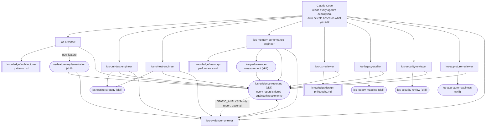

# claude-ai-agents-ios

🌐 [English](README.md) | [简体中文](README.zh-CN.md) | [Español](README.es.md) | [हिन्दी](README.hi.md) | [العربية](README.ar.md) | [Português (Brasil)](README.pt-BR.md) | [Русский](README.ru.md) | [日本語](README.ja.md) | [Français](README.fr.md) | [Deutsch](README.de.md) | [한국어](README.ko.md) | [Italiano](README.it.md) | [Türkçe](README.tr.md) | [Tiếng Việt](README.vi.md) | [Bahasa Indonesia](README.id.md)

[Claude Code](https://claude.com/claude-code)를 전담 iOS 개발팀으로 바꿔주는,
바로 설치해서 쓸 수 있는 서브에이전트(subagent)와 스킬(Skill) 모음입니다:
아키텍처, 단위 테스트, UI 테스트, 메모리/성능, UI/UX 리뷰, 보안, App Store
제출 준비, 레거시 코드베이스 조사, 그리고 독립적인 근거 검토까지——요청
내용에 따라 자동으로 호출되므로 수동으로 전환할 필요가 없습니다.

## 포함된 것

### 서브에이전트 (`.claude/agents/`)

| 에이전트 | 호출 시점 | 도구 |
|---|---|---|
| `ios-architect` | 새 기능/모듈을 시작할 때, "이건 어떻게 구조를 잡아야 할까"라고 물을 때, 리팩터링을 계획할 때, MVVM/Clean/VIPER 중 선택할 때, DI 방식이나 SwiftData vs. Core Data를 결정할 때 | Read, Grep, Glob, Write, Edit, Skill, `ios-agent`* |
| `ios-unit-test-engineer` | 테스트, 테스트 커버리지, TDD를 요청할 때, 기존 코드를 테스트 가능하게 만들 때 | Read, Grep, Glob, Write, Edit, Bash, Skill, `ios-agent`* |
| `ios-ui-test-engineer` | UI 테스트를 요청할 때, 불안정한 UI 테스트를 디버깅할 때, 스냅샷 테스트를 구성할 때 | Read, Grep, Glob, Write, Edit, Bash, Skill, `ios-agent`*, `ios-simulator`* |
| `ios-memory-performance-engineer` | 메모리 누수, 메모리 증가, 스크롤 끊김, 느린 실행 속도를 보고할 때 | Read, Grep, Glob, Bash, Edit, Skill, `ios-agent`*, `ios-simulator`* |
| `ios-ux-reviewer` | UI/UX 리뷰나 디자인 일관성 점검을 요청할 때 | Read, Grep, Glob, Skill, `ios-agent`*(읽기 전용) |
| `ios-legacy-auditor` | 낯설거나 문서화되지 않은, 또는 규모가 큰 레거시 코드베이스를 인수인계 받을 때 | Read, Grep, Glob, Bash, Skill, `ios-agent`*(읽기 전용) |
| `ios-security-reviewer` | 보안 리뷰, "이거 안전해?", 취약점 점검, 인증/세션 감사를 요청할 때 | Read, Grep, Glob, Bash, Skill, `ios-agent`*(읽기 전용) |
| `ios-app-store-reviewer` | "이거 제출해도 돼?", "반려되지 않을까?"라고 물을 때, App Store 준수 여부를 점검할 때 | Read, Grep, Glob, Bash, Skill, `ios-agent`*(읽기 전용) |
| `ios-evidence-reviewer` | 다른 에이전트가 보고서를 작성한 뒤, "이 보고서 다시 확인해줘"/"이 주장들 검증해줘"라고 요청할 때 | Read, Grep, Glob, Skill(읽기 전용) |

\* `ios-agent`와 `ios-simulator`는 선택 사항인 서드파티 MCP 서버입니다——아래
[선택적 도구](#optional-tooling-static-analysis--simulator-control) 참조.
두 서버가 없어도 모든 에이전트는 독자적으로 동작합니다. `ios-agent`는 구조화된
도구로 `STATIC_ANALYSIS`(정적 분석) 수준의 읽기를 강화할 뿐, `BUILD_VERIFIED`/
`TEST_VERIFIED`/`RUNTIME_VERIFIED`로 주장을 끌어올리지는 않습니다——앱을 직접
빌드하거나 실행하지 않기 때문입니다. `ios-simulator`는 실제로 앱을 빌드/설치/
실행하므로, 그 결과물은 실제로 `BUILD_VERIFIED`, `TEST_VERIFIED`,
`RUNTIME_VERIFIED`를 획득할 수 있습니다——7단계 근거 체계는 아래
[단정보다 근거](#evidence-over-assertion)를 참고하세요.

### 스킬 (`.claude/skills/`)

| 스킬 | 지원 대상 | 목적 |
|---|---|---|
| `ios-testing-strategy` | `ios-unit-test-engineer`, `ios-ui-test-engineer` | 구체적인 절차: 이음매 찾기 → 테스트 더블 → red/green 반복 |
| `ios-legacy-mapping` | `ios-legacy-auditor` | 구체적인 절차: 인벤토리 → 아키텍처 탐지 → 브리징 위험 → 보안 신호 → 요약 문서 작성 |
| `ios-security-review` | `ios-security-reviewer` | 8개 영역 감사: 데이터 저장/개인정보 → 전송 보안 → 인증/세션 → 입력 검증 → 딥링크 → 서드파티 SDK → 코드 위생 → 권한 |
| `ios-app-store-readiness` | `ios-app-store-reviewer` | 제출 전 감사: 개인정보 매니페스트 → 수출 규정 준수 → 권한 사용 목적 설명 → 앱 추적 투명성 → "Apple로 로그인" 동등 요건 → 사용하지 않는 권한 → 흔한 반려 사유 |
| `ios-feature-implementation` | 범용 — 어떤 기능 요청에도 작동하며 `ios-architect`와 함께 동작 | 기존 코드, 비즈니스 로직, API/네트워킹 동작, 보안 현황 조사 → 손대기 전에 계획 설명 → 구현 → 검증(빌드, 테스트, 순환 참조, 메모리, 성능, 보안) → 보고 |
| `ios-performance-measurement` | `ios-memory-performance-engineer` | 재현 → 무엇을 측정할지 결정 → 변경 전 측정 → 변경 → 동일 조건에서 재측정 → 계측 코드 제거 확인 |
| `ios-evidence-reporting` | 전체 9개 에이전트 — 어느 하나라도 작업을 마칠 때마다 작동 | 7단계 근거 체계(`ASSUMPTION` → `HUMAN_VERIFICATION`), 주장 → 최소 근거 대응표, 그리고 금지된 주장 목록——이를 통해 해당 수준의 근거 없이 "작동한다", "고쳤다", "더 빠르다/안전하다/스레드 세이프하다"라고 주장하는 에이전트가 없도록 함 |

### 지식 라이브러리 (`knowledge/`)

깊이 있는 참고 자료는 에이전트 본문에 넣지 않고 이곳에 두어, 각 에이전트는
*언제 행동할지*와 *어떤 절차를 따를지*에 집중하고, 지식 파일은 *무엇을
점검해야 하는지*에 대한 근거 자료가 됩니다. 에이전트는 필요할 때 `Read`
도구로 이 파일들을 읽습니다——별도 설정은 필요 없습니다.

| 파일 | 참조하는 곳 | 내용 |
|---|---|---|
| `memory-performance.md` | `ios-memory-performance-engineer` | ARC/Instruments/이미지/동시성 기본 지식과, 프레임워크별 구체 패턴(RxSwift, WKWebView, PDFKit, Core Data, Firebase, CocoaPods, Keychain, 서드파티 프레젠테이션 라이브러리, UICollectionView/UITableView, SwiftUI/UIKit 브리지, AVFoundation, CoreLocation, URLSession) |
| `architecture-patterns.md` | `ios-architect` | 패턴/의사결정 기준: MVVM/Clean/VIPER, Swift 동시성, 모듈화, 영속성, 내비게이션, DI, 보안을 고려한 구조 |
| `design-philosophy.md` | `ios-ux-reviewer` | Apple Human Interface Guidelines, iOS에 적용한 Dieter Rams의 10가지 좋은 디자인 원칙, Nielsen Norman Group의 사용성 원칙, 그리고 참고 문헌 목록 |

### 템플릿

- `CLAUDE.md.template` — 프로젝트 루트에 `CLAUDE.md`로 복사한 뒤 플레이스홀더를
  채우세요(또는 낯선 코드베이스라면 `ios-legacy-auditor`에게 아키텍처 섹션을
  생성하도록 맡길 수도 있습니다).

## 설치

필요한 것을 여러분의 iOS 프로젝트 루트로 복사합니다:

```bash
# 이 저장소에서 여러분 프로젝트로 복사:
mkdir -p /path/to/your-ios-project/.claude
cp -r .claude/agents /path/to/your-ios-project/.claude/
cp -r .claude/skills /path/to/your-ios-project/.claude/
cp -r knowledge /path/to/your-ios-project/knowledge
cp CLAUDE.md.template /path/to/your-ios-project/CLAUDE.md   # 이후 편집
```

```bash
# 또는 여러 프로젝트 간 동기화를 위해 복사 대신 심볼릭 링크:
ln -s /path/to/claude-ai-agents-ios/.claude/agents /path/to/your-ios-project/.claude/agents
ln -s /path/to/claude-ai-agents-ios/.claude/skills /path/to/your-ios-project/.claude/skills
ln -s /path/to/claude-ai-agents-ios/knowledge /path/to/your-ios-project/knowledge
```

`knowledge/` 폴더는 반드시 여러분 프로젝트의 루트(`.claude/`와 같은 위치)에
있어야 합니다——에이전트가 이 상대 경로로 참조하기 때문입니다.

프로젝트별이 아니라 개인적으로(여러 프로젝트에 걸쳐) 사용하려면, 대신
`~/.claude/agents/`와 `~/.claude/skills/`에 복사하세요——Claude Code가 개인
수준과 프로젝트 수준의 에이전트/스킬을 자동으로 병합합니다. 다만
`knowledge/`는 저장소 상대 경로로 참조되므로, 개인적으로 사용하더라도 각
프로젝트 루트에 `knowledge/`가 있어야 합니다(프로젝트마다 심볼릭 링크하는
것이 가장 간단합니다).

그 외에 설정할 것은 없습니다——Claude Code는 각 에이전트의 frontmatter에 있는
`description`을 읽어, 여러분의 요청에 따라 알맞은 것을 자동으로 호출합니다.
일부 에이전트의 근거 수준을 `STATIC_ANALYSIS`보다 더 끌어올려 주는 두 개의
서드파티 MCP 서버에 대해서는 아래
[선택적 도구](#optional-tooling-static-analysis--simulator-control)를
참고하세요——이 서버들이 없어도 위 내용은 모두 그 자체로 동작합니다.

## 선택적 도구: 정적 분석과 시뮬레이터 제어

아래 두 서버는 [`ios-agent-skill`](https://github.com/Nagarjuna2997/ios-agent-skill)
에서 가져온 것입니다(MIT 라이선스, 이 저장소와 제휴 관계는 아님). 위 에이전트들에게
코드를 읽는 것뿐 아니라 실제로 점검을 *실행*할 방법을 제공합니다. 둘 다 필수는
아닙니다——이 도구들이 없어도 각 에이전트는 `STATIC_ANALYSIS` 수준의 읽기와
수동으로 설명된 절차로 대체하여 동작합니다.

### `ios-agent-mcp` — 정적 분석 (배포됨, 권장)

Swift 프로젝트를 스캔해 구조화된 결과(파일, 줄, 영향, 수정 방법)를 반환하는
10개의 읽기 전용 도구. 동시성, 아키텍처, SwiftUI 패턴, 가용성 가드, App Store
제출 준비, 메모리, 보안, 테스트, 성능을 다룹니다——자세한 내용은
[도구 목록](https://github.com/Nagarjuna2997/ios-agent-skill/tree/main/mcp-server)을
참고하세요. 파일시스템 읽기 전용이며 네트워크 접근은 없습니다.

이 저장소의 `.mcp.json`이 이미 이를 선언해 두었으므로, `.mcp.json`을
`.claude/`와 함께 여러분 프로젝트로 복사하기만 하면 됩니다:

```bash
cp .mcp.json /path/to/your-ios-project/.mcp.json
```

Claude Code는 처음 관련이 있을 때 프로젝트 범위 서버를 활성화할지 물어봅니다.
`npx`가 처음 사용될 때 패키지를 가져오므로 전역 설치는 필요 없습니다.

### `ios-simulator-mcp` — 시뮬레이터 제어 (초기 단계, 소스로만 제공)

부팅된 iOS 시뮬레이터를 대상으로 빌드, 테스트, 설치, 실행, 딥링크, 스크린샷을
수행하는 도구——위 정적 분석기의 런타임 버전입니다. 이 글을 쓰는 시점 기준으로
**v0.1.0이며 아직 npm에 배포되지 않은 초기 단계**입니다(공식 문서에서도 "첫 번째
안전한 조각"이라 부릅니다), 그러니 의존할 대상이 아니라 시도해 볼 대상으로
다루세요:

```bash
git clone https://github.com/Nagarjuna2997/ios-agent-skill.git
cd ios-agent-skill/ios-simulator-mcp
npm install && npm run build
```

그런 다음 여러분 프로젝트의 `.mcp.json`(또는 개인 MCP 설정)에 서버 이름
`ios-simulator`로, 빌드된 경로를 가리키도록 추가합니다:

```jsonc
{
  "mcpServers": {
    "ios-simulator": {
      "command": "node",
      "args": ["/absolute/path/to/ios-agent-skill/ios-simulator-mcp/dist/index.js"]
    }
  }
}
```

macOS와 Xcode 커맨드라인 도구가 필요합니다. 서버 이름을 `ios-simulator`가 아닌
다른 이름으로 지정했다면, `ios-ui-test-engineer.md`와
`ios-memory-performance-engineer.md`에 있는 `mcp__ios-simulator__*` 도구
권한도 함께 맞춰서 업데이트하세요.

## 전체 구조



설정해야 할 라우터나 오케스트레이터는 없습니다——Claude Code 자체의 description
매칭이 곧 디스패치 계층입니다. 각 에이전트는 말단(leaf) 노드로서,
`knowledge/*.md` 파일을 읽어 깊이 있는 참고 자료를 얻거나, `Skill`을 따라
공유 절차를 수행하거나, 혹은 둘 다 하며, 결국 모든 경로는 동일한 근거 보고
기준으로 수렴합니다. `ios-evidence-reviewer`는 이 "말단" 규칙의 유일한
예외입니다: *다른* 에이전트가 완성한 보고서를 읽고, 제시된 근거가 뒷받침하지
못하는 주장을 강등시킨 뒤, 수정된 보고서가 동일한 상태 블록 형식으로 다시
마무리됩니다. `ios-feature-implementation`, `ios-memory-performance-engineer`,
`ios-unit-test-engineer`, `ios-ui-test-engineer`는 자신의 보고서가
`BUILD_VERIFIED` 이상에 도달할 때마다 자동으로 이를 거칩니다——빌드/테스트/
측정을 수행한 바로 그 에이전트만이 자기 보고서의 정직함을 확인하는 유일한
존재가 아니라는 뜻입니다.

## 에이전트 간 협업 방식

전형적인 흐름입니다. 다만 여러분이 직접 이름으로 호출할 필요는 전혀 없습니다:

1. **낯설거나 문서화되지 않은 코드베이스인가요?** `ios-legacy-auditor`로
   시작하세요——실제 아키텍처를 파악하고, 코드에 손대기 전에 `CLAUDE.md`에
   붙여넣을 수 있는 요약을 만들어 줍니다.
2. **새 기능/모듈인가요?** `ios-architect`가 구조를 제안하고 그 설계가 단위
   테스트 가능한지 짚어 줍니다. 이어서 `ios-feature-implementation`이 실제
   구현을 진행합니다——먼저 기존 비즈니스 로직을 조사하고, 손대기 전에 계획을
   설명하고, 합의된 구조에 따라 구현한 뒤, 검증(빌드, 테스트, 메모리, 성능)을
   거쳐 완료를 보고합니다.
3. **테스트가 필요한가요?** 로직에는 `ios-unit-test-engineer`, 사용자
   흐름에는 `ios-ui-test-engineer`——둘 다 `ios-testing-strategy`의 동일한
   "이음매 찾기 → red/green" 절차를 따릅니다.
4. **새로 만들었거나 변경한 화면인가요?** `ios-ux-reviewer`가 Apple의 Human
   Interface Guidelines와 그 배경이 되는 디자인 철학에 비추어 검토한 뒤
   출시하도록 합니다.
5. **느려진 것 같거나 메모리가 새는 것 같나요?** `ios-memory-performance-engineer`가
   먼저 코드에서 정적인 원인을 찾고, 코드만 읽어서는 찾을 수 없다면 구체적인
   Instruments 절차를 알려줍니다.
6. **보안 점검을 원하시나요?** `ios-security-reviewer`가 전용 8개 영역
   감사(저장, 전송, 인증, 입력 검증, 딥링크, 의존성, 코드 위생, 권한)를
   수행합니다. `ios-architect`, `ios-legacy-auditor`, `ios-feature-implementation`도
   각자의 작업 중 가볍고 범위가 제한된 보안 우려 사항을 함께 짚어 주며,
   전체 감사가 필요하면 이곳을 가리킵니다.
7. **App Store 제출을 앞두고 있나요?** `ios-app-store-reviewer`가 코드에서
   확인 가능한 제출 장애 요인(개인정보 매니페스트, 권한 사용 목적 설명, 수출
   규정 준수, Sign in with Apple 동등 요건)을 점검합니다——`ios-security-reviewer`와는
   별개의 관심사이지만 권한, 전송 보안 등 겹치는 부분도 있으니, 둘 중
   하나라도 해당한다면 출시 전에 둘 다 실행하세요.
8. **보고서가 `BUILD_VERIFIED` 이상에 도달했나요?** `ios-evidence-reviewer`가
   완료로 취급되기 전에 이를 점검합니다. 단순한 정적 발견이 아니라 빌드/
   테스트/실행/측정에 기반한 주장을 독자적으로 만들어 낼 수 있는
   에이전트인 `ios-feature-implementation`, `ios-memory-performance-engineer`,
   `ios-unit-test-engineer`, `ios-ui-test-engineer`는 각각 마지막 단계로
   자동으로 이를 거칩니다. 다른 어떤 에이전트의 보고서든 직접 이곳에 넘길
   수도 있습니다.

## 단정보다 근거

AI의 자신감은 근거가 아닙니다. AI의 추론은 런타임 근거가 아닙니다. 코드를
바꿨다고 해서 그것이 자동으로 검증된 수정이 되지는 않습니다. 이 저장소의
모든 에이전트는 "완료! 작동합니다"라는 단정 대신 `ios-evidence-reporting`
스킬의 상태 블록으로 보고서를 마무리하며, 그 블록의 각 줄은 약한 것부터
강한 것까지 7단계 근거 수준 중 하나로 분류됩니다:

`ASSUMPTION` → `STATIC_ANALYSIS` → `BUILD_VERIFIED` → `TEST_VERIFIED`
→ `RUNTIME_VERIFIED` → `RUNTIME_MEASURED` → `HUMAN_VERIFICATION`

어떤 주장도 실제로 도달한 근거 수준보다 높게 보고되지 않습니다. 소스를
읽는 것(MCP 정적 분석기의 구조화된 결과 포함)은 사람이 읽었든 도구가
읽었든 항상 `STATIC_ANALYSIS`입니다——도구가 만들어 냈다고 해서 더 강한
근거가 되지는 않으며, "메모리 누수가 없다"거나 "메모리가 개선됐다"는
주장을 결코 뒷받침할 수 없습니다. 이런 주장에는 반드시 `RUNTIME_MEASURED`가
필요합니다: 즉 앱을 실제로 실행해서 얻은 실제 숫자(Instruments, MetricKit,
`os_signpost`)를, `ios-performance-measurement`의 재현 → 베이스라인 →
측정 → 변경 → 빌드 → 테스트 → 재측정 → 비교 → 보고라는 루프를 통해
얻어야 합니다. 이 저장소의 에이전트들은 해당 근거가 없는 한 다음과 같은
표현을 절대 쓰지 않습니다: "고쳤다", "최적화했다", "더 빨라졌다", "메모리
누수가 없다", "스레드 세이프하다", "안전하다", 또는 "프로덕션 준비
완료(production-ready)"(이는 어느 한 에이전트의 근거만으로는 다 커버할
수 없는, 여러 영역에 걸친 주장입니다)——전체 목록과 정확한 대체 표현은
`ios-evidence-reporting`의 "주장 → 최소 근거" 대응표를 참고하세요.

무언가를 구현한 바로 그 에이전트가 자신의 보고서가 정직한지 판단하는
유일한 주체여서는 안 된다는 생각에서, `ios-evidence-reviewer`가 동일한
대응표에 비추어 완성된 보고서의 주장들을 독립적으로 재점검하고, 근거가
부족한 부분을 최종 결과로 제시되기 전에 강등시킵니다——자세한 내용은 위의
"전체 구조"를 참고하세요.

## 디자인 철학

특히 `ios-ux-reviewer`는 근거 없는 취향 주장이 아니라 구체적으로 명시된
자료에 근거를 둡니다: Apple의 Human Interface Guidelines, Dieter Rams의
"좋은 디자인의 10가지 원칙", Don Norman의 『디자인과 인간 심리』(The
Design of Everyday Things), Nielsen Norman Group의 사용성 원칙, 그리고
구체적인 시각적 판단을 위한 *Refactoring UI*. 각각이 iOS에 어떻게 적용되는지는
`knowledge/design-philosophy.md`를 참고하세요.

## 이 저장소 유지 관리

`scripts/audit-agents.sh`는 개발 중 모든 에이전트/스킬 파일이 지켜야 하는
기계적인 점검을 실행합니다: frontmatter의 `name:`이 파일명 또는 디렉터리명과
일치하는지, `description:`에 실제 트리거 문구가 담겨 있는지, 본문의 읽기
전용이라는 주장이 `Write`/`Edit` 권한 부여와 모순되지 않는지, 코드 펜스가
닫혀 있는지, 저장소 전체에서 백틱으로 감싼 `ios-*` 참조가 모두 실제
존재하는 에이전트나 스킬로 해석되는지, 그리고 이전 방식인
`(static)`/`(executed)` 등급이 현재의 7단계 체계로 마이그레이션되지 않은
채 남아 있는 파일은 없는지를 확인합니다. 이 스크립트는 아무것도 차단하지
않습니다——결과로 나오는 것은 사람이 처리해야 할 발견 사항이지, 관문이
아닙니다.

```bash
./scripts/audit-agents.sh
```
