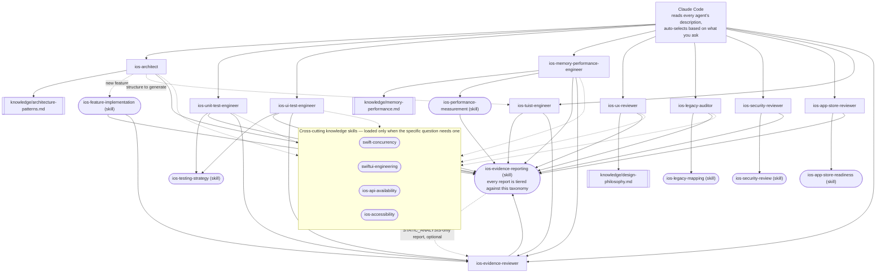

# claude-ai-agents-ios

🌐 [English](README.md) | [简体中文](README.zh-CN.md) | [Español](README.es.md) | [हिन्दी](README.hi.md) | [العربية](README.ar.md) | [Português (Brasil)](README.pt-BR.md) | [Русский](README.ru.md) | [日本語](README.ja.md) | [Français](README.fr.md) | [Deutsch](README.de.md) | [한국어](README.ko.md) | [Italiano](README.it.md) | [Türkçe](README.tr.md) | [Tiếng Việt](README.vi.md) | [Bahasa Indonesia](README.id.md)

A drop-in set of [Claude Code](https://claude.com/claude-code) subagents
and Skills that turn Claude Code into a specialized iOS development
team: architecture, unit testing, UI testing, memory/performance,
UI/UX review, security, App Store readiness, Tuist project generation,
legacy-codebase auditing, and independent evidence review — each one
auto-invoked based on what you ask, no manual switching required.

## What's included

### Subagents (`.claude/agents/`)

| Agent | Invoked when you... | Model | Tools |
|---|---|---|---|
| `ios-architect` | start a new feature/module, ask "how should I structure this", plan a refactor, choose MVVM/Clean/VIPER, decide on DI or SwiftData vs. Core Data | opus | Read, Grep, Glob, Write, Edit, WebSearch, WebFetch, Skill, `ios-agent`* |
| `ios-unit-test-engineer` | ask for tests, test coverage, TDD, or to make code testable | sonnet | Read, Grep, Glob, Write, Edit, Bash, WebSearch, WebFetch, Skill, `ios-agent`* |
| `ios-ui-test-engineer` | ask for UI tests, debug a flaky UI test, or set up snapshot testing | sonnet | Read, Grep, Glob, Write, Edit, Bash, WebSearch, WebFetch, Skill, `ios-agent`*, `ios-simulator`* |
| `ios-memory-performance-engineer` | report a leak, growing memory, slow scrolling, or slow launch | opus | Read, Grep, Glob, Bash, Edit, WebSearch, WebFetch, Skill, `ios-agent`*, `ios-simulator`* |
| `ios-ux-reviewer` | ask for a UI/UX review or design-consistency check | sonnet | Read, Grep, Glob, WebSearch, WebFetch, Skill, `ios-agent`* (read-only) |
| `ios-legacy-auditor` | onboard onto an unfamiliar, undocumented, or large legacy codebase | opus | Read, Grep, Glob, Bash, WebSearch, WebFetch, Skill, `ios-agent`* (read-only) |
| `ios-security-reviewer` | ask for a security review, "is this secure", vulnerability check, or auth/session audit | opus | Read, Grep, Glob, Bash, WebSearch, WebFetch, Skill, `ios-agent`* (read-only) |
| `ios-app-store-reviewer` | ask "is this ready to submit", "will this get rejected", or to check App Store compliance | sonnet | Read, Grep, Glob, Bash, WebSearch, WebFetch, Skill, `ios-agent`* (read-only) |
| `ios-tuist-engineer` | set up/debug/migrate to Tuist, edit `Project.swift`/`Workspace.swift`, or fix SPM resolution/"duplicate tasks" errors after `tuist generate` | sonnet | Read, Grep, Glob, Write, Edit, Bash, WebSearch, WebFetch, Skill, `ios-agent`* |
| `ios-evidence-reviewer` | after another agent produces a report, or ask to "double-check this report"/"verify these claims" | haiku | Read, Grep, Glob, WebSearch, WebFetch, Skill (read-only) |

Model assignments follow task weight, not agent seniority: `opus` for
agents doing open-ended architectural/security/undocumented-codebase
reasoning, `sonnet` for procedure-driven implementation and checklist
review, `haiku` for `ios-evidence-reviewer`'s narrower, mechanical
claim-vs-evidence check. Override any of these in your own copy if your
usage patterns differ — nothing else depends on the specific value.

\* `ios-agent` and `ios-simulator` are optional third-party MCP servers — see
[Optional tooling](#optional-tooling-static-analysis--simulator-control) below.
Every agent works standalone without them. `ios-agent` strengthens a
`STATIC_ANALYSIS`-tier read with structured tooling — it never raises a
claim to `BUILD_VERIFIED`/`TEST_VERIFIED`/`RUNTIME_VERIFIED`, since it
never builds or runs the app itself. `ios-simulator` actually does
build/install/launch the app, so its output can genuinely earn
`BUILD_VERIFIED`, `TEST_VERIFIED`, or `RUNTIME_VERIFIED` — see the
seven-tier taxonomy under [Evidence over assertion](#evidence-over-assertion).

### Skills (`.claude/skills/`)

| Skill | Backs | Purpose |
|---|---|---|
| `ios-testing-strategy` | `ios-unit-test-engineer`, `ios-ui-test-engineer` | Concrete seams → test-double → red/green procedure |
| `ios-legacy-mapping` | `ios-legacy-auditor` | Concrete inventory → detect-architecture → bridging-risk → security-signal → summary-doc procedure |
| `ios-security-review` | `ios-security-reviewer` | 8-area audit: storage/privacy → transport → authN/session → input validation → deep links → third-party SDKs → code hygiene → entitlements |
| `ios-app-store-readiness` | `ios-app-store-reviewer` | Pre-submission audit: privacy manifest → export compliance → permission descriptions → App Tracking Transparency → Sign in with Apple parity → unused entitlements → rejection triggers |
| `ios-feature-implementation` | General — fires on any feature request, works alongside `ios-architect` | Inspect existing code, business logic, API/connectivity behavior, and security posture → explain before touching files → implement → verify (build, tests, retain cycles, memory, performance, security) → report |
| `ios-performance-measurement` | `ios-memory-performance-engineer` | Reproduce → choose what to measure → measure before changing anything → change → re-measure with the same conditions → verify instrumentation removed |
| `ios-evidence-reporting` | All 10 agents — fires whenever any of them concludes a task | Seven-tier evidence taxonomy (`ASSUMPTION` → `HUMAN_VERIFICATION`), the claim → minimum-evidence matrix, and the forbidden-claims list, so no agent claims something works, is fixed, or is faster/secure/thread-safe without evidence at the matching tier |
| `swift-concurrency` | `ios-architect`, `ios-unit-test-engineer`, `ios-ui-test-engineer`, `ios-memory-performance-engineer`, `ios-legacy-auditor` — loaded only when the question involves it | async/await, actors, `Sendable`, structured/unstructured `Task`, cancellation, actor reentrancy — with the specific `STATIC_ANALYSIS` vs. concurrency-test-or-strict-mode bar a "thread-safe" claim actually needs |
| `swiftui-engineering` | `ios-architect`, `ios-ui-test-engineer`, `ios-memory-performance-engineer`, `ios-ux-reviewer`, `ios-legacy-auditor` — loaded only when the question involves it | State-ownership (`@StateObject` vs. `@ObservedObject`), view identity, body-recomputation cost, `@EnvironmentObject` injection — split into "pattern looks correct" (`STATIC_ANALYSIS`) vs. "runtime behavior confirmed" (`RUNTIME_VERIFIED`) |
| `ios-api-availability` | `ios-architect`, `ios-unit-test-engineer`, `ios-ui-test-engineer`, `ios-legacy-auditor` — loaded only when the question involves it | A mandatory 4-fact comparison per API (deployment target, API-introduction version, required guard, actual project compatibility) — flags the over-restrictive-guard failure mode, not just a missing guard |
| `ios-accessibility` | `ios-ui-test-engineer`, `ios-ux-reviewer` — loaded only when the question goes beyond `ios-ux-reviewer`'s own checklist | Static review vs. runtime verification split; names `XCUIApplication().performAccessibilityAudit()` (Xcode 15+) as real `TEST_VERIFIED`-tier automated evidence, not a manual-checklist substitute |

### Knowledge library (`knowledge/`)

Deep reference material lives here instead of inside agent bodies, so
each agent stays focused on *when to act* and *what procedure to
follow*, while the knowledge file is the *source of truth for what to
check*. Agents read these with the `Read` tool when relevant — no
extra configuration needed.

| File | Referenced by | Contents |
|---|---|---|
| `memory-performance.md` | `ios-memory-performance-engineer` | ARC/Instruments/image/concurrency fundamentals plus framework-specific patterns (RxSwift, WKWebView, PDFKit, Core Data, Firebase, CocoaPods, Keychain, third-party presentation libraries, UICollectionView/UITableView, SwiftUI/UIKit bridges, AVFoundation, CoreLocation, URLSession) |
| `architecture-patterns.md` | `ios-architect` | Pattern/decision criteria: MVVM/Clean/VIPER, Swift Concurrency, modularization, persistence, navigation, DI, security-aware structure |
| `design-philosophy.md` | `ios-ux-reviewer` | Apple HIG, Dieter Rams' ten principles applied to iOS, Nielsen Norman Group heuristics, and the named references list |

### Template

- `CLAUDE.md.template` — copy to your project root as `CLAUDE.md` and
  fill in the placeholders (or let `ios-legacy-auditor` generate the
  architecture section for you on an unfamiliar codebase).

## Install

### Option A — plugin marketplace (recommended)

```
/plugin marketplace add apexbymanish/claude-ai-agents-ios
/plugin install ios-agents@claude-ai-agents-ios
```

This installs all 10 agents and 12 skills in one step. The `knowledge/`
folder is still project-relative (see the note under Option B) — copy or
symlink it into your project root either way, plugin install or not:

```bash
cp -r knowledge /path/to/your-ios-project/knowledge
```

### Option B — copy or symlink manually

Copy what you need into your iOS project's repo root:

```bash
# From this repo, copy into your project:
mkdir -p /path/to/your-ios-project/.claude
cp -r .claude/agents /path/to/your-ios-project/.claude/
cp -r .claude/skills /path/to/your-ios-project/.claude/
cp -r knowledge /path/to/your-ios-project/knowledge
cp CLAUDE.md.template /path/to/your-ios-project/CLAUDE.md   # then edit it
```

```bash
# Or symlink instead of copying, to stay in sync across multiple projects:
ln -s /path/to/claude-ai-agents-ios/.claude/agents /path/to/your-ios-project/.claude/agents
ln -s /path/to/claude-ai-agents-ios/.claude/skills /path/to/your-ios-project/.claude/skills
ln -s /path/to/claude-ai-agents-ios/knowledge /path/to/your-ios-project/knowledge
```

The `knowledge/` folder must live at your project's repo root (alongside
`.claude/`) — agents reference it by that relative path.

For personal (cross-project) use instead of per-project, copy into
`~/.claude/agents/` and `~/.claude/skills/` instead — Claude Code merges
personal and project-level agents/skills automatically. Note that
`knowledge/` is referenced as a repo-relative path, so for personal use
you'd still need `knowledge/` present at each project's root (symlinking
it in per-project is simplest).

Nothing else is required — Claude Code reads each agent's `description`
frontmatter and invokes the right one automatically based on your
request. See [Optional tooling](#optional-tooling-static-analysis--simulator-control)
below for two third-party MCP servers that strengthen several agents'
evidence tier, without which everything above still works on its own.

## Optional tooling: static analysis & simulator control

Two servers from [`ios-agent-skill`](https://github.com/Nagarjuna2997/ios-agent-skill)
(MIT-licensed, not affiliated with this repo) give several agents above
a way to *run* a check instead of only reading code for it. Neither is
required — every agent already works without them, falling back to
`STATIC_ANALYSIS`-tier reads and manually-described procedures.

### `ios-agent-mcp` — static analysis (published, recommended)

Ten read-only tools that scan a Swift project and return structured
findings (file, line, consequence, fix) for concurrency, architecture,
SwiftUI patterns, availability guards, App Store readiness, memory,
security, testing, and performance — see the [tool list](https://github.com/Nagarjuna2997/ios-agent-skill/tree/main/mcp-server)
for specifics. It's filesystem-read-only with no network access.

This repo's `.mcp.json` already declares it, so copying `.mcp.json`
into your project alongside `.claude/` is the only step:

```bash
cp .mcp.json /path/to/your-ios-project/.mcp.json
```

Claude Code will offer to enable the project-scoped server the first
time it's relevant; `npx` fetches the package on first use, no global
install needed.

### `ios-simulator-mcp` — simulator control (early, source-only)

Build, test, install, launch, deep-link, and screenshot tools for a
booted iOS Simulator — the runtime counterpart to the static analyzer
above. As of this writing it's **v0.1.0, not yet published to npm, and
early** (its own docs call it "the first safe slice"), so treat it as
something to try, not something to depend on:

```bash
git clone https://github.com/Nagarjuna2997/ios-agent-skill.git
cd ios-agent-skill/ios-simulator-mcp
npm install && npm run build
```

Then add it to your project's `.mcp.json` (or personal MCP config)
under the server name `ios-simulator`, pointing at the built path:

```jsonc
{
  "mcpServers": {
    "ios-simulator": {
      "command": "node",
      "args": ["/absolute/path/to/ios-agent-skill/ios-simulator-mcp/dist/index.js"]
    }
  }
}
```

Requires macOS and Xcode command-line tools. If you name the server
something other than `ios-simulator`, update the `mcp__ios-simulator__*`
tool grant in `ios-ui-test-engineer.md` and
`ios-memory-performance-engineer.md` to match.

## How it fits together



There's no router or orchestrator to configure — Claude Code's own
description-matching *is* the dispatch layer. Each agent is a leaf that
either reads a `knowledge/*.md` file for deep reference material,
follows a `Skill` for a shared procedure, or both, and every path
converges on the same evidence-reporting standard at the end.
`ios-evidence-reviewer` is the one exception to "leaf": it reads
*another* agent's finished report and downgrades any claim the shown
evidence doesn't actually support, then the corrected report closes
with the same status block format again. `ios-feature-implementation`,
`ios-memory-performance-engineer`, `ios-unit-test-engineer`,
`ios-ui-test-engineer`, and `ios-tuist-engineer` route through it
automatically whenever their own report reaches `BUILD_VERIFIED` or
higher — the agent that ran the build/test/measurement isn't the only
one who checks whether its report is honest about it.

The four cross-cutting skills in the dashed cluster are different from
the rest: they aren't tied to one agent's fixed procedure, they're a
knowledge lookup an agent reaches for only when the specific question
in front of it actually needs it (a `Task`/`actor` question, a SwiftUI
state-ownership question, an availability check, an accessibility
audit beyond `ios-ux-reviewer`'s own checklist). Each agent's own file
documents exactly which trigger loads which skill — see its
`## Related Skills` section.

## How they hand off to each other

A typical flow, though you never need to invoke any of this by name:

1. **Unfamiliar/undocumented codebase?** Start with `ios-legacy-auditor`
   — it maps the real architecture and produces a summary you can drop
   into `CLAUDE.md`, before anything else touches the code.
2. **New feature/module?** `ios-architect` proposes structure and flags
   whether the design is unit-testable; `ios-feature-implementation`
   then drives the actual build — inspecting existing business logic
   first, explaining the plan before touching files, implementing
   against the agreed structure, and verifying (build, tests, memory,
   performance) before reporting done.
3. **Need tests?** `ios-unit-test-engineer` for logic, `ios-ui-test-engineer`
   for user flows — both follow the same seams → red/green discipline
   from `ios-testing-strategy`.
4. **New or changed screen?** `ios-ux-reviewer` checks it against Apple's
   Human Interface Guidelines and the underlying design philosophy
   before you ship it.
5. **Something feels slow or leaks memory?** `ios-memory-performance-engineer`
   reads the code for static causes first, and gives you the exact
   Instruments procedure when it can't be found by reading alone.
6. **Want a security check?** `ios-security-reviewer` runs a dedicated
   8-area audit (storage, transport, auth, input validation, deep
   links, dependencies, code hygiene, entitlements); `ios-architect`,
   `ios-legacy-auditor`, and `ios-feature-implementation` also flag
   lighter, scoped security concerns as part of their own work and
   point here for anything that warrants a full audit.
7. **About to submit to the App Store?** `ios-app-store-reviewer` checks
   the code-visible submission blockers (privacy manifest, permission
   descriptions, export compliance, Sign in with Apple parity) — it's a
   separate concern from `ios-security-reviewer` even though they share
   some ground (entitlements, transport security), so run both before a
   release if either is relevant.
8. **`tuist generate`/SPM resolution broken, or migrating onto Tuist?**
   `ios-tuist-engineer` diagnoses `Project.swift`/`Workspace.swift` and
   dependency-resolution failures directly — `ios-architect` decides
   *what* module structure a feature needs, this agent is the one that
   makes Tuist actually generate and resolve it.
9. **Report reaching `BUILD_VERIFIED` or higher?** `ios-evidence-reviewer`
   checks it before it's called done. `ios-feature-implementation`,
   `ios-memory-performance-engineer`, `ios-unit-test-engineer`,
   `ios-ui-test-engineer`, and `ios-tuist-engineer` — the agents that can
   independently produce a build/test/runtime/measured claim, not just a
   static finding — each route through it automatically as their last
   step; any other agent's report can be handed to it directly too.

## Evidence over assertion

AI confidence is not evidence. AI reasoning is not runtime evidence. A
code change is not automatically a verified fix. Every agent in this
repo ends its report with the `ios-evidence-reporting` skill's status
block instead of a bare "Done! It works," and every line in that block
is tiered against one of seven evidence levels, weakest to strongest:

`ASSUMPTION` → `STATIC_ANALYSIS` → `BUILD_VERIFIED` → `TEST_VERIFIED`
→ `RUNTIME_VERIFIED` → `RUNTIME_MEASURED` → `HUMAN_VERIFICATION`

A claim never gets reported at a higher tier than the evidence actually
reached. Reading source (including an MCP static analyzer's structured
output) is `STATIC_ANALYSIS`, full stop, whether a human or a tool did
the reading — it does not become stronger evidence just because a tool
produced it, and it can never support "no leak exists" or "memory
improved." Those specifically require `RUNTIME_MEASURED`: an actual
number from actually running the app (Instruments, MetricKit,
`os_signpost`), via `ios-performance-measurement`'s reproduce → baseline
→ measure → change → build → test → measure again → compare → report
loop. A claim this repo's agents will never make without matching
evidence: "fixed," "optimized," "faster," "leak-free," "thread-safe,"
"secure," or "production-ready" (a cross-cutting claim no single agent's
evidence covers alone) — see `ios-evidence-reporting`'s claim →
minimum-evidence matrix for the full list and the precise-language
alternatives.

Because the agent that implements something shouldn't be the only
authority on whether its own report is honest, `ios-evidence-reviewer`
independently re-checks a finished report's claims against that same
matrix and downgrades anything unsupported before it's presented as
final — see "How it fits together" above.

## Design philosophy

`ios-ux-reviewer` in particular is grounded in named sources rather than
asserted taste: Apple's Human Interface Guidelines, Dieter Rams' ten
principles of good design, Don Norman's *The Design of Everyday Things*,
Nielsen Norman Group's usability heuristics, and *Refactoring UI* for
concrete visual judgment calls. See `knowledge/design-philosophy.md`
for how each is applied to iOS specifically.

## Maintaining this repo

`scripts/audit-agents.sh` runs the mechanical checks every agent/skill
file gets held to during development: frontmatter `name:` matches the
filename or directory, `description:` carries a real quoted trigger
phrase, a read-only claim in the body doesn't sit next to a `Write`/
`Edit` grant, code fences close, every backtick `ios-*` reference
across the repo resolves to a real agent or skill, and no file still
carries the old `(static)`/`(executed)` grading instead of the current
seven-tier taxonomy. It's non-blocking — findings are for a human to
act on, not a gate.

```bash
./scripts/audit-agents.sh
```

## License

[MIT](LICENSE) — use, copy, modify, and redistribute freely.
