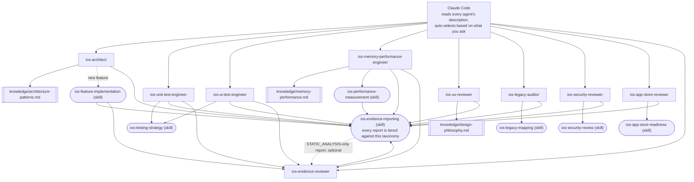

# claude-ai-agents-ios

🌐 [English](README.md) | [简体中文](README.zh-CN.md) | [Español](README.es.md) | [हिन्दी](README.hi.md) | [العربية](README.ar.md) | [Português (Brasil)](README.pt-BR.md) | [Русский](README.ru.md) | [日本語](README.ja.md) | [Français](README.fr.md) | [Deutsch](README.de.md) | [한국어](README.ko.md) | [Italiano](README.it.md) | [Türkçe](README.tr.md) | [Tiếng Việt](README.vi.md) | [Bahasa Indonesia](README.id.md)

Um conjunto pronto para uso de subagentes e Skills do [Claude Code](https://claude.com/claude-code)
que transforma o Claude Code em uma equipe especializada de desenvolvimento
iOS: arquitetura, testes unitários, testes de UI, memória/desempenho,
revisão de UI/UX, segurança, prontidão para a App Store, auditoria de
código legado, e revisão independente de evidências — cada um é
invocado automaticamente com base no que você pede, sem alternância
manual necessária.

## O que está incluído

### Subagentes (`.claude/agents/`)

| Agente | Invocado quando você... | Ferramentas |
|---|---|---|
| `ios-architect` | inicia uma nova funcionalidade/módulo, pergunta "como devo estruturar isso", planeja uma refatoração, escolhe entre MVVM/Clean/VIPER, decide sobre DI ou SwiftData vs. Core Data | Read, Grep, Glob, Write, Edit, Skill, `ios-agent`* |
| `ios-unit-test-engineer` | pede testes, cobertura de testes, TDD, ou tornar o código testável | Read, Grep, Glob, Write, Edit, Bash, Skill, `ios-agent`* |
| `ios-ui-test-engineer` | pede testes de UI, depurar um teste de UI instável, ou configurar testes de snapshot | Read, Grep, Glob, Write, Edit, Bash, Skill, `ios-agent`*, `ios-simulator`* |
| `ios-memory-performance-engineer` | relata um vazamento, memória crescente, rolagem lenta, ou inicialização lenta | Read, Grep, Glob, Bash, Edit, Skill, `ios-agent`*, `ios-simulator`* |
| `ios-ux-reviewer` | pede uma revisão de UI/UX ou uma verificação de consistência de design | Read, Grep, Glob, Skill, `ios-agent`* (somente leitura) |
| `ios-legacy-auditor` | entra em um projeto desconhecido, sem documentação, ou uma base de código legada grande | Read, Grep, Glob, Bash, Skill, `ios-agent`* (somente leitura) |
| `ios-security-reviewer` | pede uma revisão de segurança, "isso é seguro?", verificação de vulnerabilidades, ou auditoria de autenticação/sessão | Read, Grep, Glob, Bash, Skill, `ios-agent`* (somente leitura) |
| `ios-app-store-reviewer` | pergunta "isso está pronto para envio?", "isso será rejeitado?", ou quer verificar a conformidade com a App Store | Read, Grep, Glob, Bash, Skill, `ios-agent`* (somente leitura) |
| `ios-evidence-reviewer` | outro agente produz um relatório, ou você pede "verifique este relatório de novo"/"confirme estas alegações" | Read, Grep, Glob, Skill (somente leitura) |

\* `ios-agent` e `ios-simulator` são servidores MCP opcionais de terceiros — veja
[Ferramentas opcionais](#ferramentas-opcionais-análise-estática-e-controle-do-simulador) abaixo.
Cada agente funciona de forma independente sem eles. O `ios-agent`
fortalece uma leitura de nível `STATIC_ANALYSIS` com ferramentas
estruturadas — ele nunca eleva uma alegação para `BUILD_VERIFIED`/
`TEST_VERIFIED`/`RUNTIME_VERIFIED`, já que nunca compila ou executa o
app por conta própria. O `ios-simulator` de fato compila, instala e
inicia o app, então sua saída pode genuinamente conquistar
`BUILD_VERIFIED`, `TEST_VERIFIED`, ou `RUNTIME_VERIFIED` — veja a
taxonomia de sete níveis em [Evidência acima de afirmação](#evidência-acima-de-afirmação).

### Skills (`.claude/skills/`)

| Skill | Apoia | Propósito |
|---|---|---|
| `ios-testing-strategy` | `ios-unit-test-engineer`, `ios-ui-test-engineer` | Procedimento concreto: costuras → duplo de teste → vermelho/verde |
| `ios-legacy-mapping` | `ios-legacy-auditor` | Procedimento concreto: inventário → detectar arquitetura → risco de pontes → sinal de segurança → documento resumo |
| `ios-security-review` | `ios-security-reviewer` | Auditoria de 8 áreas: armazenamento/privacidade → transporte → autenticação/sessão → validação de entrada → deep links → SDKs de terceiros → higiene de código → entitlements |
| `ios-app-store-readiness` | `ios-app-store-reviewer` | Auditoria pré-envio: manifesto de privacidade → conformidade de exportação → descrições de permissões → App Tracking Transparency → paridade de Sign in with Apple → entitlements não usados → gatilhos de rejeição |
| `ios-feature-implementation` | Geral — ativado em qualquer solicitação de funcionalidade, funciona junto com `ios-architect` | Inspecionar código existente, lógica de negócio, comportamento de API/conectividade, e postura de segurança → explicar antes de tocar nos arquivos → implementar → verificar (compilação, testes, ciclos de retenção, memória, desempenho, segurança) → relatar |
| `ios-performance-measurement` | `ios-memory-performance-engineer` | Reproduzir → escolher o que medir → medir antes de mudar qualquer coisa → mudar → remedir com as mesmas condições → verificar que a instrumentação foi removida |
| `ios-evidence-reporting` | Todos os 9 agentes — ativado sempre que qualquer um deles conclui uma tarefa | Taxonomia de evidência de sete níveis (`ASSUMPTION` → `HUMAN_VERIFICATION`), a matriz de alegação → evidência mínima, e a lista de alegações proibidas, para que nenhum agente alegue que algo funciona, foi corrigido, ou é mais rápido/seguro/thread-safe sem evidência no nível correspondente |

### Biblioteca de conhecimento (`knowledge/`)

O material de referência aprofundado fica aqui em vez de dentro do corpo
dos agentes, para que cada agente permaneça focado em *quando agir* e
*qual procedimento seguir*, enquanto o arquivo de conhecimento é a
*fonte da verdade sobre o que verificar*. Os agentes leem esses arquivos
com a ferramenta `Read` quando relevante — nenhuma configuração extra
necessária.

| Arquivo | Referenciado por | Conteúdo |
|---|---|---|
| `memory-performance.md` | `ios-memory-performance-engineer` | Fundamentos de ARC/Instruments/imagem/concorrência além de padrões específicos de frameworks (RxSwift, WKWebView, PDFKit, Core Data, Firebase, CocoaPods, Keychain, bibliotecas de apresentação de terceiros, UICollectionView/UITableView, pontes SwiftUI/UIKit, AVFoundation, CoreLocation, URLSession) |
| `architecture-patterns.md` | `ios-architect` | Critérios de padrão/decisão: MVVM/Clean/VIPER, Swift Concurrency, modularização, persistência, navegação, DI, estrutura consciente de segurança |
| `design-philosophy.md` | `ios-ux-reviewer` | Apple HIG, os dez princípios de Dieter Rams aplicados ao iOS, heurísticas do Nielsen Norman Group, e a lista de referências nomeadas |

### Modelo

- `CLAUDE.md.template` — copie para a raiz do seu projeto como `CLAUDE.md`
  e preencha os espaços reservados (ou deixe o `ios-legacy-auditor`
  gerar a seção de arquitetura para você em uma base de código
  desconhecida).

## Instalação

Copie o que você precisa para a raiz do repositório do seu projeto iOS:

```bash
# A partir deste repositório, copie para o seu projeto:
mkdir -p /path/to/your-ios-project/.claude
cp -r .claude/agents /path/to/your-ios-project/.claude/
cp -r .claude/skills /path/to/your-ios-project/.claude/
cp -r knowledge /path/to/your-ios-project/knowledge
cp CLAUDE.md.template /path/to/your-ios-project/CLAUDE.md   # depois edite
```

```bash
# Ou crie um link simbólico em vez de copiar, para manter a sincronização entre vários projetos:
ln -s /path/to/claude-ai-agents-ios/.claude/agents /path/to/your-ios-project/.claude/agents
ln -s /path/to/claude-ai-agents-ios/.claude/skills /path/to/your-ios-project/.claude/skills
ln -s /path/to/claude-ai-agents-ios/knowledge /path/to/your-ios-project/knowledge
```

A pasta `knowledge/` precisa estar na raiz do repositório do seu
projeto (ao lado de `.claude/`) — os agentes a referenciam por esse
caminho relativo.

Para uso pessoal (entre projetos) em vez de por projeto, copie para
`~/.claude/agents/` e `~/.claude/skills/` — o Claude Code mescla
automaticamente agentes/skills pessoais e de nível de projeto. Observe
que `knowledge/` é referenciado como um caminho relativo ao
repositório, então para uso pessoal você ainda precisaria de
`knowledge/` presente na raiz de cada projeto (criar um link simbólico
por projeto é o mais simples).

Nada mais é necessário — o Claude Code lê o frontmatter `description`
de cada agente e invoca o correto automaticamente com base na sua
solicitação. Veja [Ferramentas opcionais](#ferramentas-opcionais-análise-estática-e-controle-do-simulador)
abaixo para dois servidores MCP de terceiros que fortalecem o nível de
evidência de vários agentes, sem os quais tudo acima ainda funciona por
conta própria.

## Ferramentas opcionais: análise estática e controle do simulador

Dois servidores do [`ios-agent-skill`](https://github.com/Nagarjuna2997/ios-agent-skill)
(licenciado sob MIT, não afiliado a este repositório) dão a vários
agentes acima uma forma de *executar* uma verificação em vez de apenas
ler o código para isso. Nenhum é obrigatório — cada agente já funciona
sem eles, recorrendo a leituras de nível `STATIC_ANALYSIS` e
procedimentos descritos manualmente.

### `ios-agent-mcp` — análise estática (publicado, recomendado)

Dez ferramentas somente leitura que escaneiam um projeto Swift e
retornam descobertas estruturadas (arquivo, linha, consequência,
correção) para concorrência, arquitetura, padrões SwiftUI, guardas de
disponibilidade, prontidão para App Store, memória, segurança, testes,
e desempenho — veja a [lista de ferramentas](https://github.com/Nagarjuna2997/ios-agent-skill/tree/main/mcp-server)
para detalhes. É somente leitura no sistema de arquivos, sem acesso à
rede.

O `.mcp.json` deste repositório já o declara, então copiar `.mcp.json`
para o seu projeto ao lado de `.claude/` é o único passo:

```bash
cp .mcp.json /path/to/your-ios-project/.mcp.json
```

O Claude Code vai oferecer para ativar o servidor com escopo de
projeto na primeira vez que for relevante; o `npx` busca o pacote no
primeiro uso, sem instalação global necessária.

### `ios-simulator-mcp` — controle do simulador (inicial, apenas via código-fonte)

Ferramentas de compilação, teste, instalação, inicialização, deep link,
e captura de tela para um Simulador de iOS já iniciado — a contraparte
em tempo de execução do analisador estático acima. No momento desta
escrita é **v0.1.0, ainda não publicado no npm, e inicial** (sua própria
documentação o chama de "a primeira fatia segura"), então trate-o como
algo para experimentar, não algo para depender:

```bash
git clone https://github.com/Nagarjuna2997/ios-agent-skill.git
cd ios-agent-skill/ios-simulator-mcp
npm install && npm run build
```

Depois adicione-o ao `.mcp.json` do seu projeto (ou à configuração MCP
pessoal) sob o nome de servidor `ios-simulator`, apontando para o
caminho compilado:

```jsonc
{
  "mcpServers": {
    "ios-simulator": {
      "command": "node",
      "args": ["/absolute/path/to/ios-agent-skill/ios-simulator-mcp/dist/index.js"]
    }
  }
}
```

Requer macOS e as ferramentas de linha de comando do Xcode. Se você
nomear o servidor de forma diferente de `ios-simulator`, atualize a
concessão de ferramenta `mcp__ios-simulator__*` em
`ios-ui-test-engineer.md` e `ios-memory-performance-engineer.md` para
corresponder.

## Como tudo se encaixa



Não há roteador ou orquestrador para configurar — a própria
correspondência de descrições do Claude Code *é* a camada de despacho.
Cada agente é uma folha que lê um arquivo `knowledge/*.md` para
material de referência aprofundado, segue uma `Skill` para um
procedimento compartilhado, ou ambos, e todo caminho converge para o
mesmo padrão de relatório de evidências no final. `ios-evidence-reviewer`
é a única exceção a "folha": ele lê o relatório finalizado de *outro*
agente e rebaixa qualquer alegação que a evidência mostrada não
sustente de fato, então o relatório corrigido fecha com o mesmo formato
de bloco de status novamente. `ios-feature-implementation`,
`ios-memory-performance-engineer`, `ios-unit-test-engineer`, e
`ios-ui-test-engineer` passam por ele automaticamente sempre que seu
próprio relatório atinge `BUILD_VERIFIED` ou superior — o agente que
executou a compilação/teste/medição não é o único que verifica se seu
relatório é honesto sobre isso.

## Como eles se transferem o trabalho uns aos outros

Um fluxo típico, embora você nunca precise invocar nada disso pelo
nome:

1. **Base de código desconhecida/sem documentação?** Comece com
   `ios-legacy-auditor` — ele mapeia a arquitetura real e produz um
   resumo que você pode colocar em `CLAUDE.md`, antes de qualquer outra
   coisa tocar no código.
2. **Nova funcionalidade/módulo?** `ios-architect` propõe a estrutura e
   sinaliza se o design é testável por testes unitários;
   `ios-feature-implementation` então conduz a construção real —
   inspecionando primeiro a lógica de negócio existente, explicando o
   plano antes de tocar nos arquivos, implementando de acordo com a
   estrutura acordada, e verificando (compilação, testes, memória,
   desempenho) antes de relatar como concluído.
3. **Precisa de testes?** `ios-unit-test-engineer` para lógica,
   `ios-ui-test-engineer` para fluxos de usuário — ambos seguem a mesma
   disciplina de costuras → vermelho/verde de `ios-testing-strategy`.
4. **Tela nova ou modificada?** `ios-ux-reviewer` a verifica contra as
   Human Interface Guidelines da Apple e a filosofia de design
   subjacente antes de você lançar.
5. **Algo parece lento ou vaza memória?** `ios-memory-performance-engineer`
   lê o código em busca de causas estáticas primeiro, e fornece o
   procedimento exato do Instruments quando não pode ser encontrado
   apenas lendo.
6. **Quer uma verificação de segurança?** `ios-security-reviewer`
   executa uma auditoria dedicada de 8 áreas (armazenamento, transporte,
   autenticação, validação de entrada, deep links, dependências,
   higiene de código, entitlements); `ios-architect`, `ios-legacy-auditor`,
   e `ios-feature-implementation` também sinalizam preocupações de
   segurança mais leves e restritas como parte do próprio trabalho, e
   apontam para cá para qualquer coisa que justifique uma auditoria
   completa.
7. **Prestes a enviar para a App Store?** `ios-app-store-reviewer`
   verifica os bloqueadores de envio visíveis no código (manifesto de
   privacidade, descrições de permissões, conformidade de exportação,
   paridade de Sign in with Apple) — é uma preocupação separada de
   `ios-security-reviewer`, mesmo que compartilhem algum terreno
   (entitlements, segurança de transporte), então execute ambos antes
   de um lançamento se algum for relevante.
8. **Relatório atingindo `BUILD_VERIFIED` ou superior?**
   `ios-evidence-reviewer` o verifica antes de considerá-lo concluído.
   `ios-feature-implementation`, `ios-memory-performance-engineer`,
   `ios-unit-test-engineer`, e `ios-ui-test-engineer` — os agentes que
   podem produzir de forma independente uma alegação de
   compilação/teste/tempo de execução/medição, não apenas uma
   descoberta estática — passam por ele automaticamente como sua
   última etapa; o relatório de qualquer outro agente também pode ser
   entregue a ele diretamente.

## Evidência acima de afirmação

A confiança da IA não é evidência. O raciocínio da IA não é evidência
em tempo de execução. Uma mudança de código não é automaticamente uma
correção verificada. Cada agente neste repositório encerra seu
relatório com o bloco de status da skill `ios-evidence-reporting` em
vez de um simples "Pronto! Funciona," e cada linha nesse bloco é
classificada em um dos sete níveis de evidência, do mais fraco ao mais
forte:

`ASSUMPTION` → `STATIC_ANALYSIS` → `BUILD_VERIFIED` → `TEST_VERIFIED`
→ `RUNTIME_VERIFIED` → `RUNTIME_MEASURED` → `HUMAN_VERIFICATION`

Uma alegação nunca é relatada em um nível mais alto do que a evidência
realmente alcançou. Ler o código-fonte (incluindo a saída estruturada
de um analisador estático MCP) é `STATIC_ANALYSIS`, ponto final, seja
um humano ou uma ferramenta quem fez a leitura — isso não se torna
evidência mais forte só porque uma ferramenta a produziu, e nunca pode
sustentar "não existe vazamento" ou "a memória melhorou." Essas
alegações especificamente exigem `RUNTIME_MEASURED`: um número real
vindo de realmente executar o app (Instruments, MetricKit,
`os_signpost`), através do ciclo de `ios-performance-measurement` de
reproduzir → linha de base → medir → mudar → compilar → testar → medir
de novo → comparar → relatar. Uma alegação que os agentes deste
repositório nunca farão sem a evidência correspondente: "corrigido,"
"otimizado," "mais rápido," "sem vazamentos," "thread-safe," "seguro,"
ou "pronto para produção" (uma alegação transversal que a evidência de
nenhum agente individual cobre sozinha) — veja a matriz de alegação →
evidência mínima de `ios-evidence-reporting` para a lista completa e
as alternativas de linguagem precisa.

Porque o agente que implementa algo não deveria ser a única autoridade
sobre se seu próprio relatório é honesto, o `ios-evidence-reviewer`
reverifica de forma independente as alegações de um relatório
finalizado contra essa mesma matriz e rebaixa qualquer coisa não
sustentada antes de ser apresentada como final — veja "Como tudo se
encaixa" acima.

## Filosofia de design

O `ios-ux-reviewer` em particular é fundamentado em fontes nomeadas em
vez de gosto pessoal afirmado: as Human Interface Guidelines da Apple,
os dez princípios de bom design de Dieter Rams, *O Design do Dia a Dia*
de Don Norman, as heurísticas de usabilidade do Nielsen Norman Group, e
*Refactoring UI* para decisões concretas de julgamento visual. Veja
`knowledge/design-philosophy.md` para como cada um se aplica
especificamente ao iOS.

## Mantendo este repositório

`scripts/audit-agents.sh` executa as verificações mecânicas às quais
todo arquivo de agente/skill é submetido durante o desenvolvimento: o
`name:` do frontmatter corresponde ao nome do arquivo ou diretório,
`description:` carrega uma frase-gatilho entre aspas real, uma
alegação de somente leitura no corpo não fica ao lado de uma concessão
`Write`/`Edit`, os blocos de código fecham corretamente, toda
referência entre crases `ios-*` em todo o repositório se resolve para
um agente ou skill real, e nenhum arquivo ainda carrega a
classificação antiga `(static)`/`(executed)` em vez da taxonomia atual
de sete níveis. Não é bloqueante — as descobertas são para uma pessoa
agir, não uma barreira.

```bash
./scripts/audit-agents.sh
```
