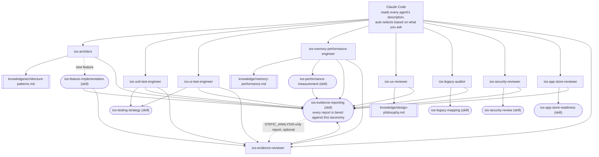

# claude-ai-agents-ios

🌐 [English](README.md) | [简体中文](README.zh-CN.md) | [Español](README.es.md) | [हिन्दी](README.hi.md) | [العربية](README.ar.md) | [Português (Brasil)](README.pt-BR.md) | [Русский](README.ru.md) | [日本語](README.ja.md) | [Français](README.fr.md) | [Deutsch](README.de.md) | [한국어](README.ko.md) | [Italiano](README.it.md) | [Türkçe](README.tr.md) | [Tiếng Việt](README.vi.md) | [Bahasa Indonesia](README.id.md)

Готовый набор сабагентов и Skills для [Claude Code](https://claude.com/claude-code),
превращающий Claude Code в специализированную команду разработки iOS:
архитектура, модульное тестирование, UI-тестирование, память/производительность,
UI/UX-обзор, безопасность, готовность к App Store, аудит устаревшего кода
и независимая проверка доказательств — каждый агент вызывается автоматически
по смыслу запроса, без ручного переключения.

## Что входит в комплект

### Сабагенты (`.claude/agents/`)

| Агент | Вызывается, когда вы... | Инструменты |
|---|---|---|
| `ios-architect` | начинаете новую функцию/модуль, спрашиваете «как это структурировать», планируете рефакторинг, выбираете между MVVM/Clean/VIPER, решаете вопрос DI или SwiftData vs. Core Data | Read, Grep, Glob, Write, Edit, Skill, `ios-agent`* |
| `ios-unit-test-engineer` | просите тесты, покрытие тестами, TDD или сделать код тестируемым | Read, Grep, Glob, Write, Edit, Bash, Skill, `ios-agent`* |
| `ios-ui-test-engineer` | просите UI-тесты, отладить нестабильный UI-тест или настроить снапшот-тестирование | Read, Grep, Glob, Write, Edit, Bash, Skill, `ios-agent`*, `ios-simulator`* |
| `ios-memory-performance-engineer` | сообщаете об утечке, росте памяти, медленной прокрутке или медленном запуске | Read, Grep, Glob, Bash, Edit, Skill, `ios-agent`*, `ios-simulator`* |
| `ios-ux-reviewer` | просите UI/UX-обзор или проверку согласованности дизайна | Read, Grep, Glob, Skill, `ios-agent`* (только чтение) |
| `ios-legacy-auditor` | знакомитесь с незнакомым, недокументированным или крупным устаревшим кодом | Read, Grep, Glob, Bash, Skill, `ios-agent`* (только чтение) |
| `ios-security-reviewer` | просите проверку безопасности, «это безопасно?», поиск уязвимостей или аудит аутентификации/сессий | Read, Grep, Glob, Bash, Skill, `ios-agent`* (только чтение) |
| `ios-app-store-reviewer` | спрашиваете «готово ли это к отправке», «отклонят ли это» или просите проверить соответствие требованиям App Store | Read, Grep, Glob, Bash, Skill, `ios-agent`* (только чтение) |
| `ios-evidence-reviewer` | после того как другой агент подготовил отчёт, или просите «перепроверь этот отчёт»/«проверь эти утверждения» | Read, Grep, Glob, Skill (только чтение) |

\* `ios-agent` и `ios-simulator` — необязательные сторонние MCP-серверы, см.
раздел «Optional tooling» ниже. Каждый агент работает автономно без них.
`ios-agent` усиливает чтение уровня `STATIC_ANALYSIS` структурированным
инструментарием — он никогда не поднимает утверждение до уровня
`BUILD_VERIFIED`/`TEST_VERIFIED`/`RUNTIME_VERIFIED`, поскольку сам не
собирает и не запускает приложение. `ios-simulator` действительно
собирает/устанавливает/запускает приложение, поэтому его вывод может
по праву получить уровень `BUILD_VERIFIED`, `TEST_VERIFIED` или
`RUNTIME_VERIFIED` — см. семиуровневую таксономию в разделе
«Evidence over assertion» ниже.

### Skills (`.claude/skills/`)

| Skill | Обслуживает | Назначение |
|---|---|---|
| `ios-testing-strategy` | `ios-unit-test-engineer`, `ios-ui-test-engineer` | Конкретная процедура: точки внедрения → тестовый двойник → red/green |
| `ios-legacy-mapping` | `ios-legacy-auditor` | Инвентаризация → определение архитектуры → риски мостов → сигналы безопасности → сводный документ |
| `ios-security-review` | `ios-security-reviewer` | Аудит по 8 областям: хранение/приватность → транспорт → аутентификация/сессии → валидация ввода → deep links → сторонние SDK → гигиена кода → права доступа |
| `ios-app-store-readiness` | `ios-app-store-reviewer` | Проверка перед отправкой: манифест приватности → экспортное соответствие → описания разрешений → App Tracking Transparency → паритет Sign in with Apple → неиспользуемые права доступа → триггеры отклонения |
| `ios-feature-implementation` | Общая — срабатывает на любой запрос функции, работает вместе с `ios-architect` | Изучить существующий код, бизнес-логику, поведение API/сети и состояние безопасности → объяснить план до правок → реализовать → проверить (сборка, тесты, циклы удержания, память, производительность, безопасность) → отчёт |
| `ios-performance-measurement` | `ios-memory-performance-engineer` | Воспроизвести → выбрать, что измерять → измерить до изменений → изменить → повторно измерить в тех же условиях → убедиться, что инструментирование убрано |
| `ios-evidence-reporting` | Все 9 агентов — срабатывает при завершении задачи любым из них | Семиуровневая таксономия доказательств (`ASSUMPTION` → `HUMAN_VERIFICATION`), матрица «утверждение → минимальное доказательство» и список запрещённых формулировок, чтобы ни один агент не утверждал, что что-то работает, исправлено или быстрее/безопаснее/потокобезопасно без доказательства нужного уровня |

### Библиотека знаний (`knowledge/`)

Глубокий справочный материал хранится здесь, а не внутри тел агентов, чтобы
каждый агент оставался сосредоточен на *когда действовать* и *какой
процедуре следовать*, а файл знаний был *источником истины о том, что
проверять*. Агенты читают эти файлы инструментом `Read` по мере
необходимости — дополнительная настройка не нужна.

| Файл | Используется | Содержание |
|---|---|---|
| `memory-performance.md` | `ios-memory-performance-engineer` | Основы ARC/Instruments/изображений/конкурентности плюс специфичные для фреймворков паттерны (RxSwift, WKWebView, PDFKit, Core Data, Firebase, CocoaPods, Keychain, сторонние библиотеки презентации, UICollectionView/UITableView, мосты SwiftUI/UIKit, AVFoundation, CoreLocation, URLSession) |
| `architecture-patterns.md` | `ios-architect` | Критерии выбора паттернов: MVVM/Clean/VIPER, конкурентность Swift, модуляризация, персистентность, навигация, DI, структура с учётом безопасности |
| `design-philosophy.md` | `ios-ux-reviewer` | Apple HIG, десять принципов Дитера Рамса применительно к iOS, эвристики Nielsen Norman Group и список именованных источников |

### Шаблон

- `CLAUDE.md.template` — скопируйте в корень вашего проекта как `CLAUDE.md`
  и заполните заполнители (или пусть `ios-legacy-auditor` сгенерирует
  раздел архитектуры для незнакомого кода).

## Установка

Скопируйте нужное в корень репозитория вашего iOS-проекта:

```bash
# Из этого репозитория скопируйте в ваш проект:
mkdir -p /path/to/your-ios-project/.claude
cp -r .claude/agents /path/to/your-ios-project/.claude/
cp -r .claude/skills /path/to/your-ios-project/.claude/
cp -r knowledge /path/to/your-ios-project/knowledge
cp CLAUDE.md.template /path/to/your-ios-project/CLAUDE.md   # затем отредактируйте
```

```bash
# Или используйте симлинки вместо копирования, чтобы оставаться в
# синхронизации между несколькими проектами:
ln -s /path/to/claude-ai-agents-ios/.claude/agents /path/to/your-ios-project/.claude/agents
ln -s /path/to/claude-ai-agents-ios/.claude/skills /path/to/your-ios-project/.claude/skills
ln -s /path/to/claude-ai-agents-ios/knowledge /path/to/your-ios-project/knowledge
```

Папка `knowledge/` должна находиться в корне репозитория вашего проекта
(рядом с `.claude/`) — агенты ссылаются на неё по этому относительному пути.

Для личного использования (в нескольких проектах) вместо копирования в
каждый проект скопируйте в `~/.claude/agents/` и `~/.claude/skills/` —
Claude Code автоматически объединяет личные и проектные агенты/skills.
Обратите внимание, что `knowledge/` указывается относительным путём
внутри репозитория, поэтому для личного использования вам всё равно
понадобится `knowledge/` в корне каждого проекта (проще всего сделать
симлинк для каждого проекта).

Больше ничего не требуется — Claude Code читает поле `description` в
метаданных каждого агента и автоматически вызывает нужного по смыслу
вашего запроса. См. раздел «Optional tooling» ниже про два сторонних
MCP-сервера, которые усиливают уровень доказательств некоторых агентов,
но без которых всё вышеописанное и так работает.

## Optional tooling: статический анализ и управление симулятором

Два сервера из [`ios-agent-skill`](https://github.com/Nagarjuna2997/ios-agent-skill)
(лицензия MIT, не аффилирован с этим репозиторием) дают некоторым
агентам выше возможность *выполнить* проверку, а не только прочитать
код для неё. Ни один не обязателен — каждый агент уже работает без них,
переходя к чтению уровня `STATIC_ANALYSIS` и вручную описанным процедурам.

### `ios-agent-mcp` — статический анализ (опубликован, рекомендуется)

Десять инструментов только для чтения, которые сканируют Swift-проект и
возвращают структурированные находки (файл, строка, последствие,
исправление) для конкурентности, архитектуры, паттернов SwiftUI, guard'ов
доступности, готовности к App Store, памяти, безопасности, тестирования
и производительности — см. [список инструментов](https://github.com/Nagarjuna2997/ios-agent-skill/tree/main/mcp-server)
для подробностей. Работает только с файловой системой, без доступа к сети.

Файл `.mcp.json` этого репозитория уже объявляет этот сервер, поэтому
достаточно скопировать `.mcp.json` вместе с `.claude/` в ваш проект:

```bash
cp .mcp.json /path/to/your-ios-project/.mcp.json
```

Claude Code предложит включить сервер уровня проекта при первой
необходимости; `npx` загрузит пакет при первом использовании,
глобальная установка не нужна.

### `ios-simulator-mcp` — управление симулятором (ранняя версия, только из исходников)

Инструменты сборки, тестирования, установки, запуска, deep link и
скриншотов для запущенного симулятора iOS — рантайм-аналог статического
анализатора выше. На момент написания это **v0.1.0, ещё не опубликовано
в npm и находится на ранней стадии** (в собственной документации
названо «первым безопасным срезом»), поэтому относитесь к этому как к
эксперименту, а не как к тому, на что стоит полагаться:

```bash
git clone https://github.com/Nagarjuna2997/ios-agent-skill.git
cd ios-agent-skill/ios-simulator-mcp
npm install && npm run build
```

Затем добавьте его в `.mcp.json` вашего проекта (или в личную
конфигурацию MCP) под именем сервера `ios-simulator`, указав путь к
собранному файлу:

```jsonc
{
  "mcpServers": {
    "ios-simulator": {
      "command": "node",
      "args": ["/absolute/path/to/ios-agent-skill/ios-simulator-mcp/dist/index.js"]
    }
  }
}
```

Требуются macOS и инструменты командной строки Xcode. Если вы назовёте
сервер иначе, чем `ios-simulator`, обновите разрешение инструмента
`mcp__ios-simulator__*` в `ios-ui-test-engineer.md` и
`ios-memory-performance-engineer.md` в соответствии с новым именем.

## Как всё это работает вместе



Здесь нет маршрутизатора или оркестратора, который нужно настраивать —
сопоставление по описанию, встроенное в Claude Code, *и есть* уровень
диспетчеризации. Каждый агент — это лист, который либо читает файл
`knowledge/*.md` за глубоким справочным материалом, либо следует
`Skill` для общей процедуры, либо и то и другое, и каждый путь сходится
к единому стандарту отчётности о доказательствах в конце.
`ios-evidence-reviewer` — единственное исключение из правила «лист»: он
читает готовый отчёт *другого* агента и понижает уровень любого
утверждения, которое не подтверждено показанными доказательствами,
после чего исправленный отчёт снова закрывается тем же форматом блока
статуса. `ios-feature-implementation`, `ios-memory-performance-engineer`,
`ios-unit-test-engineer` и `ios-ui-test-engineer` автоматически проходят
через него всякий раз, когда их собственный отчёт достигает уровня
`BUILD_VERIFIED` или выше — агент, который выполнил сборку/тест/
измерение, не единственный, кто проверяет, честен ли его отчёт.

## Как они передают задачи друг другу

Типичный поток, хотя вам никогда не нужно вызывать что-либо из этого по имени:

1. **Незнакомый/недокументированный код?** Начните с `ios-legacy-auditor`
   — он картирует реальную архитектуру и создаёт сводку, которую можно
   вставить в `CLAUDE.md`, прежде чем что-либо ещё коснётся кода.
2. **Новая функция/модуль?** `ios-architect` предлагает структуру и
   отмечает, тестируем ли дизайн; затем `ios-feature-implementation`
   ведёт саму сборку — сначала изучая существующую бизнес-логику,
   объясняя план до правок, реализуя согласно утверждённой структуре и
   проверяя (сборка, тесты, память, производительность) перед тем как
   сообщить о завершении.
3. **Нужны тесты?** `ios-unit-test-engineer` для логики,
   `ios-ui-test-engineer` для пользовательских сценариев — оба следуют
   одной и той же дисциплине «точки внедрения → red/green» из
   `ios-testing-strategy`.
4. **Новый или изменённый экран?** `ios-ux-reviewer` проверяет его на
   соответствие Apple Human Interface Guidelines и лежащей в основе
   философии дизайна перед выпуском.
5. **Что-то тормозит или утекает память?** `ios-memory-performance-engineer`
   сначала читает код в поисках статических причин и даёт точную
   процедуру Instruments, если причину не удаётся найти только чтением.
6. **Нужна проверка безопасности?** `ios-security-reviewer` проводит
   выделенный аудит по 8 областям (хранение, транспорт, аутентификация,
   валидация ввода, deep links, зависимости, гигиена кода, права
   доступа); `ios-architect`, `ios-legacy-auditor` и
   `ios-feature-implementation` также отмечают более лёгкие, точечные
   проблемы безопасности в рамках своей работы и указывают сюда, если
   нужен полный аудит.
7. **Готовитесь отправить в App Store?** `ios-app-store-reviewer`
   проверяет видимые в коде препятствия для отправки (манифест
   приватности, описания разрешений, экспортное соответствие, паритет
   Sign in with Apple) — это отдельная задача от `ios-security-reviewer`,
   хотя они пересекаются (права доступа, транспортная безопасность),
   поэтому перед релизом стоит запускать оба, если применимо.
8. **Отчёт достигает уровня `BUILD_VERIFIED` или выше?**
   `ios-evidence-reviewer` проверяет его перед тем, как считать
   завершённым. `ios-feature-implementation`, `ios-memory-performance-engineer`,
   `ios-unit-test-engineer` и `ios-ui-test-engineer` — агенты, способные
   самостоятельно создать утверждение уровня сборки/теста/рантайма/
   измерения, а не только статическую находку — автоматически проходят
   через него в качестве последнего шага; отчёт любого другого агента
   тоже можно передать ему напрямую.

## Доказательства важнее уверенности

Уверенность ИИ — не доказательство. Рассуждения ИИ — не доказательство
поведения в рантайме. Изменение кода не является автоматически
проверенным исправлением. Каждый агент в этом репозитории завершает
отчёт блоком статуса из skill `ios-evidence-reporting` вместо голого
«Готово! Работает», и каждая строка в этом блоке привязана к одному из
семи уровней доказательств, от слабого к сильному:

`ASSUMPTION` → `STATIC_ANALYSIS` → `BUILD_VERIFIED` → `TEST_VERIFIED`
→ `RUNTIME_VERIFIED` → `RUNTIME_MEASURED` → `HUMAN_VERIFICATION`

Утверждение никогда не сообщается на более высоком уровне, чем
фактически достигнутые доказательства. Чтение исходного кода (включая
структурированный вывод MCP-статического анализатора) — это
`STATIC_ANALYSIS`, и точка, независимо от того, читал человек или
инструмент — это не становится более сильным доказательством просто
потому, что его получил инструмент, и никогда не может подтвердить
«утечки не существует» или «память улучшилась». Для этого конкретно
требуется `RUNTIME_MEASURED`: реальное число из реального запуска
приложения (Instruments, MetricKit, `os_signpost`) через цикл skill
`ios-performance-measurement`: воспроизвести → базовый замер →
измерить → изменить → собрать → протестировать → измерить снова →
сравнить → отчитаться. Утверждение, которое агенты этого репозитория
никогда не сделают без соответствующего доказательства: «исправлено»,
«оптимизировано», «быстрее», «без утечек», «потокобезопасно»,
«безопасно» или «готово к продакшену» (сквозное утверждение, которое
не покрывается доказательствами ни одного отдельного агента) — полный
список и точные альтернативные формулировки см. в матрице «утверждение
→ минимальное доказательство» в skill `ios-evidence-reporting`.

Поскольку агент, реализовавший изменение, не должен быть единственным,
кто решает, честен ли его собственный отчёт, `ios-evidence-reviewer`
независимо перепроверяет утверждения готового отчёта по той же матрице
и понижает уровень всего, что не подтверждено, прежде чем это будет
представлено как окончательный результат — см. раздел «Как всё это
работает вместе» выше.

## Философия дизайна

`ios-ux-reviewer`, в частности, опирается на именованные источники, а не
на декларируемый вкус: Apple Human Interface Guidelines, десять
принципов хорошего дизайна Дитера Рамса, «Дизайн привычных вещей» Дона
Нормана, эвристики юзабилити Nielsen Norman Group и *Refactoring UI*
для конкретных визуальных решений. См. `knowledge/design-philosophy.md`,
как каждый из этих источников применяется конкретно к iOS.

## Поддержка этого репозитория

`scripts/audit-agents.sh` выполняет механические проверки, которым
подчиняется каждый файл агента/skill в процессе разработки:
`name:` в метаданных совпадает с именем файла или каталога,
`description:` содержит реальную цитируемую триггерную фразу,
утверждение о доступе только для чтения в теле файла не соседствует с
разрешением `Write`/`Edit`, блоки кода корректно закрыты, каждая
ссылка на `ios-*` в обратных кавычках по всему репозиторию указывает на
реально существующего агента или skill, и ни один файл больше не
содержит старую градацию `(static)`/`(executed)` вместо текущей
семиуровневой таксономии. Скрипт не блокирует работу — находки
предназначены для человека, а не являются шлагбаумом.

```bash
./scripts/audit-agents.sh
```
