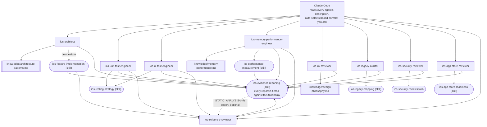

# claude-ai-agents-ios

🌐 [English](README.md) | [简体中文](README.zh-CN.md) | [Español](README.es.md) | [हिन्दी](README.hi.md) | [العربية](README.ar.md) | [Português (Brasil)](README.pt-BR.md) | [Русский](README.ru.md) | [日本語](README.ja.md) | [Français](README.fr.md) | [Deutsch](README.de.md) | [한국어](README.ko.md) | [Italiano](README.it.md) | [Türkçe](README.tr.md) | [Tiếng Việt](README.vi.md) | [Bahasa Indonesia](README.id.md)

[Claude Code](https://claude.com/claude-code) subagent'larını ve Skill'lerini
Claude Code'u özel bir iOS geliştirme ekibine dönüştüren, kullanıma hazır bir
paket: mimari, birim testi, arayüz testi, bellek/performans, UI/UX incelemesi,
güvenlik, App Store hazırlığı, eski kod tabanı denetimi ve bağımsız kanıt
incelemesi — her biri ne sorduğunuza göre otomatik olarak devreye giriyor,
manuel geçiş gerekmiyor.

## Neler dahil

### Subagent'lar (`.claude/agents/`)

| Agent | Şu durumlarda devreye girer... | Araçlar |
|---|---|---|
| `ios-architect` | yeni bir özellik/modüle başladığınızda, "bunu nasıl yapılandırmalıyım" diye sorduğunuzda, bir yeniden yapılandırma planladığınızda, MVVM/Clean/VIPER arasında seçim yaptığınızda, dependency injection'a veya SwiftData ile Core Data arasında karar verdiğinizde | Read, Grep, Glob, Write, Edit, Skill, `ios-agent`* |
| `ios-unit-test-engineer` | test, test kapsamı, TDD istediğinizde, veya mevcut kodu test edilebilir hale getirmek istediğinizde | Read, Grep, Glob, Write, Edit, Bash, Skill, `ios-agent`* |
| `ios-ui-test-engineer` | UI testleri istediğinizde, kararsız bir UI testini hata ayıkladığınızda, veya snapshot testi kurduğunuzda | Read, Grep, Glob, Write, Edit, Bash, Skill, `ios-agent`*, `ios-simulator`* |
| `ios-memory-performance-engineer` | bir bellek sızıntısı, büyüyen bellek kullanımı, yavaş kaydırma, veya yavaş başlatma bildirdiğinizde | Read, Grep, Glob, Bash, Edit, Skill, `ios-agent`*, `ios-simulator`* |
| `ios-ux-reviewer` | bir UI/UX incelemesi veya tasarım tutarlılığı kontrolü istediğinizde | Read, Grep, Glob, Skill, `ios-agent`* (salt okunur) |
| `ios-legacy-auditor` | tanıdık olmayan, belgelenmemiş veya büyük bir eski projeye alışmaya çalıştığınızda | Read, Grep, Glob, Bash, Skill, `ios-agent`* (salt okunur) |
| `ios-security-reviewer` | bir güvenlik incelemesi, "bu güvenli mi", bir güvenlik açığı kontrolü, veya bir kimlik doğrulama/oturum denetimi istediğinizde | Read, Grep, Glob, Bash, Skill, `ios-agent`* (salt okunur) |
| `ios-app-store-reviewer` | "bu göndermeye hazır mı", "reddedilir mi" diye sorduğunuzda, veya App Store uyumluluğunu kontrol etmek istediğinizde | Read, Grep, Glob, Bash, Skill, `ios-agent`* (salt okunur) |
| `ios-evidence-reviewer` | başka bir agent bir rapor ürettikten sonra, veya "bu raporu tekrar kontrol et"/"bu iddiaları doğrula" dediğinizde | Read, Grep, Glob, Skill (salt okunur) |

\* `ios-agent` ve `ios-simulator`, isteğe bağlı üçüncü taraf MCP sunucularıdır —
aşağıdaki "İsteğe Bağlı Araçlar" bölümüne bakın.
Her agent bunlar olmadan da bağımsız çalışır. `ios-agent`, `STATIC_ANALYSIS`
düzeyindeki bir okumayı yapılandırılmış araçlarla güçlendirir — bir iddiayı
asla `BUILD_VERIFIED`/`TEST_VERIFIED`/`RUNTIME_VERIFIED` düzeyine
yükseltmez, çünkü uygulamayı kendisi hiçbir zaman derlemez veya çalıştırmaz.
`ios-simulator` ise uygulamayı gerçekten derler/kurar/başlatır, bu yüzden
çıktısı gerçekten `BUILD_VERIFIED`, `TEST_VERIFIED`, veya `RUNTIME_VERIFIED`
düzeyine ulaşabilir — "Varsayımdan Önce Kanıt" bölümündeki yedi katmanlı
sınıflandırmaya bakın.

### Skill'ler (`.claude/skills/`)

| Skill | Destekler | Amaç |
|---|---|---|
| `ios-testing-strategy` | `ios-unit-test-engineer`, `ios-ui-test-engineer` | Somut prosedür: bağlantı noktaları → test çifti → kırmızı/yeşil |
| `ios-legacy-mapping` | `ios-legacy-auditor` | Somut prosedür: envanter → mimari tespiti → köprü riski → güvenlik sinyali → özet belge |
| `ios-security-review` | `ios-security-reviewer` | 8 alanlı denetim: depolama/gizlilik → aktarım → kimlik doğrulama/oturum → girdi doğrulama → derin bağlantılar → üçüncü taraf SDK'lar → kod hijyeni → yetkilendirmeler |
| `ios-app-store-readiness` | `ios-app-store-reviewer` | Gönderim öncesi denetim: gizlilik manifestosu → ihracat uyumluluğu → izin açıklamaları → App Tracking Transparency → Sign in with Apple eşitliği → kullanılmayan yetkilendirmeler → reddetme tetikleyicileri |
| `ios-feature-implementation` | Genel — herhangi bir özellik isteğinde devreye girer, `ios-architect` ile birlikte çalışır | Mevcut kodu, iş mantığını, API/bağlantı davranışını ve güvenlik durumunu incele → dosyalara dokunmadan önce açıkla → uygula → doğrula (derleme, testler, retain döngüleri, bellek, performans, güvenlik) → raporla |
| `ios-performance-measurement` | `ios-memory-performance-engineer` | Yeniden oluştur → neyin ölçüleceğini seç → herhangi bir şeyi değiştirmeden önce ölç → değiştir → aynı koşullarda yeniden ölç → enstrümantasyonun kaldırıldığını doğrula |
| `ios-evidence-reporting` | Tüm 9 agent — herhangi biri bir görevi tamamladığında devreye girer | Yedi katmanlı kanıt sınıflandırması (`ASSUMPTION` → `HUMAN_VERIFICATION`), iddia → asgari kanıt matrisi, ve yasaklı iddialar listesi, böylece hiçbir agent bir şeyin çalıştığını, düzeltildiğini, veya daha hızlı/güvenli/thread-safe olduğunu karşılık gelen kanıt düzeyi olmadan iddia edemez |

### Bilgi kütüphanesi (`knowledge/`)

Derinlemesine referans materyali, agent gövdelerinin içinde değil burada
yaşar, böylece her agent *ne zaman harekete geçileceğine* ve *hangi
prosedürün izleneceğine* odaklanmış kalır, bilgi dosyası ise *neyin kontrol
edileceği konusunda gerçeğin kaynağı* olur. Agent'lar bunları ilgili
olduğunda `Read` aracıyla okur — ek yapılandırma gerekmez.

| Dosya | Referans veren | İçerik |
|---|---|---|
| `memory-performance.md` | `ios-memory-performance-engineer` | ARC/Instruments/görsel/eşzamanlılık temelleri artı çerçeveye özgü kalıplar (RxSwift, WKWebView, PDFKit, Core Data, Firebase, CocoaPods, Keychain, üçüncü taraf sunum kütüphaneleri, UICollectionView/UITableView, SwiftUI/UIKit köprüleri, AVFoundation, CoreLocation, URLSession) |
| `architecture-patterns.md` | `ios-architect` | Kalıp/karar kriterleri: MVVM/Clean/VIPER, Swift Concurrency, modülerleştirme, kalıcılık, gezinme, dependency injection, güvenlik bilinçli yapı |
| `design-philosophy.md` | `ios-ux-reviewer` | Apple İnsan Arayüzü Kılavuzları, Dieter Rams'ın iOS'a uygulanan on ilkesi, Nielsen Norman Group buluşsal yöntemleri, ve adı geçen kaynaklar listesi |

### Şablon

- `CLAUDE.md.template` — proje kök dizininize `CLAUDE.md` olarak kopyalayın
  ve yer tutucuları doldurun (veya `ios-legacy-auditor`'ın tanıdık olmayan
  bir kod tabanı için mimari bölümünü sizin için oluşturmasına izin verin).

## Kurulum

İhtiyacınız olanı iOS projenizin kök dizinine kopyalayın:

```bash
# Bu depodan, projenize kopyalayın:
mkdir -p /path/to/your-ios-project/.claude
cp -r .claude/agents /path/to/your-ios-project/.claude/
cp -r .claude/skills /path/to/your-ios-project/.claude/
cp -r knowledge /path/to/your-ios-project/knowledge
cp CLAUDE.md.template /path/to/your-ios-project/CLAUDE.md   # sonra düzenleyin
```

```bash
# Ya da kopyalamak yerine sembolik bağlantı oluşturun, birden fazla proje arasında senkronize kalmak için:
ln -s /path/to/claude-ai-agents-ios/.claude/agents /path/to/your-ios-project/.claude/agents
ln -s /path/to/claude-ai-agents-ios/.claude/skills /path/to/your-ios-project/.claude/skills
ln -s /path/to/claude-ai-agents-ios/knowledge /path/to/your-ios-project/knowledge
```

`knowledge/` klasörü projenizin kök dizininde (`.claude/` ile aynı yerde)
bulunmalıdır — agent'lar ona bu göreli yol üzerinden referans verir.

Proje başına yerine kişisel (projeler arası) kullanım için, bunun yerine
`~/.claude/agents/` ve `~/.claude/skills/` içine kopyalayın — Claude Code
kişisel ve proje düzeyindeki agent/skill'leri otomatik olarak birleştirir.
`knowledge/`'ın depo-göreli bir yol olarak referans verildiğini unutmayın,
bu yüzden kişisel kullanım için her projenin kök dizininde yine de
`knowledge/` bulunması gerekir (proje başına sembolik bağlantı en basit
yoldur).

Başka hiçbir şey gerekmez — Claude Code her agent'ın `description`
frontmatter'ını okur ve isteğinize göre otomatik olarak doğru olanı çağırır.
Birkaç agent'ın kanıt düzeyini güçlendiren, ancak olmadan da yukarıdakilerin
hepsinin bağımsız çalıştığı iki üçüncü taraf MCP sunucusu için aşağıdaki
"İsteğe Bağlı Araçlar" bölümüne bakın.

## İsteğe Bağlı Araçlar: statik analiz ve simülatör kontrolü

[`ios-agent-skill`](https://github.com/Nagarjuna2997/ios-agent-skill)
deposundan (MIT lisanslı, bu depoyla bağlantılı değil) iki sunucu, yukarıdaki
birkaç agent'a sadece kodu okumak yerine bir kontrolü gerçekten
*çalıştırma* imkanı verir. Hiçbiri gerekli değildir — her agent bunlar
olmadan zaten çalışır, `STATIC_ANALYSIS` düzeyinde okumalara ve elle
tanımlanmış prosedürlere geri döner.

### `ios-agent-mcp` — statik analiz (yayınlanmış, önerilir)

Bir Swift projesini tarayan ve eşzamanlılık, mimari, SwiftUI kalıpları,
kullanılabilirlik korumaları, App Store hazırlığı, bellek, güvenlik, testler
ve performans için yapılandırılmış bulgular (dosya, satır, sonuç, düzeltme)
döndüren on tane salt okunur araç — ayrıntılar için
[araç listesine](https://github.com/Nagarjuna2997/ios-agent-skill/tree/main/mcp-server)
bakın. Dosya sisteminde tamamen salt okunurdur, ağ erişimi yoktur.

Bu deponun `.mcp.json`'ı onu zaten bildiriyor, bu yüzden `.mcp.json`'ı
projenize `.claude/` ile birlikte kopyalamak tek adımdır:

```bash
cp .mcp.json /path/to/your-ios-project/.mcp.json
```

Claude Code, proje kapsamlı sunucuyu ilk kez ilgili olduğunda etkinleştirmeyi
önerecektir; `npx` paketi ilk kullanımda getirir, genel kurulum gerekmez.

### `ios-simulator-mcp` — simülatör kontrolü (erken aşama, yalnızca kaynak)

Başlatılmış bir iOS Simülatörü için derleme, test, kurulum, başlatma, derin
bağlantı, ve ekran görüntüsü araçları — yukarıdaki statik analiz aracının
çalışma zamanı karşılığı. Bu yazının yazıldığı tarihte **v0.1.0, henüz npm'de
yayınlanmamış, ve erken aşamada** (kendi belgeleri onu "ilk güvenli dilim"
olarak adlandırıyor), bu yüzden ona güvenilecek bir şey değil, denenecek bir
şey olarak yaklaşın:

```bash
git clone https://github.com/Nagarjuna2997/ios-agent-skill.git
cd ios-agent-skill/ios-simulator-mcp
npm install && npm run build
```

Ardından, derlenmiş yola işaret ederek `ios-simulator` sunucu adı altında
projenizin `.mcp.json`'ına (veya kişisel MCP yapılandırmanıza) ekleyin:

```jsonc
{
  "mcpServers": {
    "ios-simulator": {
      "command": "node",
      "args": ["/absolute/path/to/ios-agent-skill/ios-simulator-mcp/dist/index.js"]
    }
  }
}
```

macOS ve Xcode komut satırı araçları gerektirir. Sunucuyu `ios-simulator`
dışında bir adla adlandırırsanız, `ios-ui-test-engineer.md` ve
`ios-memory-performance-engineer.md` içindeki `mcp__ios-simulator__*` araç
atamasını buna göre güncelleyin.

## Her şey nasıl bir araya geliyor



Yapılandırılacak bir yönlendirici veya orkestratör yoktur — Claude Code'un
kendi açıklama eşleştirmesi dağıtım katmanının *ta kendisidir*. Her agent,
ya derinlemesine referans materyali için bir `knowledge/*.md` dosyası okuyan,
ya paylaşılan bir prosedür için bir `Skill`'i izleyen, ya da her ikisini de
yapan bir uç noktadır ve her yol sonunda aynı kanıt raporlama standardında
birleşir. `ios-evidence-reviewer`, "uç nokta" kuralının tek istisnasıdır: o,
*başka* bir agent'ın tamamlanmış raporunu okur ve gösterilen kanıtın
gerçekten desteklemediği herhangi bir iddiayı düşürür, ardından düzeltilmiş
rapor aynı durum bloğu formatıyla tekrar kapanır. `ios-feature-implementation`,
`ios-memory-performance-engineer`, `ios-unit-test-engineer`, ve
`ios-ui-test-engineer`, kendi raporları `BUILD_VERIFIED` veya üzerine
ulaştığında otomatik olarak ondan geçer — derleme/test/ölçümü çalıştıran
agent, raporunun bu konuda dürüst olup olmadığını kontrol eden tek kişi
değildir.

## Birbirlerine nasıl devrederler

Tipik bir akış, ancak bunların hiçbirini asla adıyla çağırmanız gerekmez:

1. **Tanıdık olmayan/belgelenmemiş bir kod tabanı mı?** `ios-legacy-auditor`
   ile başlayın — başka hiçbir şey koda dokunmadan önce, gerçek mimariyi
   haritalar ve `CLAUDE.md`'ye bırakabileceğiniz bir özet üretir.
2. **Yeni bir özellik/modül mü?** `ios-architect` bir yapı önerir ve
   tasarımın birim test edilebilir olup olmadığını belirtir;
   `ios-feature-implementation` daha sonra gerçek yapımı yürütür — önce
   mevcut iş mantığını inceleyerek, dosyalara dokunmadan önce planı
   açıklayarak, üzerinde anlaşılan yapıya göre uygulayarak, ve tamamlandı
   olarak raporlamadan önce doğrulayarak (derleme, testler, bellek,
   performans).
3. **Test mi gerekiyor?** Mantık için `ios-unit-test-engineer`, kullanıcı
   akışları için `ios-ui-test-engineer` — ikisi de `ios-testing-strategy`'den
   gelen aynı bağlantı noktası → kırmızı/yeşil disiplinini izler.
4. **Yeni veya değişen bir ekran mı?** `ios-ux-reviewer`, göndermeden önce
   onu Apple'ın İnsan Arayüzü Kılavuzlarına ve altta yatan tasarım
   felsefesine göre kontrol eder.
5. **Bir şey yavaş hissediliyor mu veya bellek mi sızdırıyor?**
   `ios-memory-performance-engineer` önce statik nedenler için kodu okur,
   ve bu yalnızca okuyarak bulunamıyorsa size kesin Instruments
   prosedürünü verir.
6. **Bir güvenlik kontrolü mü istiyorsunuz?** `ios-security-reviewer` özel
   bir 8 alanlı denetim yürütür (depolama, aktarım, kimlik doğrulama, girdi
   doğrulama, derin bağlantılar, bağımlılıklar, kod hijyeni,
   yetkilendirmeler); `ios-architect`, `ios-legacy-auditor`, ve
   `ios-feature-implementation` de kendi çalışmalarının bir parçası olarak
   daha hafif, hedeflenmiş güvenlik endişelerini işaretler ve tam bir
   denetimi gerektiren her şey için buraya yönlendirir.
7. **App Store'a göndermek üzere misiniz?** `ios-app-store-reviewer`, kodda
   görünür gönderim engelleyicilerini kontrol eder (gizlilik manifestosu,
   izin açıklamaları, ihracat uyumluluğu, Sign in with Apple eşitliği) —
   bazı ortak zeminleri paylaşsalar da (yetkilendirmeler, aktarım
   güvenliği), bu `ios-security-reviewer`'dan ayrı bir konudur, bu yüzden
   ikisi de ilgiliyse bir sürümden önce ikisini de çalıştırın.
8. **Rapor `BUILD_VERIFIED` veya üzerine mi ulaşıyor?** `ios-evidence-reviewer`
   tamamlandı olarak kabul edilmeden önce onu kontrol eder.
   `ios-feature-implementation`, `ios-memory-performance-engineer`,
   `ios-unit-test-engineer`, ve `ios-ui-test-engineer` — sadece statik bir
   bulgu değil, bağımsız olarak bir derleme/test/çalışma zamanı/ölçüm
   iddiası üretebilen agent'lar — her biri son adım olarak otomatik olarak
   ondan geçer; başka herhangi bir agent'ın raporu da doğrudan ona
   verilebilir.

## Varsayımdan Önce Kanıt

Yapay zekanın güveni kanıt değildir. Yapay zekanın akıl yürütmesi çalışma
zamanı kanıtı değildir. Bir kod değişikliği otomatik olarak doğrulanmış bir
düzeltme değildir. Bu depodaki her agent, raporunu basit bir "Bitti! Çalışıyor"
yerine `ios-evidence-reporting` skill'inin durum bloğuyla bitirir, ve bu
bloktaki her satır en zayıftan en güçlüye doğru yedi kanıt düzeyinden birine
göre sınıflandırılır:

`ASSUMPTION` → `STATIC_ANALYSIS` → `BUILD_VERIFIED` → `TEST_VERIFIED`
→ `RUNTIME_VERIFIED` → `RUNTIME_MEASURED` → `HUMAN_VERIFICATION`

Bir iddia, kanıtın gerçekten ulaştığından daha yüksek bir düzeyde asla
raporlanmaz. Kaynak kodu okumak (bir MCP statik analizörünün yapılandırılmış
çıktısı dahil) tamamen `STATIC_ANALYSIS`'tır — okumayı bir insan mı yoksa
bir araç mı yaptığı fark etmez — bir araç ürettiği için daha güçlü bir kanıt
haline gelmez, ve asla "sızıntı yok" veya "bellek iyileşti" iddiasını
destekleyemez. Bunlar özellikle `RUNTIME_MEASURED` gerektirir: uygulamanın
gerçekten çalıştırılmasından gelen gerçek bir sayı (Instruments, MetricKit,
`os_signpost`), `ios-performance-measurement`'ın yeniden oluştur → temel
çizgi → ölç → değiştir → derle → test et → yeniden ölç → karşılaştır →
raporla döngüsü aracılığıyla. Bu depodaki agent'ların karşılık gelen kanıt
olmadan asla yapmayacağı bir iddia: "düzeltildi", "optimize edildi", "daha
hızlı", "sızıntısız", "thread-safe", "güvenli", veya "üretime hazır" (hiçbir
tek agent'ın kanıtının tek başına kapsamadığı, alanlar arası bir iddia) —
tam liste ve kesin dil alternatifleri için `ios-evidence-reporting`'in iddia
→ asgari kanıt matrisine bakın.

Bir şeyi uygulayan agent'ın kendi raporunun dürüst olup olmadığına dair tek
otorite olmaması gerektiğinden, `ios-evidence-reviewer` tamamlanmış bir
raporun iddialarını bağımsız olarak aynı matrise göre yeniden kontrol eder
ve nihai olarak sunulmadan önce desteklenmeyen her şeyi düşürür — yukarıdaki
"Her şey nasıl bir araya geliyor" bölümüne bakın.

## Tasarım felsefesi

Özellikle `ios-ux-reviewer`, iddia edilen bir zevk yerine adı belirtilen
kaynaklara dayanır: Apple'ın İnsan Arayüzü Kılavuzları, Dieter Rams'ın on
iyi tasarım ilkesi, Don Norman'ın *The Design of Everyday Things*'i,
Nielsen Norman Group'un kullanılabilirlik buluşsal yöntemleri, ve somut
görsel yargılar için *Refactoring UI*. Her birinin iOS'a özel olarak nasıl
uygulandığı için `knowledge/design-philosophy.md`'ye bakın.

## Bu deponun bakımı

`scripts/audit-agents.sh`, geliştirme sırasında her agent/skill dosyasının
tabi tutulduğu mekanik kontrolleri çalıştırır: frontmatter'daki `name:`
dosya adı veya dizinle eşleşir, `description:` gerçek, tırnak içine alınmış
bir tetikleme ifadesi taşır, gövdedeki salt okunur bir iddia bir
`Write`/`Edit` yetkisiyle yan yana durmaz, kod blokları düzgün kapanır, tüm
depodaki her ters tırnaklı `ios-*` referansı gerçek bir agent veya skill'e
çözümlenir, ve hiçbir dosya hala mevcut yedi katmanlı sınıflandırma yerine
eski `(static)`/`(executed)` derecelendirmesini taşımaz. Engelleyici
değildir — bulgular bir insanın üzerinde hareket etmesi içindir, bir engel
değil.

```bash
./scripts/audit-agents.sh
```
