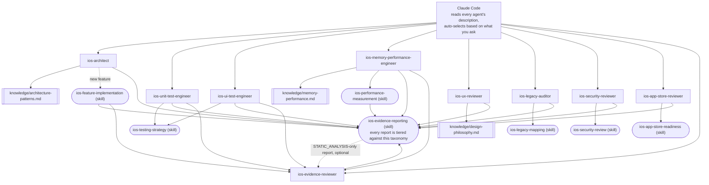

# claude-ai-agents-ios

🌐 [English](README.md) | [简体中文](README.zh-CN.md) | [Español](README.es.md) | [हिन्दी](README.hi.md) | [العربية](README.ar.md) | [Português (Brasil)](README.pt-BR.md) | [Русский](README.ru.md) | [日本語](README.ja.md) | [Français](README.fr.md) | [Deutsch](README.de.md) | [한국어](README.ko.md) | [Italiano](README.it.md) | [Türkçe](README.tr.md) | [Tiếng Việt](README.vi.md) | [Bahasa Indonesia](README.id.md)

Một bộ subagent và Skill có sẵn cho [Claude Code](https://claude.com/claude-code),
biến Claude Code thành một đội ngũ phát triển iOS chuyên biệt: kiến trúc,
unit test, UI test, bộ nhớ/hiệu năng, đánh giá UI/UX, bảo mật, mức độ sẵn
sàng cho App Store, kiểm toán mã cũ, và đánh giá bằng chứng độc lập —
mỗi agent được tự động gọi dựa trên yêu cầu của bạn, không cần chuyển đổi
thủ công.

## Nội dung bao gồm

### Subagent (`.claude/agents/`)

| Agent | Được gọi khi bạn... | Công cụ |
|---|---|---|
| `ios-architect` | bắt đầu một tính năng/module mới, hỏi "nên cấu trúc thế nào", lên kế hoạch tái cấu trúc, chọn giữa MVVM/Clean/VIPER, quyết định DI hoặc SwiftData và Core Data | Read, Grep, Glob, Write, Edit, Skill, `ios-agent`* |
| `ios-unit-test-engineer` | yêu cầu viết test, tăng độ phủ test, TDD, hoặc làm cho code có thể test được | Read, Grep, Glob, Write, Edit, Bash, Skill, `ios-agent`* |
| `ios-ui-test-engineer` | yêu cầu UI test, gỡ lỗi UI test không ổn định, hoặc thiết lập snapshot testing | Read, Grep, Glob, Write, Edit, Bash, Skill, `ios-agent`*, `ios-simulator`* |
| `ios-memory-performance-engineer` | báo cáo rò rỉ bộ nhớ, bộ nhớ tăng dần, cuộn chậm, hoặc khởi động chậm | Read, Grep, Glob, Bash, Edit, Skill, `ios-agent`*, `ios-simulator`* |
| `ios-ux-reviewer` | yêu cầu đánh giá UI/UX hoặc kiểm tra tính nhất quán của thiết kế | Read, Grep, Glob, Skill, `ios-agent`* (chỉ đọc) |
| `ios-legacy-auditor` | tiếp cận một dự án xa lạ, không có tài liệu, hoặc mã cũ quy mô lớn | Read, Grep, Glob, Bash, Skill, `ios-agent`* (chỉ đọc) |
| `ios-security-reviewer` | yêu cầu đánh giá bảo mật, "cái này có an toàn không", kiểm tra lỗ hổng, hoặc kiểm toán xác thực/phiên đăng nhập | Read, Grep, Glob, Bash, Skill, `ios-agent`* (chỉ đọc) |
| `ios-app-store-reviewer` | hỏi "cái này đã sẵn sàng nộp chưa", "liệu có bị từ chối không", hoặc kiểm tra tuân thủ App Store | Read, Grep, Glob, Bash, Skill, `ios-agent`* (chỉ đọc) |
| `ios-evidence-reviewer` | sau khi một agent khác tạo ra báo cáo, hoặc yêu cầu "kiểm tra lại báo cáo này"/"xác minh các khẳng định này" | Read, Grep, Glob, Skill (chỉ đọc) |

\* `ios-agent` và `ios-simulator` là các MCP server bên thứ ba tùy chọn —
xem phần "Optional tooling" bên dưới. Mọi agent đều hoạt động độc lập mà
không cần chúng. `ios-agent` củng cố một lượt đọc ở mức `STATIC_ANALYSIS`
bằng công cụ có cấu trúc — nó không bao giờ nâng một khẳng định lên mức
`BUILD_VERIFIED`/`TEST_VERIFIED`/`RUNTIME_VERIFIED`, vì bản thân nó không
build hay chạy ứng dụng. `ios-simulator` thực sự build/cài đặt/chạy ứng
dụng, nên kết quả của nó có thể đạt mức `BUILD_VERIFIED`, `TEST_VERIFIED`,
hoặc `RUNTIME_VERIFIED` một cách chính đáng — xem hệ thống bảy cấp độ
trong phần "Evidence over assertion" bên dưới.

### Skill (`.claude/skills/`)

| Skill | Hỗ trợ | Mục đích |
|---|---|---|
| `ios-testing-strategy` | `ios-unit-test-engineer`, `ios-ui-test-engineer` | Quy trình cụ thể: điểm nối → test double → red/green |
| `ios-legacy-mapping` | `ios-legacy-auditor` | Kiểm kê → phát hiện kiến trúc → rủi ro cầu nối → tín hiệu bảo mật → tài liệu tổng hợp |
| `ios-security-review` | `ios-security-reviewer` | Kiểm toán 8 hạng mục: lưu trữ/quyền riêng tư → vận chuyển → xác thực/phiên → kiểm tra đầu vào → deep link → SDK bên thứ ba → vệ sinh mã nguồn → quyền hạn |
| `ios-app-store-readiness` | `ios-app-store-reviewer` | Kiểm tra trước khi nộp: manifest quyền riêng tư → tuân thủ xuất khẩu → mô tả quyền → App Tracking Transparency → tương đương Sign in with Apple → quyền hạn không dùng → các yếu tố gây từ chối |
| `ios-feature-implementation` | Chung — kích hoạt với bất kỳ yêu cầu tính năng nào, hoạt động cùng `ios-architect` | Khảo sát code hiện có, logic nghiệp vụ, hành vi API/kết nối và tình trạng bảo mật → giải thích trước khi chỉnh sửa → triển khai → xác minh (build, test, chu trình giữ tham chiếu, bộ nhớ, hiệu năng, bảo mật) → báo cáo |
| `ios-performance-measurement` | `ios-memory-performance-engineer` | Tái hiện → chọn cái cần đo → đo trước khi thay đổi → thay đổi → đo lại trong cùng điều kiện → xác nhận đã gỡ bỏ công cụ đo |
| `ios-evidence-reporting` | Cả 9 agent — kích hoạt mỗi khi bất kỳ agent nào hoàn thành nhiệm vụ | Hệ thống bằng chứng bảy cấp độ (`ASSUMPTION` → `HUMAN_VERIFICATION`), ma trận "khẳng định → bằng chứng tối thiểu", và danh sách các phát biểu bị cấm, để không agent nào khẳng định điều gì đó hoạt động, đã sửa, hoặc nhanh hơn/an toàn/thread-safe mà không có bằng chứng ở đúng cấp độ |

### Thư viện kiến thức (`knowledge/`)

Tài liệu tham khảo chuyên sâu được lưu ở đây thay vì trong thân của agent,
để mỗi agent tập trung vào *khi nào cần hành động* và *quy trình cần
theo*, còn file kiến thức là *nguồn chân lý về những gì cần kiểm tra*.
Agent đọc các file này bằng công cụ `Read` khi cần — không cần cấu hình
thêm.

| File | Được dùng bởi | Nội dung |
|---|---|---|
| `memory-performance.md` | `ios-memory-performance-engineer` | Kiến thức nền tảng về ARC/Instruments/hình ảnh/concurrency cộng với các mẫu hình đặc thù cho từng framework (RxSwift, WKWebView, PDFKit, Core Data, Firebase, CocoaPods, Keychain, thư viện trình bày bên thứ ba, UICollectionView/UITableView, cầu nối SwiftUI/UIKit, AVFoundation, CoreLocation, URLSession) |
| `architecture-patterns.md` | `ios-architect` | Tiêu chí lựa chọn mẫu hình: MVVM/Clean/VIPER, Swift Concurrency, module hóa, lưu trữ dữ liệu, điều hướng, DI, cấu trúc chú trọng bảo mật |
| `design-philosophy.md` | `ios-ux-reviewer` | Apple HIG, mười nguyên tắc của Dieter Rams áp dụng cho iOS, các nguyên tắc heuristic của Nielsen Norman Group, và danh sách nguồn tham khảo |

### Mẫu

- `CLAUDE.md.template` — sao chép vào thư mục gốc dự án của bạn thành
  `CLAUDE.md` rồi điền vào các chỗ trống (hoặc để `ios-legacy-auditor`
  tự tạo phần kiến trúc cho bạn với một codebase xa lạ).

## Cài đặt

Sao chép những gì bạn cần vào thư mục gốc của dự án iOS:

```bash
# Từ repo này, sao chép vào dự án của bạn:
mkdir -p /path/to/your-ios-project/.claude
cp -r .claude/agents /path/to/your-ios-project/.claude/
cp -r .claude/skills /path/to/your-ios-project/.claude/
cp -r knowledge /path/to/your-ios-project/knowledge
cp CLAUDE.md.template /path/to/your-ios-project/CLAUDE.md   # rồi chỉnh sửa
```

```bash
# Hoặc tạo symlink thay vì sao chép, để đồng bộ giữa nhiều dự án:
ln -s /path/to/claude-ai-agents-ios/.claude/agents /path/to/your-ios-project/.claude/agents
ln -s /path/to/claude-ai-agents-ios/.claude/skills /path/to/your-ios-project/.claude/skills
ln -s /path/to/claude-ai-agents-ios/knowledge /path/to/your-ios-project/knowledge
```

Thư mục `knowledge/` phải nằm ở thư mục gốc dự án của bạn (cạnh `.claude/`)
— agent tham chiếu đến nó theo đường dẫn tương đối này.

Để dùng cho cá nhân (nhiều dự án) thay vì từng dự án riêng, hãy sao chép
vào `~/.claude/agents/` và `~/.claude/skills/` — Claude Code sẽ tự động
hợp nhất agent/skill cá nhân và của dự án. Lưu ý rằng `knowledge/` được
tham chiếu theo đường dẫn tương đối trong repo, nên nếu dùng cho cá
nhân bạn vẫn cần có `knowledge/` ở gốc mỗi dự án (dùng symlink cho từng
dự án là đơn giản nhất).

Không cần gì khác — Claude Code đọc trường `description` trong metadata
của mỗi agent và tự động gọi đúng agent dựa trên yêu cầu của bạn. Xem
phần "Optional tooling" bên dưới về hai MCP server bên thứ ba giúp
tăng cấp độ bằng chứng của một số agent, dù không có chúng mọi thứ ở
trên vẫn hoạt động độc lập.

## Optional tooling: phân tích tĩnh & điều khiển simulator

Hai server từ [`ios-agent-skill`](https://github.com/Nagarjuna2997/ios-agent-skill)
(giấy phép MIT, không liên kết với repo này) cho một số agent ở trên khả
năng *thực thi* một kiểm tra thay vì chỉ đọc code. Không cái nào bắt
buộc — mọi agent đã hoạt động tốt mà không có chúng, quay về đọc ở mức
`STATIC_ANALYSIS` và các quy trình được mô tả thủ công.

### `ios-agent-mcp` — phân tích tĩnh (đã xuất bản, khuyến nghị)

Mười công cụ chỉ đọc quét một dự án Swift và trả về các phát hiện có
cấu trúc (file, dòng, hậu quả, cách sửa) cho concurrency, kiến trúc, mẫu
hình SwiftUI, availability guard, mức sẵn sàng cho App Store, bộ nhớ,
bảo mật, testing, và hiệu năng — xem [danh sách công cụ](https://github.com/Nagarjuna2997/ios-agent-skill/tree/main/mcp-server)
để biết chi tiết. Chỉ đọc hệ thống file, không truy cập mạng.

File `.mcp.json` của repo này đã khai báo sẵn, nên chỉ cần sao chép
`.mcp.json` vào dự án của bạn cùng với `.claude/`:

```bash
cp .mcp.json /path/to/your-ios-project/.mcp.json
```

Claude Code sẽ đề nghị bật server phạm vi dự án khi cần dùng đến lần
đầu; `npx` sẽ tải package khi dùng lần đầu, không cần cài đặt toàn cục.

### `ios-simulator-mcp` — điều khiển simulator (giai đoạn đầu, chỉ có mã nguồn)

Các công cụ build, test, cài đặt, chạy, deep link, và chụp màn hình cho
simulator iOS đang chạy — đối tác thời gian chạy của công cụ phân tích
tĩnh ở trên. Tại thời điểm viết tài liệu này, đây là phiên bản **v0.1.0,
chưa được xuất bản lên npm, và còn ở giai đoạn đầu** (tài liệu của chính
nó gọi đây là "lát cắt an toàn đầu tiên"), nên hãy coi đây là thứ để
thử nghiệm, không phải thứ để phụ thuộc vào:

```bash
git clone https://github.com/Nagarjuna2997/ios-agent-skill.git
cd ios-agent-skill/ios-simulator-mcp
npm install && npm run build
```

Sau đó thêm nó vào `.mcp.json` của dự án (hoặc cấu hình MCP cá nhân) với
tên server là `ios-simulator`, trỏ đến đường dẫn đã build:

```jsonc
{
  "mcpServers": {
    "ios-simulator": {
      "command": "node",
      "args": ["/absolute/path/to/ios-agent-skill/ios-simulator-mcp/dist/index.js"]
    }
  }
}
```

Yêu cầu macOS và Xcode command-line tools. Nếu bạn đặt tên server khác
với `ios-simulator`, hãy cập nhật quyền công cụ `mcp__ios-simulator__*`
trong `ios-ui-test-engineer.md` và `ios-memory-performance-engineer.md`
cho khớp.

## Cách mọi thứ kết hợp với nhau



Không có router hay orchestrator nào cần cấu hình — cơ chế so khớp
theo mô tả có sẵn của Claude Code *chính là* lớp điều phối. Mỗi agent là
một "lá" — nó đọc file `knowledge/*.md` để lấy tài liệu tham khảo
chuyên sâu, theo một `Skill` cho quy trình dùng chung, hoặc cả hai — và
mọi nhánh đều hội tụ về cùng một chuẩn báo cáo bằng chứng ở cuối.
`ios-evidence-reviewer` là ngoại lệ duy nhất của quy tắc "lá": nó đọc
báo cáo hoàn chỉnh của một agent *khác* và hạ cấp bất kỳ khẳng định nào
không được bằng chứng đã nêu hỗ trợ, sau đó báo cáo đã sửa lại đóng
bằng cùng định dạng khối trạng thái. `ios-feature-implementation`,
`ios-memory-performance-engineer`, `ios-unit-test-engineer`, và
`ios-ui-test-engineer` tự động đi qua nó bất cứ khi nào báo cáo của
chính chúng đạt mức `BUILD_VERIFIED` trở lên — agent thực hiện việc
build/test/đo lường không phải là bên duy nhất kiểm tra xem báo cáo của
nó có trung thực hay không.

## Cách chúng bàn giao cho nhau

Một luồng điển hình, dù bạn không bao giờ cần gọi bất kỳ cái nào trong
số này theo tên:

1. **Codebase xa lạ/không có tài liệu?** Bắt đầu với `ios-legacy-auditor`
   — nó ánh xạ kiến trúc thực tế và tạo ra một bản tóm tắt bạn có thể
   đưa vào `CLAUDE.md`, trước khi bất cứ thứ gì khác chạm vào code.
2. **Tính năng/module mới?** `ios-architect` đề xuất cấu trúc và đánh
   dấu xem thiết kế có thể unit test được hay không; sau đó
   `ios-feature-implementation` thực hiện việc xây dựng thực tế — trước
   tiên khảo sát logic nghiệp vụ hiện có, giải thích kế hoạch trước khi
   chỉnh sửa, triển khai theo đúng cấu trúc đã thống nhất, và xác minh
   (build, test, bộ nhớ, hiệu năng) trước khi báo cáo hoàn thành.
3. **Cần test?** `ios-unit-test-engineer` cho logic,
   `ios-ui-test-engineer` cho luồng người dùng — cả hai đều theo cùng
   một kỷ luật "điểm nối → red/green" từ `ios-testing-strategy`.
4. **Màn hình mới hoặc đã thay đổi?** `ios-ux-reviewer` kiểm tra nó theo
   Apple Human Interface Guidelines và triết lý thiết kế nền tảng
   trước khi bạn phát hành.
5. **Có gì đó chậm hoặc rò rỉ bộ nhớ?** `ios-memory-performance-engineer`
   trước tiên đọc code để tìm nguyên nhân tĩnh, và đưa ra quy trình
   Instruments chính xác khi không thể tìm ra nguyên nhân chỉ bằng cách
   đọc code.
6. **Cần kiểm tra bảo mật?** `ios-security-reviewer` thực hiện kiểm
   toán chuyên sâu 8 hạng mục (lưu trữ, vận chuyển, xác thực, kiểm tra
   đầu vào, deep link, phụ thuộc, vệ sinh mã nguồn, quyền hạn);
   `ios-architect`, `ios-legacy-auditor`, và `ios-feature-implementation`
   cũng đánh dấu các vấn đề bảo mật nhẹ hơn, có phạm vi hẹp hơn trong
   công việc của chính chúng và chỉ đến đây khi cần một cuộc kiểm toán
   đầy đủ.
7. **Sắp nộp lên App Store?** `ios-app-store-reviewer` kiểm tra các
   yếu tố chặn việc nộp có thể thấy được trong code (manifest quyền
   riêng tư, mô tả quyền, tuân thủ xuất khẩu, tương đương Sign in with
   Apple) — đây là một mối quan tâm khác với `ios-security-reviewer`
   dù chúng có chung một số phạm vi (quyền hạn, bảo mật vận chuyển), vì
   vậy hãy chạy cả hai trước khi phát hành nếu cả hai đều liên quan.
8. **Báo cáo đạt mức `BUILD_VERIFIED` trở lên?** `ios-evidence-reviewer`
   kiểm tra nó trước khi coi là hoàn thành. `ios-feature-implementation`,
   `ios-memory-performance-engineer`, `ios-unit-test-engineer`, và
   `ios-ui-test-engineer` — các agent có thể tự mình tạo ra một khẳng
   định ở mức build/test/runtime/đo lường, không chỉ là một phát hiện
   tĩnh — đều tự động đi qua nó như bước cuối cùng; báo cáo của bất kỳ
   agent nào khác cũng có thể được chuyển trực tiếp đến nó.

## Bằng chứng quan trọng hơn sự tự tin

Sự tự tin của AI không phải là bằng chứng. Lý luận của AI không phải là
bằng chứng về hành vi thời gian chạy. Một thay đổi code không tự động
là một bản sửa lỗi đã được xác minh. Mỗi agent trong repo này kết thúc
báo cáo bằng khối trạng thái của skill `ios-evidence-reporting` thay vì
một câu "Xong! Nó hoạt động" trần trụi, và mỗi dòng trong khối đó được
xếp hạng theo một trong bảy cấp độ bằng chứng, từ yếu nhất đến mạnh nhất:

`ASSUMPTION` → `STATIC_ANALYSIS` → `BUILD_VERIFIED` → `TEST_VERIFIED`
→ `RUNTIME_VERIFIED` → `RUNTIME_MEASURED` → `HUMAN_VERIFICATION`

Một khẳng định không bao giờ được báo cáo ở cấp độ cao hơn mức bằng
chứng thực sự đạt được. Việc đọc mã nguồn (kể cả kết quả có cấu trúc từ
một công cụ phân tích tĩnh MCP) là `STATIC_ANALYSIS`, chấm hết, dù là
con người hay công cụ thực hiện việc đọc — nó không trở thành bằng
chứng mạnh hơn chỉ vì một công cụ tạo ra nó, và không bao giờ có thể
chứng minh "không có rò rỉ" hay "bộ nhớ đã cải thiện". Những khẳng định
đó cụ thể cần `RUNTIME_MEASURED`: một con số thực tế từ việc thực sự
chạy ứng dụng (Instruments, MetricKit, `os_signpost`), thông qua chu
trình của skill `ios-performance-measurement`: tái hiện → đo cơ sở →
đo → thay đổi → build → test → đo lại → so sánh → báo cáo. Một khẳng
định mà các agent của repo này sẽ không bao giờ đưa ra nếu thiếu bằng
chứng tương ứng: "đã sửa", "đã tối ưu", "nhanh hơn", "không rò rỉ",
"thread-safe", "an toàn", hoặc "sẵn sàng cho production" (một khẳng
định xuyên suốt mà bằng chứng của không một agent đơn lẻ nào có thể
bao quát hết) — xem ma trận "khẳng định → bằng chứng tối thiểu" của
skill `ios-evidence-reporting` để biết danh sách đầy đủ và các cách
diễn đạt chính xác thay thế.

Vì agent thực hiện một thay đổi không nên là bên duy nhất quyết định
liệu báo cáo của chính nó có trung thực hay không, `ios-evidence-reviewer`
độc lập kiểm tra lại các khẳng định của một báo cáo đã hoàn thành theo
cùng ma trận đó và hạ cấp bất cứ điều gì không có căn cứ trước khi nó
được trình bày như kết quả cuối cùng — xem phần "Cách mọi thứ kết hợp
với nhau" ở trên.

## Triết lý thiết kế

`ios-ux-reviewer` nói riêng dựa trên các nguồn có tên cụ thể thay vì gu
thẩm mỹ tự cho là đúng: Apple Human Interface Guidelines, mười nguyên
tắc thiết kế tốt của Dieter Rams, *The Design of Everyday Things* của
Don Norman, các nguyên tắc heuristic về khả năng sử dụng của Nielsen
Norman Group, và *Refactoring UI* cho các quyết định thị giác cụ thể.
Xem `knowledge/design-philosophy.md` để biết mỗi nguồn được áp dụng cụ
thể cho iOS như thế nào.

## Duy trì repo này

`scripts/audit-agents.sh` chạy các kiểm tra máy móc mà mỗi file
agent/skill phải tuân theo trong quá trình phát triển: `name:` trong
metadata khớp với tên file hoặc thư mục, `description:` có một cụm từ
kích hoạt được trích dẫn thực sự, một khẳng định "chỉ đọc" trong nội
dung file không đi kèm với quyền `Write`/`Edit`, các khối code được
đóng đúng cách, mọi tham chiếu `ios-*` trong dấu backtick trên toàn bộ
repo đều trỏ đến một agent hoặc skill có thật, và không còn file nào
mang hệ thống phân cấp cũ `(static)`/`(executed)` thay vì hệ thống bảy
cấp độ hiện tại. Script này không chặn công việc — các phát hiện là để
con người hành động, không phải một cổng chặn.

```bash
./scripts/audit-agents.sh
```
