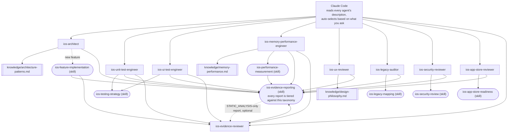

# claude-ai-agents-ios

🌐 [English](README.md) | [简体中文](README.zh-CN.md) | [Español](README.es.md) | [हिन्दी](README.hi.md) | [العربية](README.ar.md) | [Português (Brasil)](README.pt-BR.md) | [Русский](README.ru.md) | [日本語](README.ja.md) | [Français](README.fr.md) | [Deutsch](README.de.md) | [한국어](README.ko.md) | [Italiano](README.it.md) | [Türkçe](README.tr.md) | [Tiếng Việt](README.vi.md) | [Bahasa Indonesia](README.id.md)

一套开箱即用的 [Claude Code](https://claude.com/claude-code) 子代理（subagent）
和技能（Skill），把 Claude Code 变成一支专职的 iOS 开发团队：架构设计、单元测试、
UI 测试、内存/性能、UI/UX 审查、安全、App Store 上架合规、遗留代码库审计，以及
独立证据审查——每一个都会根据你的请求自动调用，无需手动切换。

## 包含内容

### 子代理（`.claude/agents/`）

| 代理 | 触发场景 | 工具 |
|---|---|---|
| `ios-architect` | 开始新功能/模块，问"这个应该怎么设计结构"，规划重构，在 MVVM/Clean/VIPER 之间做选择，决定依赖注入方式或 SwiftData vs. Core Data | Read, Grep, Glob, Write, Edit, Skill, `ios-agent`* |
| `ios-unit-test-engineer` | 请求测试、测试覆盖率、TDD，或让现有代码变得可测试 | Read, Grep, Glob, Write, Edit, Bash, Skill, `ios-agent`* |
| `ios-ui-test-engineer` | 请求 UI 测试、调试不稳定的 UI 测试，或搭建快照测试 | Read, Grep, Glob, Write, Edit, Bash, Skill, `ios-agent`*, `ios-simulator`* |
| `ios-memory-performance-engineer` | 报告内存泄漏、内存持续增长、滚动卡顿或启动缓慢 | Read, Grep, Glob, Bash, Edit, Skill, `ios-agent`*, `ios-simulator`* |
| `ios-ux-reviewer` | 请求 UI/UX 审查或设计一致性检查 | Read, Grep, Glob, Skill, `ios-agent`*（只读） |
| `ios-legacy-auditor` | 接手一个陌生、无文档或体量庞大的遗留代码库 | Read, Grep, Glob, Bash, Skill, `ios-agent`*（只读） |
| `ios-security-reviewer` | 请求安全审查、"这个安全吗"、漏洞检查，或身份验证/会话审计 | Read, Grep, Glob, Bash, Skill, `ios-agent`*（只读） |
| `ios-app-store-reviewer` | 问"这个能提交了吗"、"会不会被拒"，或检查 App Store 合规性 | Read, Grep, Glob, Bash, Skill, `ios-agent`*（只读） |
| `ios-evidence-reviewer` | 在另一个代理产出报告之后，或要求"复核这份报告"/"核实这些结论" | Read, Grep, Glob, Skill（只读） |

\* `ios-agent` 和 `ios-simulator` 是可选的第三方 MCP 服务器——参见下方的
[可选工具](#optional-tooling-static-analysis--simulator-control)。
没有它们，每个代理照样能独立工作。`ios-agent` 用结构化工具增强
`STATIC_ANALYSIS`（静态分析）级别的检查——它不会把结论提升到
`BUILD_VERIFIED`/`TEST_VERIFIED`/`RUNTIME_VERIFIED` 级别，因为它自己
从不构建或运行 App。`ios-simulator` 则会真正构建/安装/启动 App，因此
它的输出可以真正达到 `BUILD_VERIFIED`、`TEST_VERIFIED` 或
`RUNTIME_VERIFIED`——七级证据体系详见下方的
[证据优先于断言](#evidence-over-assertion)。

### 技能（`.claude/skills/`）

| 技能 | 支撑对象 | 用途 |
|---|---|---|
| `ios-testing-strategy` | `ios-unit-test-engineer`、`ios-ui-test-engineer` | 具体流程：寻找测试接缝 → 测试替身 → 红/绿测试循环 |
| `ios-legacy-mapping` | `ios-legacy-auditor` | 具体流程：清点 → 检测架构 → 桥接风险 → 安全信号 → 生成总结文档 |
| `ios-security-review` | `ios-security-reviewer` | 8 大领域审计：数据存储/隐私 → 传输安全 → 身份验证/会话 → 输入校验 → 深链接 → 第三方 SDK → 代码卫生 → 权限授权 |
| `ios-app-store-readiness` | `ios-app-store-reviewer` | 提交前审计：隐私清单 → 出口合规 → 权限用途说明 → 应用跟踪透明度 → "通过 Apple 登录"对等要求 → 未使用的权限声明 → 常见拒审原因 |
| `ios-feature-implementation` | 通用——任何功能请求都会触发，与 `ios-architect` 协同工作 | 检查现有代码、业务逻辑、API/网络行为与安全现状 → 动手前先说明方案 → 实现 → 验证（构建、测试、循环引用、内存、性能、安全）→ 汇报 |
| `ios-performance-measurement` | `ios-memory-performance-engineer` | 复现 → 确定要测量什么 → 改动前先测量 → 改动 → 在相同条件下重新测量 → 确认已移除埋点 |
| `ios-evidence-reporting` | 全部 9 个代理——任何一个完成任务时都会触发 | 七级证据体系（`ASSUMPTION` → `HUMAN_VERIFICATION`）、结论 → 最低证据要求对照表，以及禁用断言词清单，确保没有任何代理会在证据未达到相应级别时,就声称某个功能可用、已修复,或更快/更安全/线程安全 |

### 知识库（`knowledge/`）

深层参考资料放在这里,而不是塞进各个代理主体里,这样每个代理才能专注于
*何时该行动*以及*该遵循什么流程*,而知识文件则是*该检查什么内容*的权威来源。
代理在需要时会用 `Read` 工具读取这些文件——无需额外配置。

| 文件 | 被谁引用 | 内容 |
|---|---|---|
| `memory-performance.md` | `ios-memory-performance-engineer` | ARC/Instruments/图片/并发方面的基础知识,以及框架相关的具体模式(RxSwift、WKWebView、PDFKit、Core Data、Firebase、CocoaPods、Keychain、第三方展示库、UICollectionView/UITableView、SwiftUI/UIKit 桥接、AVFoundation、CoreLocation、URLSession) |
| `architecture-patterns.md` | `ios-architect` | 模式/决策标准:MVVM/Clean/VIPER、Swift 并发、模块化、持久化、导航、依赖注入、安全导向的结构设计 |
| `design-philosophy.md` | `ios-ux-reviewer` | Apple 人机界面指南(HIG)、Dieter Rams 的设计十诫在 iOS 上的应用、Nielsen Norman Group 的可用性原则,以及具名参考资料列表 |

### 模板

- `CLAUDE.md.template` ——复制到你项目根目录下作为 `CLAUDE.md`,然后
  填写其中的占位内容(或者让 `ios-legacy-auditor` 针对一个陌生代码库
  帮你生成架构部分)。

## 安装

把你需要的部分复制到你的 iOS 项目根目录:

```bash
# 从本仓库复制到你的项目:
mkdir -p /path/to/your-ios-project/.claude
cp -r .claude/agents /path/to/your-ios-project/.claude/
cp -r .claude/skills /path/to/your-ios-project/.claude/
cp -r knowledge /path/to/your-ios-project/knowledge
cp CLAUDE.md.template /path/to/your-ios-project/CLAUDE.md   # 之后再编辑
```

```bash
# 或者用符号链接代替复制,方便多个项目保持同步:
ln -s /path/to/claude-ai-agents-ios/.claude/agents /path/to/your-ios-project/.claude/agents
ln -s /path/to/claude-ai-agents-ios/.claude/skills /path/to/your-ios-project/.claude/skills
ln -s /path/to/claude-ai-agents-ios/knowledge /path/to/your-ios-project/knowledge
```

`knowledge/` 文件夹必须放在你项目的根目录下(与 `.claude/` 同级)——
代理是按这个相对路径来引用它的。

如果是个人跨项目使用而非按项目安装,可以改为复制到 `~/.claude/agents/`
和 `~/.claude/skills/`——Claude Code 会自动合并个人级和项目级的代理/技能。
注意 `knowledge/` 是按仓库相对路径引用的,所以即便是个人使用,每个项目
根目录下也仍需要有 `knowledge/`(逐项目建立符号链接是最简单的办法)。

不需要其他配置——Claude Code 会读取每个代理 frontmatter 中的
`description` 字段,并根据你的请求自动调用对应的代理。关于两个能把部分
代理的证据级别从 `STATIC_ANALYSIS` 提升上去的第三方 MCP 服务器,参见下方的
[可选工具](#optional-tooling-static-analysis--simulator-control)——没有
它们,以上内容照样能独立运作。

## 可选工具:静态分析与模拟器控制

以下两个服务器来自 [`ios-agent-skill`](https://github.com/Nagarjuna2997/ios-agent-skill)
(MIT 许可,与本仓库没有从属关系),让上面的一些代理能够*实际运行*一次检查,
而不只是靠阅读代码。两者都不是必需的——没有它们,每个代理照样能工作,
只是会回退到 `STATIC_ANALYSIS` 级别的阅读和纯文字描述的操作步骤。

### `ios-agent-mcp` ——静态分析(已发布,推荐使用)

十个只读工具,扫描 Swift 项目并返回结构化结论(文件、行号、后果、修复建议),
涵盖并发、架构、SwiftUI 模式、可用性守卫、App Store 上架合规、内存、安全、
测试与性能——具体工具清单见[这里](https://github.com/Nagarjuna2997/ios-agent-skill/tree/main/mcp-server)。
它只读文件系统,不联网。

本仓库的 `.mcp.json` 已经声明了它,所以只需把 `.mcp.json` 复制到你项目里,
和 `.claude/` 放在一起即可:

```bash
cp .mcp.json /path/to/your-ios-project/.mcp.json
```

第一次用到时,Claude Code 会提示你启用这个项目级服务器;`npx` 会在首次
使用时自动拉取该软件包,无需全局安装。

### `ios-simulator-mcp` ——模拟器控制(早期版本,仅源码可用)

针对已启动的 iOS 模拟器提供构建、测试、安装、启动、深链接跳转和截图工具——
是上面静态分析工具的运行时对应版本。截至目前它还是 **v0.1.0,尚未发布到
npm,处于早期阶段**(官方文档自称是"第一块安全切片"),所以请把它当作
可以尝试的东西,而不是可以依赖的东西:

```bash
git clone https://github.com/Nagarjuna2997/ios-agent-skill.git
cd ios-agent-skill/ios-simulator-mcp
npm install && npm run build
```

然后把它加到你项目的 `.mcp.json`(或个人 MCP 配置)里,服务器名用
`ios-simulator`,指向构建产物的路径:

```jsonc
{
  "mcpServers": {
    "ios-simulator": {
      "command": "node",
      "args": ["/absolute/path/to/ios-agent-skill/ios-simulator-mcp/dist/index.js"]
    }
  }
}
```

需要 macOS 和 Xcode 命令行工具。如果你给服务器起了别的名字而不是
`ios-simulator`,记得把 `ios-ui-test-engineer.md` 和
`ios-memory-performance-engineer.md` 里的 `mcp__ios-simulator__*`
工具授权同步改一下。

## 整体结构



这里没有需要配置的路由器或编排层——Claude Code 自身基于 description 的
匹配机制*就是*调度层。每个代理都是一个叶子节点,要么读取某个
`knowledge/*.md` 文件获取深层参考资料,要么遵循某个 `Skill` 执行共享流程,
或者两者都有,最终所有路径都汇聚到同一套证据汇报标准。
`ios-evidence-reviewer` 是"叶子节点"这个规则里唯一的例外:它读取的是
*另一个*代理已完成的报告,把报告里证据撑不住的结论降级,然后修正后的报告
再用同样的状态区块格式收尾。`ios-feature-implementation`、
`ios-memory-performance-engineer`、`ios-unit-test-engineer` 和
`ios-ui-test-engineer` 只要自己的报告达到 `BUILD_VERIFIED` 或更高级别,
就会自动经过它——负责构建/测试/测量的那个代理,并不是唯一一个检查自己
报告是否属实的人。

## 各代理之间如何协作

一个典型的流程——虽然你从来不需要按名字手动调用它们:

1. **陌生或无文档的代码库?** 先用 `ios-legacy-auditor`——它会梳理出
   真实的架构,并生成一份可以直接放进 `CLAUDE.md` 的总结,然后再动手
   改任何代码。
2. **新功能/模块?** `ios-architect` 提出结构方案,并指出这个设计是否
   便于单元测试;然后 `ios-feature-implementation` 负责实际动手——
   先梳理现有业务逻辑,动手前先说明方案,按商定好的结构实现,最后
   验证(构建、测试、内存、性能)后再汇报完成。
3. **需要测试?** 业务逻辑用 `ios-unit-test-engineer`,用户流程用
   `ios-ui-test-engineer`——两者都遵循 `ios-testing-strategy` 里同一套
   "找接缝 → 红/绿测试"的流程。
4. **新增或改动了界面?** `ios-ux-reviewer` 会依据 Apple 的人机界面
   指南以及背后的设计哲学做检查,再让你上线。
5. **感觉变慢了或者在漏内存?** `ios-memory-performance-engineer` 会
   先从代码里找静态原因,如果读代码找不出来,会给你一套具体的
   Instruments 排查步骤。
6. **想做安全检查?** `ios-security-reviewer` 会跑一套专门的 8 大领域
   审计(存储、传输、身份验证、输入校验、深链接、依赖项、代码卫生、
   权限授权);`ios-architect`、`ios-legacy-auditor` 和
   `ios-feature-implementation` 也会在各自工作中顺带标记出一些较轻量、
   范围有限的安全问题,并在需要完整审计时指向这里。
7. **准备提交 App Store?** `ios-app-store-reviewer` 会检查代码层面能
   看出来的提交障碍(隐私清单、权限用途说明、出口合规、"通过 Apple
   登录"对等要求)——这和 `ios-security-reviewer` 是两码事,尽管两者在
   权限声明、传输安全上有些重叠,所以只要其中一个相关,建议两个都跑
   一遍再发布。
8. **报告达到了 `BUILD_VERIFIED` 或更高级别?** `ios-evidence-reviewer`
   会在结论被当作定论之前先复核一遍。`ios-feature-implementation`、
   `ios-memory-performance-engineer`、`ios-unit-test-engineer` 和
   `ios-ui-test-engineer`——这几个能独立产出构建/测试/运行时/测量类
   结论(而不只是静态发现)的代理——都会在最后一步自动经过它;其他任何
   代理的报告也都可以直接交给它复核。

## 证据优先于断言

AI 的自信不是证据。AI 的推理不是运行时证据。改了代码不代表这个改动就
经过了验证。本仓库里的每个代理都会在报告结尾用 `ios-evidence-reporting`
技能的状态区块收尾,而不是一句干巴巴的"完成了!能用了。"这个区块里的
每一行都会对照七个证据级别中的一个来定级,从弱到强:

`ASSUMPTION` → `STATIC_ANALYSIS` → `BUILD_VERIFIED` → `TEST_VERIFIED`
→ `RUNTIME_VERIFIED` → `RUNTIME_MEASURED` → `HUMAN_VERIFICATION`

一个结论汇报的级别永远不会高于证据实际达到的级别。阅读源码(包括某个
MCP 静态分析工具输出的结构化结论)就是 `STATIC_ANALYSIS`,不管是人读的
还是工具读的都一样——不会因为是工具产出的就变成更强的证据,也永远不能
支撑"不存在内存泄漏"或"内存有所改善"这类结论。这类结论必须要有
`RUNTIME_MEASURED`(运行时测量)才行:也就是真正运行 App 得到的实际数字
(Instruments、MetricKit、`os_signpost`),走一遍 `ios-performance-measurement`
的复现 → 建立基线 → 测量 → 改动 → 构建 → 测试 → 再次测量 → 对比 → 汇报
这套流程。本仓库的代理永远不会在证据不够的情况下说出这些词:"修好了"、
"优化了"、"更快了"、"没有内存泄漏"、"线程安全"、"安全"或"生产就绪"
(这是个跨维度的结论,没有哪一个代理单独的证据能覆盖全部)——完整清单
和精确表述的替代说法参见 `ios-evidence-reporting` 的"结论 → 最低证据
要求"对照表。

因为负责实现某个改动的代理不应该是唯一判断自己报告是否属实的人,
`ios-evidence-reviewer` 会独立地依据同一套对照表复核一份已完成报告里的
每条结论,把证据撑不住的部分降级,然后再把结果当作定论呈现——详见上面
"整体结构"部分。

## 设计哲学

`ios-ux-reviewer` 的判断尤其依据具名的资料来源,而不是凭空断言的审美
偏好:Apple 的人机界面指南、Dieter Rams 的设计十诫、Don Norman 的
《设计心理学》(The Design of Everyday Things)、Nielsen Norman Group
的可用性原则,以及 *Refactoring UI* 里关于具体视觉判断的方法。这些
原则具体怎么应用到 iOS 上,详见 `knowledge/design-philosophy.md`。

## 维护本仓库

`scripts/audit-agents.sh` 会跑一遍每个代理/技能文件在开发过程中都要
满足的机械检查:frontmatter 里的 `name:` 是否和文件名/目录名一致,
`description:` 是否带有真实的触发短语,声称只读的正文内容是否和
`Write`/`Edit` 授权同时出现,代码围栏(code fence)是否闭合,仓库里每个
反引号包裹的 `ios-*` 引用是否都能对应到真实存在的代理或技能,以及是否
还有文件残留旧版的 `(static)`/`(executed)` 分级方式而没有迁移到当前的
七级体系。这个脚本不会阻断任何操作——它给出的是供人参考的发现,而不是
强制关卡。

```bash
./scripts/audit-agents.sh
```
